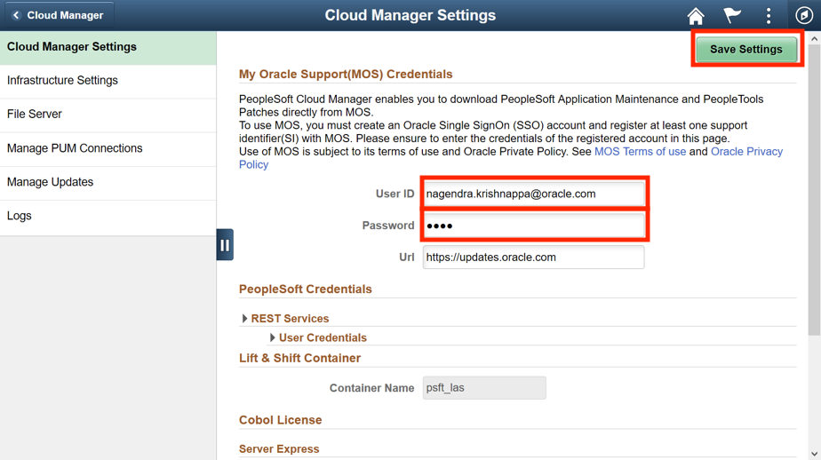

# Lab 3: Configuring Cloud Manager Settings

## Introduction
This lab will guide you on how to configure the system and infrastructure settings on Cloud Manager

Estimated Lab Time: 10 minutes.

### Objectives
The purpose of this lab is to show you how to configure Cloud Manager settings.

In this lab, you will:
* Upload SSH public keys
* Update My Oracle Support Credentials
* Input the image OCID for the Cloud Manager
* Create a Mount Target for a File System

### Prerequisites
1. My Oracle Support (MOS) account credentials.
    - User ID
    - Password

## **STEP 1**: Uploading SSH public keys

1. Navigate to **Cloud Manager Dashboard** > **Cloud Manager Settings** > **My Settings**.

    

2. Navigate to the folder where you generated the keys (Lab 2, Step 1) and open the file **id_rsa.pub**.

    

3. Copy the contents of the file in **My SSH Public Key** and click on **Save**

    

## **STEP 2**: Entering My Oracle Support Credentials

1.	Navigate to **Cloud Manager Dashboard** > **Cloud Manager Settings** > **Cloud Manager Settings**.

2.	Update **My Oracle Support (MOS) Credentials**. These credentials are the same as the username and password you enter when you access http://support.oracle.com. Please make sure that you have an account and you can access http://support.oracle.com, this is required to download DPKs and PRPs automatically. Once you have entered your **User ID** and **Password**, click **Save Settings** at the top of the page.

    
    
## **STEP 3**: Updating Infrastructure Settings

1.	Navigate to Infrastructure Settings on the left and update Operating System Images.     
    For Linux, enable **Marketplace Image** radio button and choose the latest version from the displayed list (see the screenshot below).

    For Windows image, as per your home region, please select the OCID of the vanilla custom image from this [website](https://docs.cloud.oracle.com/en-us/iaas/images/image/146ab34c-064a-4255-b5ea-e26bbfa6591d/).

    For example, in this lab, we selected our Availability Domain to be us-ashburn-1 so our OCID is:    
    **ocid1.image.oc1.iad.aaaaaaaahobtltelwdrzm6sd3nn6j7fsb3bwinq2ggmpcnsgdvhihnz2mhga**
 
    

2.	Click **Save** to save the configuration. 

3.	Click **Refresh OCI Metadata** button on top of the page and wait for a few minutes.

## **STEP 4**: Configuring File Server System

1.	Navigate to **File Server tab** on the left.  Accept the defaults. For Mount Target field, type “**lab**”.

    

2.	Click **Create**.  This action will create a file server in a few minutes. Please wait until the file server status shows ‘**FSS Configured**’, and then the system will be ready for downloads. 

You may now proceed to the next lab.

## Acknowledgements

**Created By/Date**   
- Rich Konopka, Peoplesoft Specialist, October 2020  
- Megha Gajbhiye, Cloud Solutions Engineer, October 2020  

**Last Updated By/Date**    
- Sara Lipowsky, Cloud Solutions Engineer, October 2020  

## See an issue?

Please submit feedback using this [form](https://apexapps.oracle.com/pls/apex/f?p=133:1:::::P1_FEEDBACK:1). Please include the **workshop name**, **lab** and **step** in your request. If you don't see the workshop name listed, please enter it manually. If you would like for us to follow up with you, enter your email in the **Feedback Comments** section.  