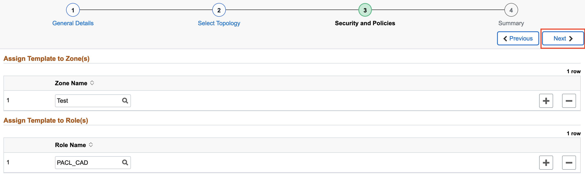
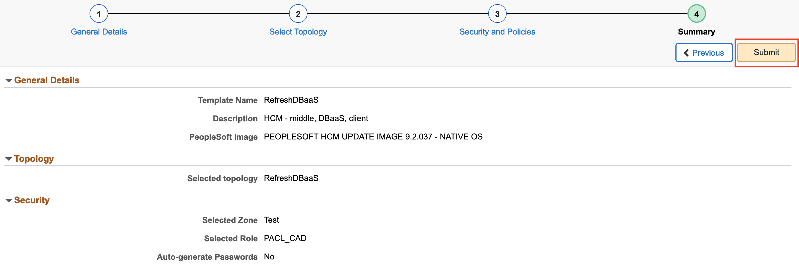

# Refreshing an Environment

## Introduction
This lab walks you through the steps to refresh an environment.

### Objectives
In this lab you will:
* Create a clone of an environment
* Create a backup of an environment
* Use a backup to refresh an environment

### Prerequisites
- Access to the Cloud Manager console.

## **STEP 1**: Creating a New Topology With DBaaS

In order to refresh an environment you will need a topology with DBaaS. If you already have a topology with DBaaS you can skip this step.

1.  Navigate to **Dashboard** > **Topology**. Click **Add New Topology**.
    

2.  Give the topology a name such as **RefreshDBaaS** and enter a description. Now we will add 3 new nodes. First we will add the Middle Tier node. Click **Add Node**.
    

    Enter the following details:
    * Operating System: Linux
    * Environment Type: Middle Tier
    * Shape Name: VM.Standard2.1
    * Leave rest as default and click **Done**
    
    
    Next the DB Systems node:
    * Operating System: Linux
    * Environment Type: DB Systems
    * Shape Name: VM.Standard2.1
    * Leave Disk Space as default and click **Done**
    
    
    Finally the Peoplesoft Client node:
    * Operating System: Windows
    * Environment Type: PeopleSoft Client
    * Shape Name: VM.Standard2.1
    * Leave Disk Space as default and click **Done**
    

    Your topology should look like the following:
    
    
    Click **Save**.

## **STEP 2**: Creating a New Environment Template

In order to refresh an environment you will need an environment template that is using a topology with DBaaS. If you already have this you can skip this step.

1.  Navigate to **Dashboard** > **Environment Template**. 
    Click **Add New Template**.
    

2.  On the General Details page:
    * Give the template a name such as **RefreshDBaaS** and enter a description
    * Click on the search icon next to PeopleSoft Image and select **PEOPLESOFT HCM UPDATE IMAGE 9.2.037 - NATIVE OS** 
    * Click **Next**
    

3.  On the Select Topology page:
    * Click on the search icon under Topology Name and select **RefreshDBaaS**
    * Expand the **Custom Attributes** section and select **RefreshDBaaS** again in  the dropdown
    * Click on **Edit Custom Attributes**
       
    * Expand the **Region and Availability Domains** section and select the following: 
    
    * Expand **Middle Tier** > **Network Settings** and select the following:
        * Subnet For Primary Instance: **mt**
    * Expand **DB Systems** > **General Settings** and make the following changes:
        * Database Operator Id: **PS**
        * Database Name: **HCMDBAAS**
    
    * Expand **DB Systems** > **Network Settings** and select the following:
        * Subnet For Primary Instance: **db**
    * Expand **DB Systems** > **DB System Options** and select the following:
    
    * Expand **PeopleSoft Client** > **Network Settings** and select the following:
        * Subnet For Primary Instance: **win**
    * Click **Next**

4.  On the Define Security page:
    * Click on the search icon under Zone Name and select **Test**
    * Click on the search icon under Role Name and select **PACL_CAD**
    * Click **Next**
    

5. On the Summary page:
    * Review the details and click **Submit**
    

## **STEP 3**: Creating a New Environment

In order to refresh an environment you will need an environment created from a template with DBaaS. If you already have this you can skip this step.

1.  Navigate to **Dashboard** > **Environments**. Click **Create Environment**.
    

2.  Provide a unique environment name such as **RefreshDB** and enter a description. For Template Name select the template we created in the previous step: **RefreshDBaaS**. 
    

3.  Expand **Environment Attributes** > **Middle Tier**. Assign the following values to each field:
    * Weblogic Administrator Password: **Psft1234**
    * Gateway Administrator Password: **Psft1234**
    * Web Profile Password for user PTWEBSERVER: **Psft1234**
    

    Expand **Environment Attributes** > **DB Systems**. Assign the following values to each field:
    * Database Administrator Password: **PSft1234##**
    * Database Connect Password: **Psft1234**
    * Database Access Password: **Psft1234**
    * Database Operator Password: **Psft1234**
    

    Expand **Environment Attributes** > **PeopleSoft Client**. Assign the following value to the field:
    * Windows Administrator Password: **Psft12345678#**
    
    
    Click **Done**.
    

4. Click **Accept** on the license.
   

## **STEP 4**: Refreshing an Environment

1.	First we will create a target environment for our refresh. 
    Navigate to **Dashboard** > **Environment**.
    Click the down arrow on your source environment (**RefreshDB**) and then click **Clone Environment**.
    

    Provide a unique environment name such as **TestRefresh**. Leave everything else as default and then click **Clone**.
    

2.  Once the source and target environments are both running, we can then create
    a backup from the source environment. We will use this backup to refresh the target environment.
    On your source environment (**RefreshDB**), click the down arrow and then click **Backup and Restore**. 
    

    Provide a unique backup name such as **TestBackup**. Click **Backup**.
    

3.  Once the backup has finished we are ready to refresh the target environment. 
    On your target (**TestRefresh**) environment, click the down arrow and then click **Refresh**.
    

    Enter the following details
    * Source Type: **OCI Backup**
    * Environment Name: Your source environment (**RefreshDB**)
    * Backup ID: **TestBackup**
    * Use Latest Backup: **YES**
    * App Refresh: **NO**
    * Source TDE KeyStore (Wallet) Password: DB Admin password (**Psft1234##**)
    

    Click **Done**.
    

You may now proceed to the next lab.

## Acknowledgements

**Created By/Date**   
* **Authors** - Rich Konopka, Peoplesoft Specialist, Megha Gajbhiye, Cloud Solutions Engineer
* **Contributor** -  Sara Lipowsky, Cloud Engineer
* **Last Updated By/Date** - Sara Lipowsky, Cloud Engineer, February 2021

## Need Help?
Please submit feedback or ask for help using our [LiveLabs Support Forum](https://community.oracle.com/tech/developers/categories/Migrate%20SaaS%20to%20OCI). Please click the **Log In** button and login using your Oracle Account. Click the **Ask A Question** button to the left to start a *New Discussion* or *Ask a Question*.  Please include your workshop name and lab name.  You can also include screenshots and attach files.  Engage directly with the author of the workshop.

If you do not have an Oracle Account, click [here](https://profile.oracle.com/myprofile/account/create-account.jspx) to create one.