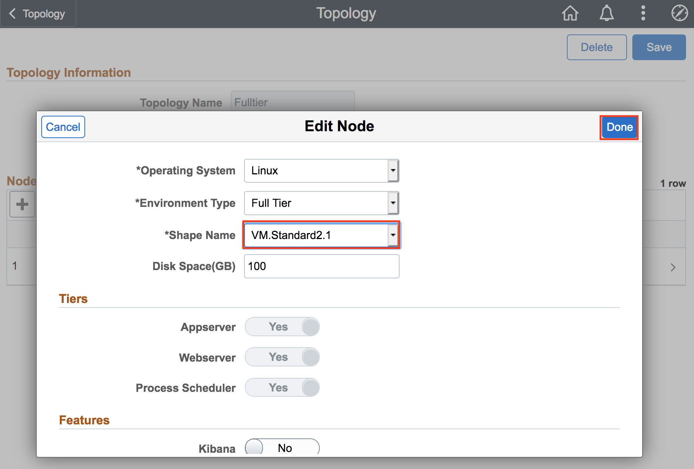

# Reviewing and Updating a Topology

## Introduction

Cloud Manager provisions PeopleSoft environments on-demand with just a few clicks. The entire provisioning process is automated. At the end of provisioning, a ready-to-use environment is available within a short time. The environments can be created by a three step process:
1. Create Topology
2. Create Template
3. Create Environment

Topology defines the infrastructure layout that will be created on Oracle Cloud by Cloud Manager. An administrator defines a template for creating an environment. The topology is encapsulated inside the template. 

Users can select a template, override topologies, change any attributes, if needed, and provision PeopleSoft environments on demand. Users are allowed to perform actions on a running environment, such as stop, view details, create new template from it, and so on.

Estimated Time: 5 minutes

### Objectives
In this lab you will:
* Create a topolgy for a template to automatically provision a PeopleSoft environment
* Give it required attributes including name, description, OS, shape type, and environment type

### Prerequisites
- Access to the Cloud Manager console.

## **STEP 1**: Defining a Topology

1.	Navigate to **Dashboard** > **Topology**.
    Click the radio button next to **PUM Fulltier** and then click **Clone**
    

    Give the cloned Topology a name: **Fulltier** and click **Clone**
    
2. Now let's edit the Topogy we just created. 
    Click **Fulltier**
    

    You should see 2 Nodes like this:
    

3.  Click **Full Tier** under Environment Type and select **VM.Standard2.1** 

    

    Click **Done**.

    Now, let's edit the other node. Click **PeopleSoft Client** and then **Delete** this node.
    

4.	When you have something like this, click **Save**. 

    

You may now proceed to the next lab.

## Acknowledgements

**Created By/Date**   
* **Authors** - Rich Konopka, Peoplesoft Specialist, Megha Gajbhiye, Cloud Solutions Engineer
* **Contributor** -  Sara Lipowsky, Cloud Engineer
* **Last Updated By/Date** - Sara Lipowsky, Cloud Engineer, February 2021

## Need Help?
Please submit feedback or ask for help using our [LiveLabs Support Forum](https://community.oracle.com/tech/developers/categories/Migrate%20SaaS%20to%20OCI). Please click the **Log In** button and login using your Oracle Account. Click the **Ask A Question** button to the left to start a *New Discussion* or *Ask a Question*.  Please include your workshop name and lab name.  You can also include screenshots and attach files.  Engage directly with the author of the workshop.

If you do not have an Oracle Account, click [here](https://profile.oracle.com/myprofile/account/create-account.jspx) to create one.