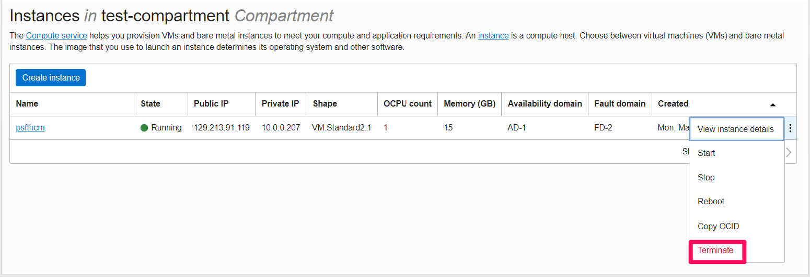

# Teardown Your Oracle PeopleSoft Environment

## Introduction
In this lab, we will decommission the PeopleSoft environment by deleting all the resources we created in OCI.

Estimated Time: 15 minutes

### Objectives
* Delete your PeopleSoft virtual machine
* Destroy OCI Resources

### Prerequisites
* Tenancy Admin User
* Tenancy Admin Password

## Task 1: Delete the PeopleSoft Virtual Machine In OCI

1. Navigate to the OCI home page.

2. Use the dropdown menu located in the upper lefthand corner of the screen and select **Compute** then **Instances**.

    

3. You are now on the **Instances** page. Make sure that you have the compartment you created in the "Setup" lab selected.

    

4.   You should now be able to see the PeopleSoft instance you created previously.

    Now click on the three dots to the right of your Siebel instance and then select **Terminate**.

    

    Once the image has finished terminating you will see its state change to terminated.

    

## Task 2: Terminating the VCN

1. Use the dropdown menu located in the upper lefthand corner of the screen and select **Networking** then **Virtual Cloud Networks**.
    

2. You will now see you are in the **Virtual Cloud Networks** page. Make sure that you have the compartment you created in the "Setup" lab selected.
    

3. You shoud now be able to se the VCN that you created in the "Setup" lab.

    Now click on the three dots to the right of your VCN and then select **Terminate**.

    

4. On the next screen you will see a list of all of the Associated Resources.

    After the window has finished loading all of the resources you can click the terminate all button.

    **Note:** It may take a moment for all of the resources to load.

    

    After all the resouces have terminated the VCN itself will terminate and you may then click the close button.

## Task 3: Deleting the test Compartment

1.  Use the dropdown menu located in the upper lefthand corner of the screen and select **Identity & Security** then **Compartments**.

    

    From this screen navigate to the compartment you created in the "Setup" lab.

    

    After some time the status will be shown as deleted.

    

You have now removed all the resources you created for the PeopleSoft Marketplace environment.

## Acknowledgements
* **Authors** - Deepak Kumar M, Principal Cloud Architect
* **Contributors** - Deepak Kumar M, Principal Cloud Architect
* **Last Updated By/Date** - Deepak Kumar M, Principal Cloud Architect, April 2022

