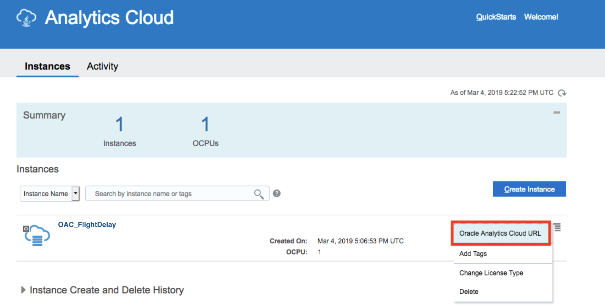
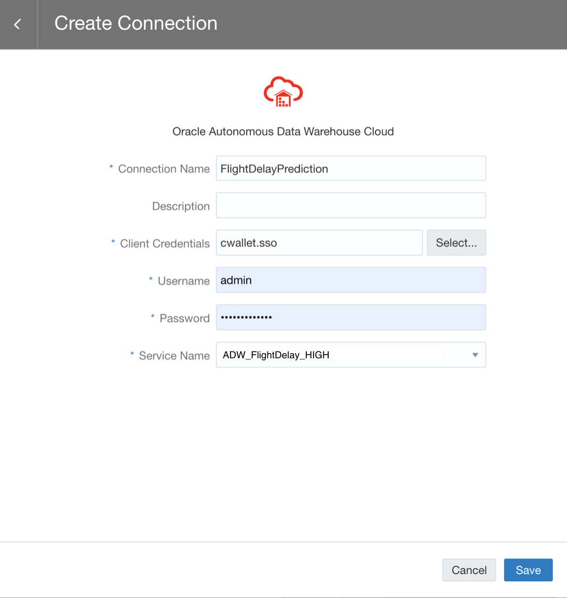

# Building Machine Learning Models in Oracle Analytics Cloud (OAC)  

  
Updated: January 4, 2019

## Introduction

This lab walks you through the steps to provision an Oracle Analytics Cloud (OAC) instance and connect it to the instance of ADW you created. In addition, we will demonstrate how to build machine learning models and how to find out which model fits flight delay prediction the best in OAC which is "no-code" development platform. 

**_To log issues_**, click here to go to the [github oracle](https://github.com/oracle/learning-library/issues/new) repository issue submission form.

## Objectives
-   Learn how to provision a new Oracle Analytics Cloud (OAC) Instance
-   Learn how to connect the OAC instance to the instance of ADW you created 
-   Learn how to build machine learning models in OAC
-   Learn how to find out which ML model fits the flight delay prediction the best in OAC 

## Required Artifacts
-   The following lab requires an Oracle Public Cloud account. You may use your own cloud account, a cloud account that you obtained through a trial, or a training account whose details were given to you by an Oracle instructor.

# Provision Oracle Analytics Cloud (OAC) and Connect to Autonomous Data Warehouse (ADW)

## Part 1. Create an OAC Instance
In this section, you will create an OAC instance.

### **STEP 1: Sign in to Oracle Cloud**

-   Go to [cloud.oracle.com](https://cloud.oracle.com), click **Sign In** to sign in with your Oracle Cloud account.

-   Enter your **Cloud Account Name** and click **My Services**.

-   Enter your Oracle Cloud **username** and **password**, and click **Sign In**.

### **STEP 2: Create an OAC Instance**

-   Go to your **Dashboard** page by clicking **My Services Dashboard** from the OCI Console navigation menu.

- Click on **Create Instance**.

-   Under **All Services**, find **Analytics** and click on **Create**.

-   On the **Analytics** page, click on **Create Instance**.

-   Enter the following information and then click on **Next**.

    - **Instance Name:** Enter a name for your service instance (e.g. OAC_FlightDelay)
    - **Notification Email:** Enter the email address of the person you want to notify when this service is ready to use and receive other status updates about this service in the future
    - **Region:** Select the region where you want to deploy Oracle Analytics Cloud (e.g. us-Phoenix-1)
    - **License Type:** Select whether you want to use your on-premises license with Oracle Analytics Cloud and to be charged the Bring Your Own License (BYOL) rate or subscribe to a new license for Oracle Analytics Cloud
    - **Edition:** Select the edition that you want to use (e.g. Enterprise Edition) 
    - **Feature Set:** Select the features that you want to deply. The options available to you depend on the deition you are subscribed to. (e.g. Business Intelligence) 
    

-   After validating your configuration, click on **Create**.

-   It will take 20 minutes to create the instance. If you enter the notification email, Oracle sends an email to the email address when your servie is ready.

-   Now your OAC instance is ready. In order to access your instance, click **Manage this instance** button on the right side of your instance.

-   Then, click **Oracle Analytics Cloud URL**. It will open a new tab within your browser. 

-   This is main page of **Oracle Analytics Cloud (OAC)** which is "no-code" development platform. 

## Part 2. Connect OAC to ADW

### **STEP 3: Connect OAC to ADW**

-   In the Oracle Analytics Cloud main page, click on the **Create** button on the top-right and then click on **Connection** in the popped menu.

-   Select the **Oracle Autonomous Data Warehouse Cloud** from the existing connection types.

-   Complete all the required fields in the wizard and Save the connection. Note that you need the ADW instance **Wallet** in order to be able to complete these fields. Please refer to the instruction in **Lab100** for accessing the **Wallet**.

-   You should fill the following connection fields, then click **Save**:

    - **Connection Name:** Type a name for this connection (e.g. FlightDelayPrediction)
    - **Client Credentials:** Click on **‘Select’** and select the zipped **Wallet** file (The **cwallet.sso** file will be automatically extracted from the **Wallet** file)
    - **Username:** Admin (the username you created during the ADW provisioning)
    - **Password:** The password you specified during provision of your ADW instance
    - **Service Name:** Select your database name and desired service level (low, medium, high) from the drop down list. (e.g.  ADW_FlightDelay_HIGH)

## Part 3. Upload Dataset from ADW to OAC

### **STEP 4: Upload Dataset from ADW to OAC to build ML Models**

-   In the Oracle Analytics Cloud Homepage, click on the **Create** button on the top-right and then click on **Data Set** in the popped menu.

-   Select the connection that you have created in previous step.

-   Select the **ADMIN** schema from the list of users, then pick the dataset (**OAC_DATASET**) that you want to use to train the model.  

-   Click **Add All** to add all columns. 

-   Then, type a name for the dataset (**OAC_DATASET**) and click **Add**.

## Part 4. Build Machine Learning Models in OAC 

### **STEP 5: Create Data Flow to Build Machine Learning Models**
Once you have created connection and uploaded dataset from ADW to OAC successfully, let's create **Data Flow** to build machine learning model. 

-   On the main page of OAC, click **Data Flow** to create the machine learning model. 

-   Pick the dataset (**OAC_DATASET**) which you uploaded on previous step. 

-   Using “+” button, you can add next steps to build machine learning model. You need to select some columns, so click **select columns**. Then, since you need all columns, select all of them. 

- Then, select proper statistical algorithm for flight delay prediction project. Here, OAC provides four different classes of machine learning. In this case, you want to predict numerical variable of flight delay. So, let’s click **train numeric prediction model**. 

- Here, for training numeric prediciton model, we have four different statistical algorithms built in OAC. Let’s suppose we are not someone who are familiar with machine learning. So, we will just pick one of them. (e.g. pick **linear regression algorithm**) 

- Once you pick the algorithm, all of the parameters are set by default except for the target value. Here, you want to predict flight delay time, so set **ARRDELAY** column as target. 

- Then, we just need to **save** both our model and the Data Flow.

- Once the Data Flow and model are saved, you can run the model that you had trained using the data you selected in the first step. It will take only about 2-3 mins.

- Once you have ran the model successfully, you will see the following message. 

## Part 5. Find Out Which ML Model Fits Flight Delay Prediction the Best 

### **STEP 6: Import the ML_ModelQuality.dva Project File**
You can repeat the same process and create four different ML models for predicting flight delay time, then compare them and find out which model fits our problem the best using statistical methods. However, to simplify the process, we have already created all those models in OAC. And then, we have saved statistical results from each model in the project of  **ML_ModelQuality.dva**. From follwing steps, you will import the project of **ML_ModelQuality.dva**  and find out which model fits our problem the best. 

- Click [ML_ModelQuality.dva](./files/project/ML_ModelQuality.dva) to download the project file to a directory on your local computer.

- Click **Menu Page** button on the top of right side and select **Import Project**. Then, click **Select File** and **import** the downloaded ML_ModelQuality.dva file. 

- You can find the imported project under the section **Projects**. 

- Let's open the project. 

- Then, click the tap of **Narrate** and click **Present**. 

- Now, you can see the graph as presentation mode as below: 

### **STEP 7: Find Out Which ML Model Fits Flight Delay Prediction the Best**

We have created four different ml models in OAC. And then, to find out which model fits our problem the best, we have calculated Mean Absolute Error (MAE) of each model. MAE is commonly used statistics for evaluating the overall quality of model. MAE value ranges from zero to infinity, and smaller MAE value means better model quality. 

Here, we can see that the Linear Regression has the lowest MAE of 13. Generally speaking, 13 is a small value for MAE that represents good model quality. Also, you can see that the Linear Regression has the lowest MAE of our four models, meaning it is the best one here. Then, we can decide to use linear regression model to predict flight delay. 

But, what if you want to operationalize ML and build ML model on the entire dataset with more parameter options? You can use oracle Machine Learning Notebook (OML). In the next lab, you will follow steps for building ML model in OML. 

## Great Work - All Done with Lab300!
**You are ready to move on to the next lab. You may now close this tab.**
