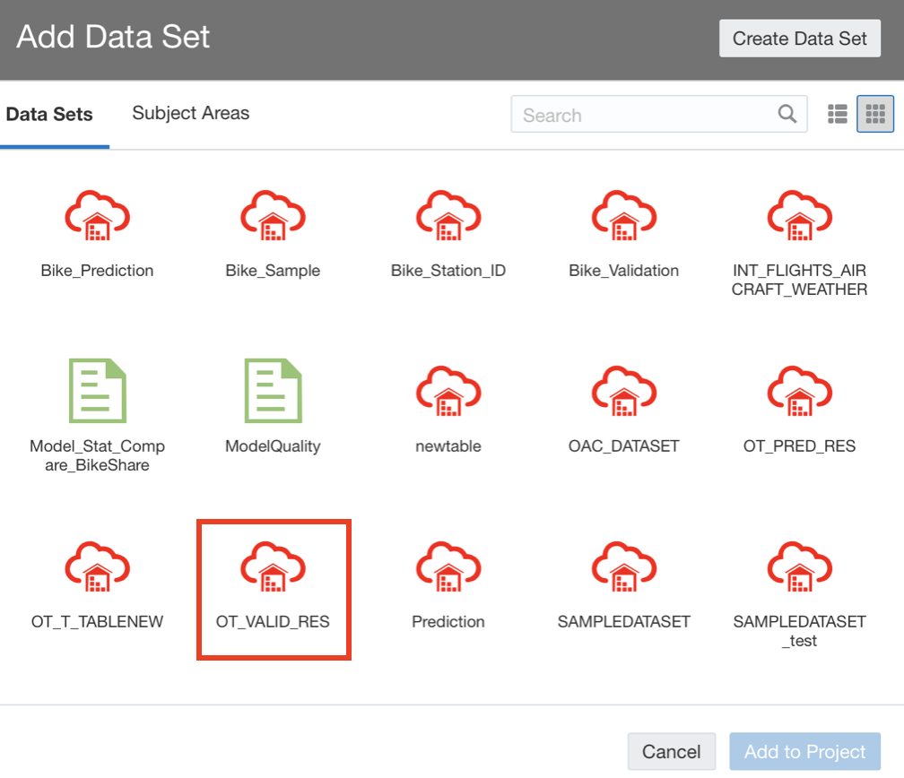
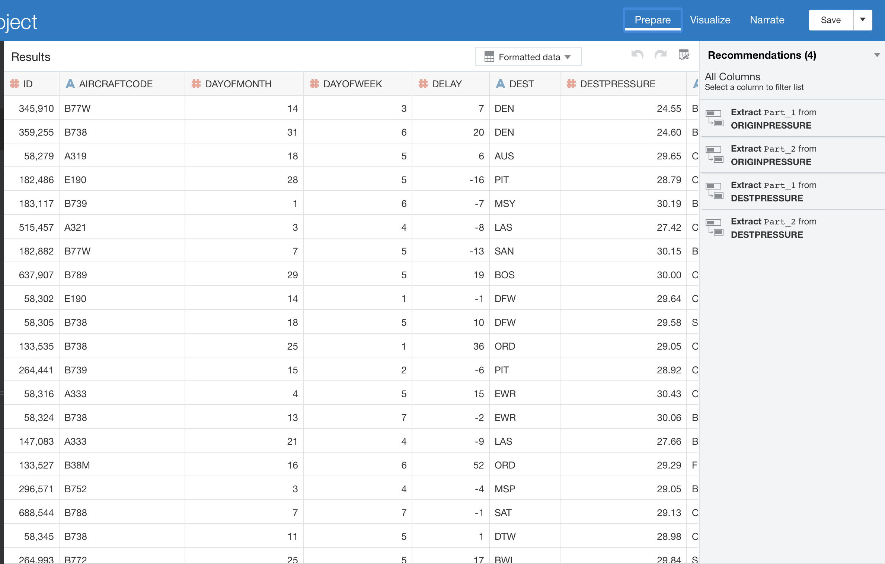

# Visualizing results of Validation and Prediction in Oracle Analytics Cloud (OAC)

  
Updated: January 4, 2019

## Introduction
This lab walks you through the steps to visualize results of validation and prediction in Oracle Analytics Cloud (OAC).  

**_To log issues_**, click here to go to the [github oracle](https://github.com/oracle/learning-library/issues/new) repository issue submission form.

## Objectives
-   Learn how to visualize the results in Oracle Analytics Cloud

## Required Artifacts
-   The following lab requires an Oracle Public Cloud account. You may use your own cloud account, a cloud account that you obtained through a trial, or a training account whose details were given to you by an Oracle instructor.

# Visualizing results of Validation and Prediction in Oracle Analytics Cloud (OAC)

## Part 1. Visualize Results of Validation in OAC. 

### **STEP 1: Load the Validation Result Table onto OAC**

-   In the Oracle Analytics Cloud Homepage, click on the **Create** button on the top-right and then click on **Data Set** in the popped menu.

-   Select the connection (**FlightDelayPrediction**) that you have created in previous lab.

-   Select the OML user created in **Lab 100**, then pick the validation result table (**OT_Valid_Res**).

-   Click **Add All** to add all columns and click **Add** to save the dataset.  

### **STEP 2: Visualize Results of Validation using Combo chart**
-   Once you have uploaded the validation result table onto OAC successfully, click **Visualize** tap.  

-   Make visualization by following below steps to visualize the validation result. 

    - Change **Aggregation** of DELAY, PREDICTEDDELAY columns as **Average**.
    - Create a **Combo** chart
    - **Values (Y-Axis)**: DELAY (Bar) and PREDICTEDDELAY (Line) 
    - **Category (X-Axis)**: DEST
    - Save the visualization (e.g. Visualization_Validation) 

- Click the tap of **Narrate** and click **Present**. Now, you can see the graph as presentation mode. 

**Notes:** In this graph, x-axis is each airport and y-axis is averaged flight’s delay time. Here, bars show the actual flight delay time and lines show the predicted delay time. This graph shows actual flight delay and predicted delay time at each destination. You can see that the line (predicted value) closely follows the pattern exhibited by the bar graphs (actual value). Hence, you can say the machine learning model is very reliable.

## Part 2. Visualize Results of Prediction in OAC. 

### **STEP 3: Load the Prediction Result Table onto OAC**

- Repeat **Part 1.STEP1** to load the prediction result table (**OT_Pred_Res**) onto OAC. 

### **STEP 4: Make a new CARRIER column on tap of Prepare**
- Click **Option** button on the column of **UNIQUECARRIER** and select **Duplicate**. 

- Rename the duplicated column as **CARRIER** and click **Add Step**. 

- Click **Option** button on the column of **CARRIER** and select **Replace**. Then, replace the actual carrier names to some character (e.g. AS -> A, UA -> B, WN -> C) and click **Add Step**. 

- Click **Apply Script** button to make all changes happen on the dataset. 

### **STEP 5: Visualize Results of Prediction using Bar graph**
-   Once you have uploaded the prediction result table onto OAC successfully, click **Visualize** tap.  

-   Make visualization by following below steps to visualize the prediction result. 

    - Change **Aggregation** of PREDICTEDDELAY columns as **Average**.
    - Change SCHEDULEDEEPTTIME, DAYOFWEEK as **Attribute**. 
    - Create a **Bar** graph
    - **Values (Y-Axis)**: PREDICTEDDELAY
    - **Category (X-Axis)**: SCHEDULEDEEPTTIME
    - **Color**: CARRIER
    - Add ORIGIN (**LAX**), DEST(**SFO**), DAYOFWEEK(**4**, Thursday) and CARRIER(**A,B,C**) as filter. 
    - Save the visualization (e.g. Visualization_Prediction) 

- Click the tap of **Narrate** and click **Present**. Now, you can see the graph as presentation mode. 

**Notes:** This graph shows predicted delay time for flights from LAX to SFO on a Thursday. Each color represents three major airlines, a, b, and c. This graph predicts that on a Thursday, airline “B” from LAX to SFO leaving at 4:50 p.m. will arrive about 17 minutes late. On the other hand, airline “C” from leaving at 4:45 p.m. will arrive only about 5 minutes late.

## Great Work - All Done with Lab500!
**Congrats! You are all done. You may now close this tab.**
