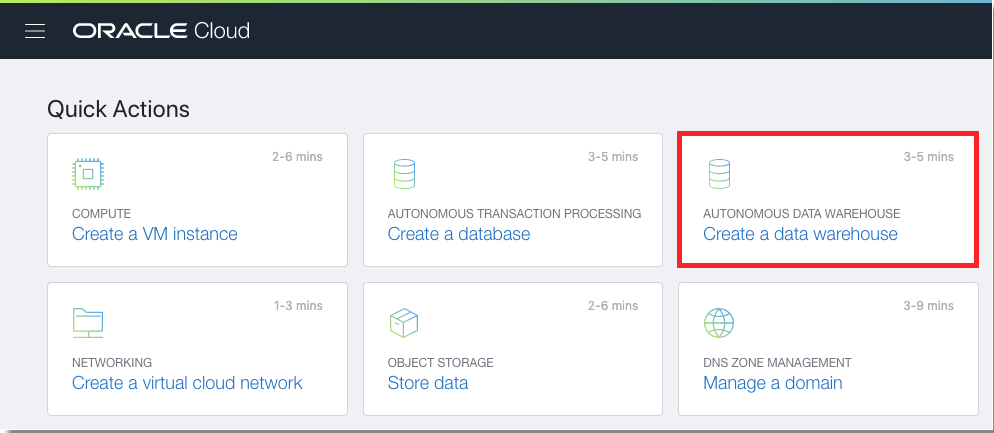
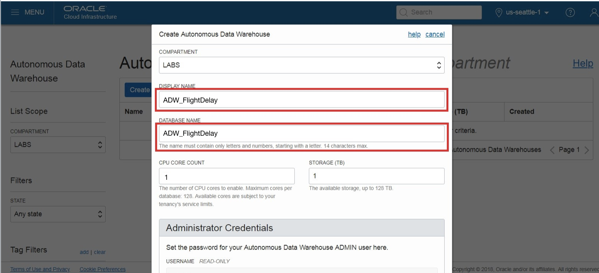
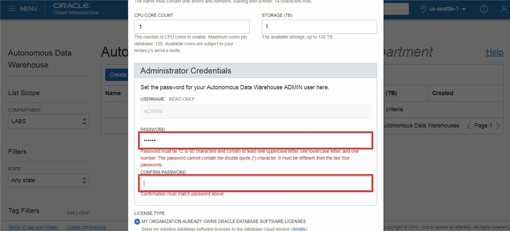
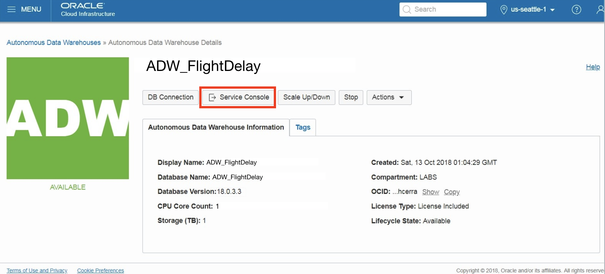
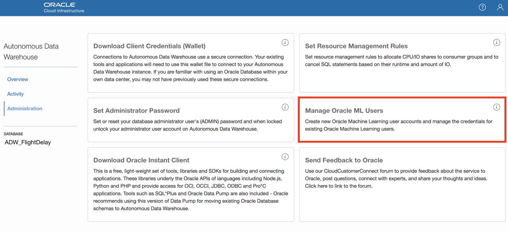

# Provision Autonomous Data Warehouse (ADW) 

## Introduction
This is the first of several labs that are part of the Predicting Flight Delays with Oracle Machine Learning & Autonomous Data Warehouse Cloud Service workshop. This lab walks you through the steps to get started using the Oracle Autonomous Data Warehouse (ADW) on Oracle Infrastructure Cloud (OCI). You will provision a new ADW instance during this lab. 

### Objectives
-   Learn how to provision a new Autonomous Data Warehouse (ADW) 
-   Learn how to creae Oracle Machine Leaning (OML) Notebook Users

### Required Artifacts
The following lab requires an Oracle Public Cloud account. You may use your own cloud account, a cloud account that you obtained through a trial, or a training account whose details were given to you by an Oracle instructor.

## Part 1. Provisioning an ADW Instance

1.  Once you are logged in, you are taken to the OCI Console. Click **Create a data warehouse**

 

2. This will bring up the **Create Autonomous Data Warehouse** screen where you will specify the configurations of the instance. Select the root compartment, or another compartment of your choice.

3. Specify a memorable display name for the instance. Also specify your database's name (e.g. **ADW_FlightDelay**).

4.  Next, select the number of CPUs and storage size. Here, we will use **1 CPU** and **1 TB of storage**.

5.  Then, specify an **ADMIN password** for the instance.

6.  For this lab, we will select **Subscribe To A New Database License**. If your organization owns Oracle Database licenses already, you may bring those license to your cloud service.

7. Make sure everything is filled out correctly, then proceed to click on **Create Autonomous Data Warehouse**.

8.  Your instance will begin provisioning. Once the state goes from Provisioning to Available, click on your display name to see its details.

9.  You now have created your first Autonomous Data Warehouse instance. Have a look at your instance's details here including its name, database version, CPU count and storage size.

## Part 2. Creating OML Users

1. Click the **Service Console** button on your Autonomous Data Warehouse details page.

2. Click the **Administration** tab and click **Manage Oracle ML Users** to go to the OML user management page.

This will open OML user Administration page as a new tab within your browser. 

3.  Click **Create** button to create a new OML user. Note that this will also create a new database user with the same name. This newly created user will be able to use the OML notebook application. Note that you can also enter an email address to send an email confirmation to your user (*for this lab you can use your own personal email address*) when creating the user.

4.  Enter the required information for new user (Username:**omluser1** and Password). If you supplied a valid **email address**, a welcome email should arrive within a few minutes to your Inbox. Click the **Create** button, in the top-right corner of the page, to create the user.

5.   Below is a welcome email. It includes a direct link to the OML application for the user. 

6.  After you click **Create**, you can find the user on the list of Users. 

7.   Using the same steps, create another user named **omluser2**.

You will use **omluser1** later in this workshop. 

## Acknowledgements

- **Author** - NATD Solution Engineering - Austin Hub (Joowon Cho)
- **Last Updated By/Date** - Joowon Cho, Solutions Engineer, May 2020

## See an issue?
Please submit feedback using this [form](https://apexapps.oracle.com/pls/apex/f?p=133:1:::::P1_FEEDBACK:1). Please include the *workshop name*, *lab* and *step* in your request.  If you don't see the workshop name listed, please enter it manually. If you would like us to follow up with you, enter your email in the *Feedback Comments* section.    Please include the workshop name and lab in your request. 

