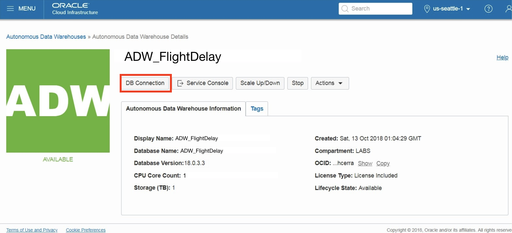
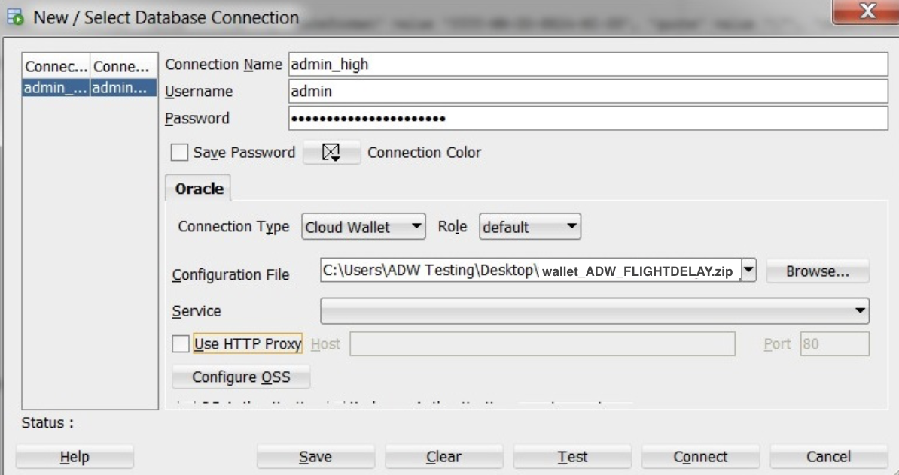
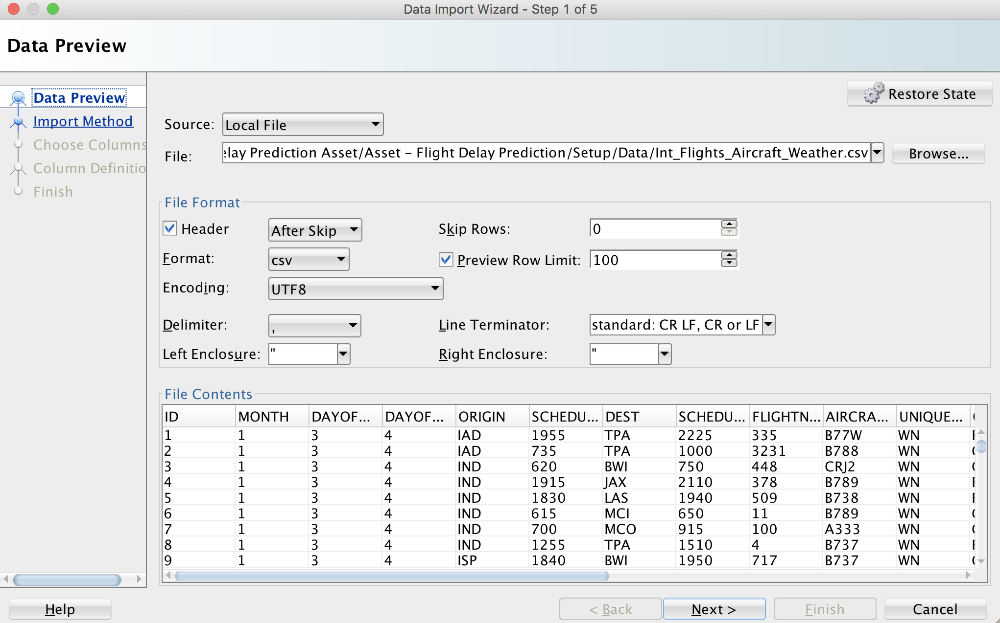
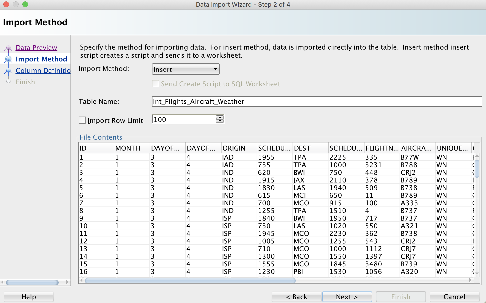
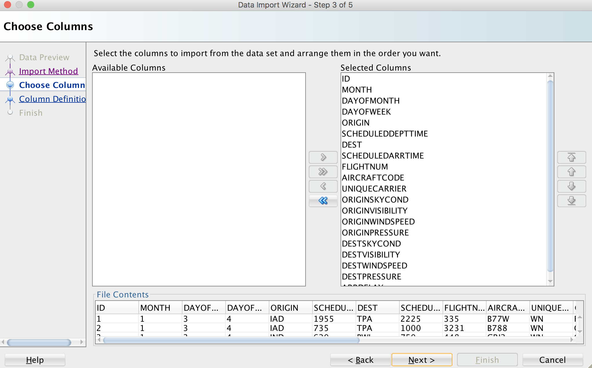
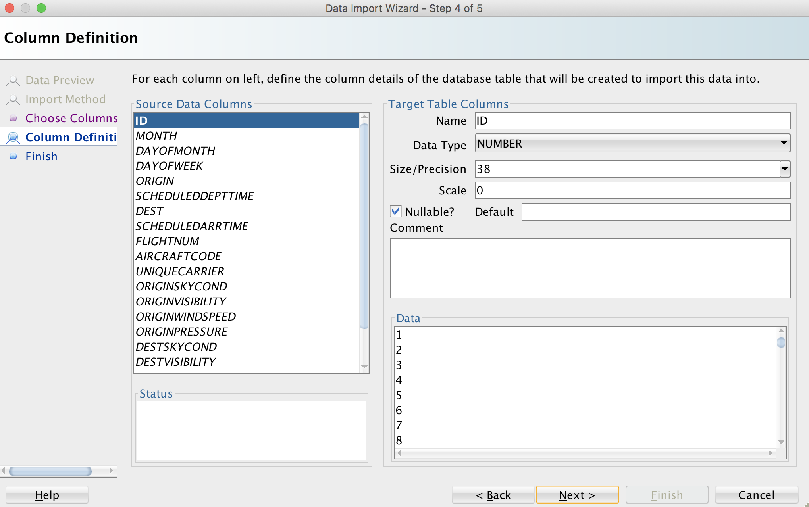

# Loading Datasets to Autonomous Data Warehouse (ADW) using SQL Developer

## Introduction

This lab walks you through the steps to load datasets from local file system into the Autonomous Data Warehouse (ADW) instance that you provisioned in the previous lab. You will use SQL Developer for connecting and uploading datasets to ADW. 

### Objectives
-   Learn how to connect to your new Autonomous Data Warehouse using SQL Developer
-   Learn how to use the SQL Developer Data Import Wizard to load datasets
-   Learn how to prepare datasets for training machine learning model in OAC 
-   Learn how to grant privileges to the OML User to access all datasets

### Required Artifacts
-   The following lab requires an Oracle Public Cloud account. You may use your own cloud account, a cloud account that you obtained through a trial, or a training account whose details were given to you by an Oracle instructor.
-   Oracle SQL Developer 18.3 or later (see <a href="http://www.oracle.com/technetwork/developer-tools/sql-developer/downloads/index.html" target="\_blank">Oracle Technology Network download site</a>)
Please use SQL Developer version 18.3 or later as this version contains enhancements for key Autonomous Data Warehouse features, including using ADW behind a VPN or Firewall.

## Part 1. Connect SQL Developer to the ADW Instance
In this section you will connect the SQL Developer to the ADW instance that you provisioned in Lab 100.

### **STEP 1**: Download the Connection Wallet
As ADW only accepts secure connections to the database, you need to download a wallet file containing your credentials first. The wallet can be downloaded either from the instance's details page, or from the ADW service console. In this case, we will be showing you how to download the wallet file from the instance's details page.

1.  In your databases's instance details page, click **DB Connection**.

2.  Under Download a Connection Wallet, click **Download**.

3.  Specify a password of your choice for the wallet. You will need this password when connecting to the database via SQL Developer later, and is also used as the JKS keystore password for JDBC applications that use JKS for security. Click **Download** to download the wallet file to your client machine. 
*Note: If you are prevented from downloading your Connection Wallet, it may be due to your browser's pop-blocker. Please disable it or create an exception for Oracle Cloud domains.*

### **STEP 2**: Connect to the Database using SQL Developer
Start SQL Developer and create a connection for your database using the default administrator account 'ADMIN' by following these steps.

1.   Click the **New Connection** icon in the Connections toolbox on the top left of the SQL Developer homepage.

2.   Fill in the connection details as below:

-   Connection Name: admin_high
-   Username: admin
-   Password: The password you specified during provisioning your instance
-   Connection Type: Cloud Wallet
-   Configuration File: Enter the full path for the wallet file you downloaded before, or click the **Browse button** to point to the location of the file.
-   Service: There are 3 pre-configured database services for each database. Pick **&lt;databasename&gt;_high** for this lab. For example, if you the database you created was named adwfinance, select adwfinance_high as the service.
*Note* : SQL Developer versions prior to 18.3 ask for a **Keystore Password.** Here, you would enter the password you specified when downloading the wallet from ADW.

3.  Test your connection by clicking the **Test** button, if it succeeds, save your connection information by clicking **Save**, then connect to your database by clicking the **Connect** button. An entry for the new connection appears under Connections.

4.  If you are behind a VPN or Firewall and this Test fails, make sure you have <a href="https://www.oracle.com/technetwork/developer-tools/sql-developer/downloads/index.html" target="\_blank">SQL Developer 18.3</a> or higher. This version and above will allow you to select the "Use HTTP Proxy Host" option for a Cloud Wallet type connection. While creating your new ADW connection here, provide your proxy's Host and Port. If you are unsure where to find this, you may look at your computer's connection settings or contact your Network Administrator.

## Part 2. Load Data File to the ADW Instance

### **STEP 1**: Download the Data File to Your Local Computer

For this lab, you will need a data file. Click [here](./files/flights_aircraft_weather.zip) to download a zipfile of the data file and unzip it to a directory on your local computer. This data file is the resulting integrated table including flight, weather, and aircraft data at each time and each airport.

### **STEP 2**: Load the Data File to the ADW Instance using SQL Developer Data Import Wizard**

1. Click **Tables** in your user schema object tree. Clicking the right mouse button opens the context-sensitive menu in SQL Developer; select **Import Data**. 

2. The Data Import Wizard is started. Enter the following information:

- Select **Local File** as source for the data load
- Click the browse button and navigate to the Int_Flights_Aircraft_Weather.csv file which you unzipped before 
  
After selecting the file, you can preview the data and select the appropriate file formats. When you are satisfied with the file content view, click **NEXT**.

 
  

On Step 2 of the Import Wizard, you control the import method and parameters. Leave the Import Method as Insert. 
- Enter **Int_Flights_Aircraft_Weather** as your target table name, this table will be created by the import wizard. Click **NEXT**.

3. The Choose Columns screen lets you select the columns you want to import. Leave the defaults and click **NEXT**.

4. The column definition screen allows you to set the column names and data types for your new table. You can change these if you need to. For this exercise, leave them as default and click **NEXT**.

5. Click **FINISH** to load the data into your newly created table **Int_Flights_Aircraft_Weather**. 

*Note: This table has about 1M rows. It will may take about 5 mins to import the table.*

## Part 3. Create Data for Machine Learning Training in Oracle Analytics Cloud (OAC)

1.  Copy and paste [this code snippet](./files/data_OAC.sql) to a SQL Developer worksheet and run the script. This code is to create the train portion of the data which you will use to train a ML model in OAC. 

## Part 4. Grant Privileges to the OML User to Access All Datasets

1.  Copy and paste [this code snippet](./files/grant_Privileges.sql) to a SQL Developer worksheet and run the script. This code is to grant privileges to the OML User (**omluser1**) which we created on previous lab. 

## Acknowledgements

- **Author** - NATD Solution Engineering - Austin Hub (Joowon Cho)
- **Last Updated By/Date** - Joowon Cho, Solutions Engineer, May 2020

## See an issue?
Please submit feedback using this [form](https://apexapps.oracle.com/pls/apex/f?p=133:1:::::P1_FEEDBACK:1). Please include the *workshop name*, *lab* and *step* in your request.  If you don't see the workshop name listed, please enter it manually. If you would like for us to follow up with you, enter your email in the *Feedback Comments* section.    Please include the workshop name and lab in your request. 
