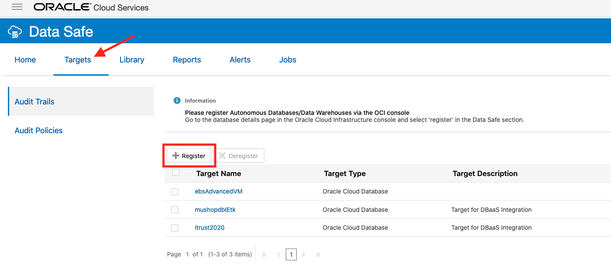
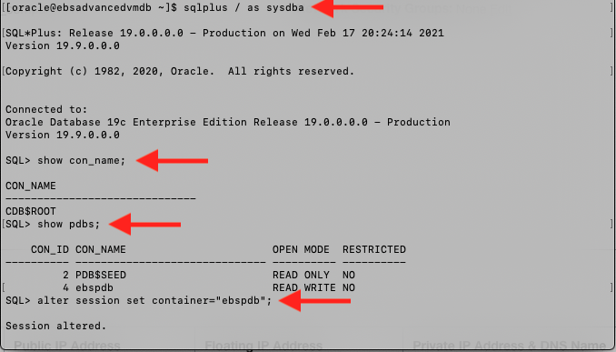

# Configure the Target Database 
 
## Introduction

This lab guides you through configuring the target database for use with Data Safe. We will be downloading a privilege script from Data Safe in order to create a user on the database that will act as the Data Safe Admin User. This user will have certain permissions outlined the in the downloaded privileges script. 

Note: Please be aware that the screenshots in this lab follow the enabling of Data Safe for an EBS instance. This is not required and simply provides the walkthrough of a typical "installment" of Data Safe on a database. 

Estimated Lab Time: 15 minutes

### Objectives

In this lab, you will:
* Download a privileges script from the Data Safe Console
* Create a Data Safe user on the target database and grant the user the appropriate privileges

### Prerequisites

* A tenancy admin user
* A paid Oracle Cloud Infrastructure tenancy (not available for Free Tier or Always Free tenancies)
* A private Virtual Machine Database System 
* A text file with the following values: 
    - The private IP address of the database to be targeted on Data Safe
    - (Optional) The public IP address of the bastion host you will use to connect to the database 
    - The OCID of the target database

## **STEP 1:** Download the Privileges Script

First, we must download a file from the Data Safe console that will give the created user the roles necessary to act as a Data Safe user.  

1. Access the Data Safe console by going to **Data Safe** under the Navigation menu and then selecting the **Service Console** button.

    

2. Click on the **Targets** tab at the top. 

  a. Click **Register**.

    

  b. Click **Download Privilege Script** and save the file to your local computer.

    This will download the .sql file that we will run on the database later to give privileges to our user. 

    

3. Login to your Bastion Host using ssh and its public IP address if necessary to connect to your database.

        <copy>
        ssh -i <private-ssh-key-filepath> opc@<Bastion-Host-public-IP>
        </copy>
    Cloud Manager:
    ``cd Documents/keys``
    ``ssh -f -C -q -N -i id_rsa -L 2222:10.0.1.2:22 opc@132.145.214.16``
    ``ssh -p 2222 opc@localhost -i id_rsa``

4. Login to your database using the database's private IP address. 

        <copy>
        ssh <database-private-IP>
        </copy>

    ``[opc@psftcm12test ~]$ sudo su - psadm2``
    ``[psadm2@psftcm12test ~]$ ssh -i /home/psadm2/psft/data/cloud/ocihome/keys/cm_adm_pvt_key opc@10.0.1.9``
    ``[opc@hcm-lnxdb-2 ~]$ ls``
    ``cloud  datasafe_privileges.sql  log psc_linux_remote_executor_sh_20210325.log``
    

5. Copy over the ``datasafe_privileges.sql`` file we downloaded in part 2. 

  a. On your local machine, open the file in a text editor (or cat it in terminal) and copy its contents. 

  b. On the database, create a file ``datasafe_privileges.sql``. 

        <copy>
        vi datasafe_privileges.sql
        </copy>

  c. Press ``i`` to start inserting values into the file. 

  d. Now paste in the contents of the downloaded file into the file we just created on the database. 

  e. Save and exit by pressing ``ecs`` and then typing in ``:wq``. 

## **STEP 2:** Create a Data Safe Admin User on the Target Database

In this step, we will create a database user and grant them privileges which will allow them to be used as the Data Safe admin user. 

1. While still on the target database, connect to SQLPlus as the sysdba user. Depending on your target database, you may need to run a file to set the environment variables before you are able to execute the following command. 

        <copy>
        sqlplus / as sysdba
        </copy>

    MUST CHANGE TO oracle2 USER FIRST!

    ``[opc@hcm-lnxdb-2 ~]$ sudo su - oracle``
    ``[oracle@hcm-lnxdb-2 ~]$ sqlplus / as sysdba``

    ``SQL> show pdbs;    ``               

    CON_ID CON_NAME			  OPEN MODE  RESTRICTED
    ---------- ------------------------------ ---------- ----------
	 2 PDB$SEED			  READ ONLY  NO
	 3 DFLTDB			  READ WRITE NO
	 4 PSPDB			  READ WRITE NO

2. Connect to the pdb 

        <copy>
        alter session set container="<pdb-name>";
        </copy>

    

    ``SQL> alter session set container="PSPDB";``

  Make sure the pdb's name is in quotation marks. If you are unsure of the pdb name, enter the following command into sqlplus. 

        <copy>
        show pdbs;
        </copy>

3. Before we are able to create a user, we must create a tablespace on the database that will act as the user's default tablespace. 

        <copy>
        CREATE TABLESPACE DATASAFE_TABLE
        DATAFILE ‘datasafe_table.dbf’
        SIZE 1m;
        </copy>

4. Now we can create the user that will act as our Data Safe user on this database. 

        <copy>
        CREATE USER DATASAFE_ADMIN IDENTIFIED BY <password>
        DEFAULT TABLESPACE DATASAFE_TABLE
        TEMPORARY TABLESPACE TEMP;
        </copy>

    

    ``SQL> CREATE USER DATASAFE_ADMIN IDENTIFIED BY PSft1234##``
    ``2  DEFAULT TABLESPACE DATASAFE_TABLE``
    ``3  TEMPORARY TABLESPACE TEMP;``

5. Grant permissions to this user. 

        <copy>
        GRANT CONNECT, RESOURCE TO DATASAFE_ADMIN;
        </copy>

6. Now run the following command to grant privileges to this user. 

        <copy>
        @datasafe_privileges.sql DATASAFE_ADMIN GRANT ALL
        </copy>

    

7. Lastly run this command in sqlplus on the pdb (you may have to rerun the commands in step 1 and 2 to do so) and write down its output in a text file under "Database Service Name" for later reference. 

        <copy>
        select sys_context('userenv','service_name') from dual;
        </copy>

    

    

    ``SQL> select sys_context('userenv', 'service_name') from dual;``

    ``SYS_CONTEXT('USERENV','SERVICE_NAME')``
    ``-----------------------------------------------------------------------``
    ``pspdb.sub03232254351.psftcm2subnet.oraclevcn.com``
You may now move on to the next lab. 

## Learn More

* [Oracle Data Safe Documentation](https://docs.oracle.com/en/cloud/paas/data-safe/udscs/get-started-oracle-data-safe.html)
* [Learn how to set up Data Safe with a Compute Database](https://docs.oracle.com/en/cloud/paas/data-safe/udscs/register-oracle-databases-oracle-cloud-infrastructure-compute-instances.html#GUID-304A2F0E-67B1-44E4-AD48-649F1FE59DAC)
* [Learn how to register an on-premise database with a Private Endpoint](https://docs.oracle.com/en/cloud/paas/data-safe/udscs/register-premises-oracle-databases-using-oracle-data-safe-private-endpoint.html#GUID-61F946FF-5AFB-4BB3-9BAB-7BABC9B4A6C4)
* [Learn how to register an on-premise database with an On-Premises Connector](https://docs.oracle.com/en/cloud/paas/data-safe/udscs/register-onpremises-oracle-databases-using-oracle-data-safe-onpremises-connector.html#GUID-ED6C6F89-3123-4A4E-9EBE-30D2C920C1CA)

## Acknowledgements

* **Author:** William Masdon, Cloud Engineering
* **Contributors:** 
    - Quintin Hill, Cloud Engineering
* **Last Updated By/Date:** William Masdon, Cloud Engineering, Mar 2021

## Need Help?
Please submit feedback or ask for help using our [LiveLabs Support Forum](https://community.oracle.com/tech/developers/categories/livelabsdiscussions). Please click the **Log In** button and login using your Oracle Account. Click the **Ask A Question** button to the left to start a *New Discussion* or *Ask a Question*.  Please include your workshop name and lab name.  You can also include screenshots and attach files.  Engage directly with the author of the workshop.

If you do not have an Oracle Account, click [here](https://profile.oracle.com/myprofile/account/create-account.jspx) to create one.
