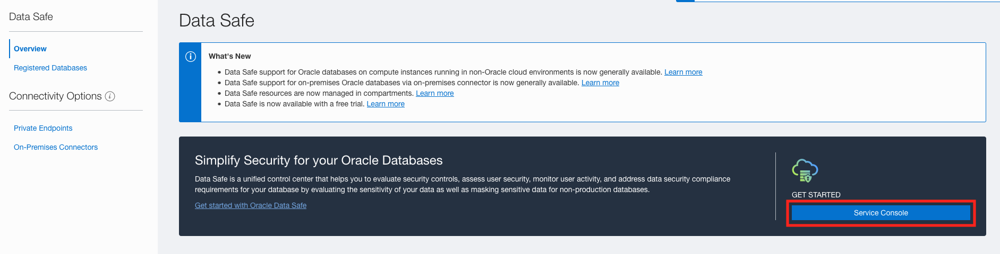
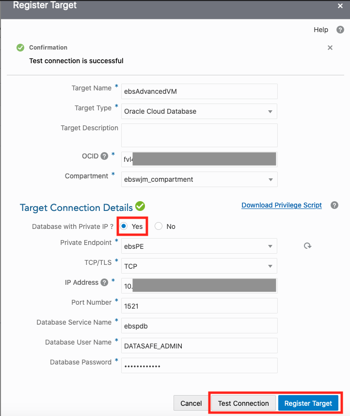
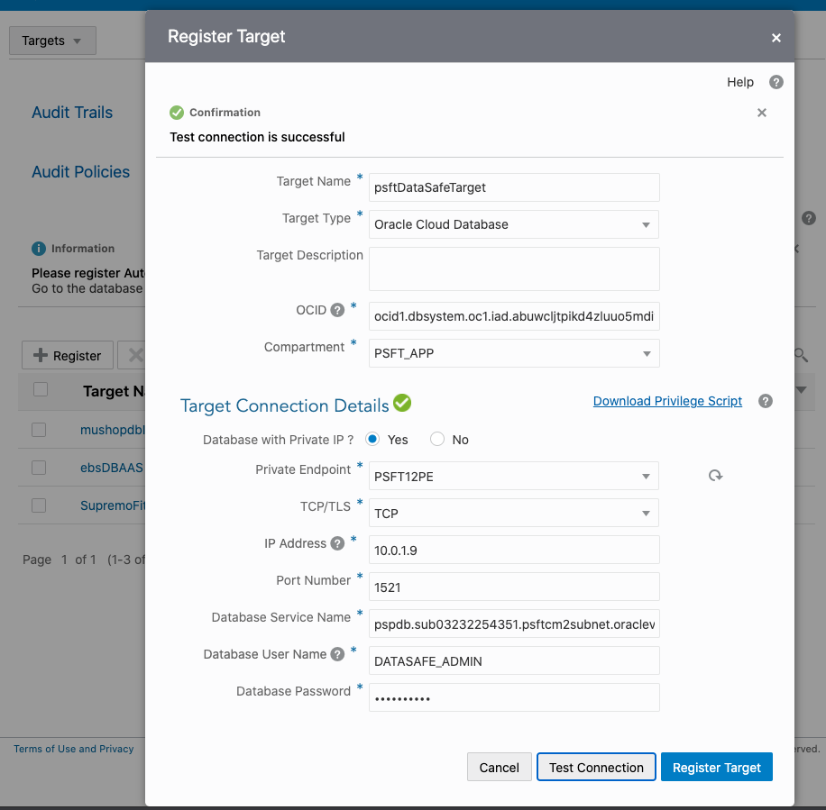
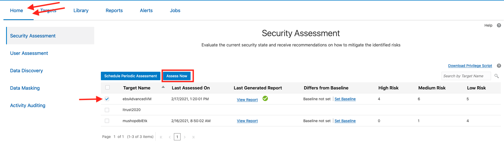
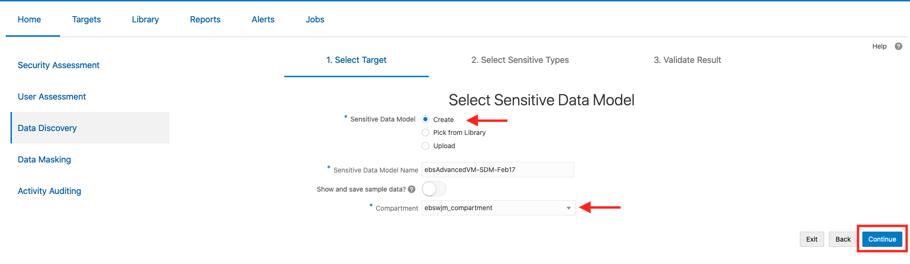
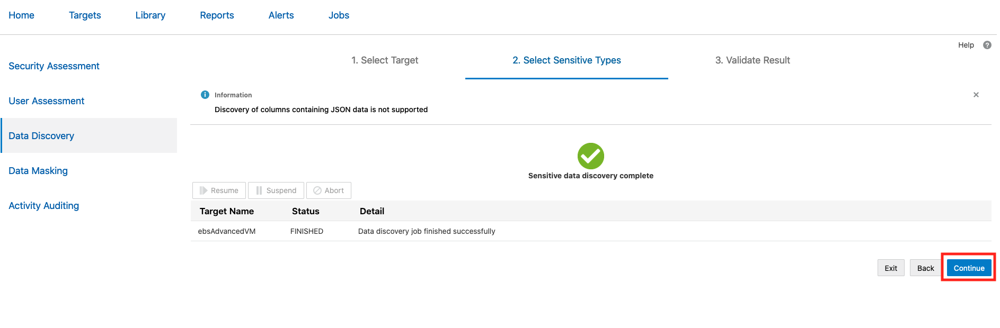
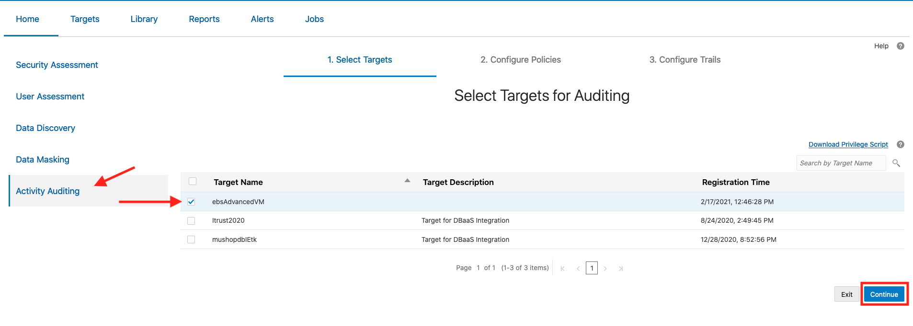

# Monitor the Target Database on Data Safe

## Introduction 

This lab guides you through adding the target database to the Data Safe Console. The lab then walks you through a simple assessment of the database on Data Safe using its different functions. 

Note: Please be aware that the screenshots in this lab follow the enabling of Data Safe for an EBS instance. This is not required and simply provides the walkthrough of a typical "installment" of Data Safe on a database. 

Estimated Lab Time: 30 minutes

### Objectives

In this lab, you will:
* Add the database as a target to the Data Safe console 
* View a report of the database using the Security and User assessment
* Run a Data Discovery job to find potentially sensitive data on your database
* Enable Activity Auditing on the target database to monitor certain activities

### Prerequisites

* A tenancy admin user
* A paid Oracle Cloud Infrastructure tenancy (not available for Free Tier or Always Free tenancies)
* A private Virtual Machine Database System 
* A text file with the following values: 
    - The private IP address of the database to be targeted on Data Safe
    - (Optional) The public IP address of the bastion host you will use to connect to the database 
    - The OCID of the target database

## **STEP 1:** Register the Target Database on the Data Safe Console

1. Login to the Data Safe Service Console from OCI. 

  a. Navigate from the menu to Data Safe and click on the **Service Console** button. 

    

2. Click the **Targets** tab at the top. 

3. Click **Register** and fill out the following details. 

  a. **Target Name:** ``DataSafeTarget``

  b. **Target Type:** ``Oracle Cloud Database``

  c. **OCID:** the OCID of your target database

  d. **Compartment:** the compartment of your database

  e. **Database with Private IP:** ``Yes``

  f. **Private Endpoint:** select the private endpoint we created in Lab 1

  g. **TCP/TLS:** select ``TCP``

  h. **IP address:** private IP address of your database

  i. **Port number:** ``1521``

  j. **Database Service Number:** the value from the SQLPlus command we ran in Lab 2 - Step 2 - Part 7 

  k. **Database User Name:** ``DATASAFE_ADMIN``

  l. **Database Password:** the DATASAFE_ADMIN password you specified in part 9 of Step 3. 

4. Click **Test Connection** to verify the connection information is correct. 

5. Once the connection has been verified, click **Register Target**. 

    
    

Congratulations! You have successfully registered a database with Data Safe. You can now go to the **Home** tab on Data Safe and begin running assessments to gain additional insight into your EBS data. 

## **STEP 2:** Monitor your Target Database with Security and User Assessments

In this step, we will access the data on the target database we registered. Security and User Assessments will give us snapshots into the current security of the database. 

1. In the Data Safe Console, go to the **Home** tab. 

2. Click on **Security Assessment** and select your target database. Click **Assess Now** to run an assessment. Once the report has been generated, you can click on **Set Baseline** to establish a baseline that will be compared to future assessments or **View Report** to see the results of the assessment. You can also select your database and click **Schedule Periodic Assessment** to setup a regularly run security assessment. 

    

3. Now, click on **User Assessment** on the left panel. From here select your database and click **Assess**. Here you can also view a report by clicking **View Report** once the assessment completes. 

    

## **STEP 3:** Run Data Discovery Jobs

Data Discovery allows us to run jobs that discover potentially sensitive data on the database.

1. Click on **Data Discovery** on the left panel and select your target database. Click **Continue**.

    

2. Select **Create** for Sensitive Data Model and provide a name for the model, if desired. 

3. Leave **Show and save sample data?** unchecked (unless you would like to view sample data from the data discovery job). Select the compartment where you would like to store this model. Click **Continue**. 

    

4. Select the schemas on which you would like to run the discovery job. Click **Continue**. 

    

5. Select the sensitive data types which you would like to discovery and then click **Continue**. The job will now run and create a Sensitive Data Model. Once this job has finished, you can click **Continue**. 

    

    

6. This page will show the results from the data discovery job. You may click **Back** to reconfigure the job and run it again. If satisfied, you can click **Report** to save and view the model. 

    

## **STEP 3:** Audit the Target Database with Activity Auditing

Activity Auditing allows users to view activity and data manipulation on the database. 

1. Click on **Activity Auditing** on the left panel and select your target database. Click **Continue**. 

    

2. Select your target and click **Retrieve** to obtain the valid Audit Policies for your target. Wait for the Audit Policies to be retrieved, then click **Continue**. 

    

3. On the Review and Provision Audit and Alert Policies page, click on the target database name. This will open a window that allows you to customize which audit and alert policies you would like to enable. Select the desired policies and click **Provision**. Then click **Continue**. 

    

    

    

4. On the Start Audit Collection page, we will designate from what date we would like to collect audit data. Having selected your target database, click on the calendar icon and select a date to designate as the start of the audit collection. From there, you can click **Start** to begin the audit collection process. After the process begins, you can click **Done**. 

    

5. You can view the Activity Audit reports by clicking on the **Reports** tab and selecting a subcategory under **Activity Auditing**. 

    

  Congratulations! You have successfully set up and used Data Safe for your private Virtual Machine Database System on OCI. 

## Learn More

* [Oracle Data Safe Documentation](https://docs.oracle.com/en/cloud/paas/data-safe/udscs/get-started-oracle-data-safe.html)
* [Learn how to set up Data Safe with a Compute Database](https://docs.oracle.com/en/cloud/paas/data-safe/udscs/register-oracle-databases-oracle-cloud-infrastructure-compute-instances.html#GUID-304A2F0E-67B1-44E4-AD48-649F1FE59DAC)
* [Learn how to register an on-premise database with a Private Endpoint](https://docs.oracle.com/en/cloud/paas/data-safe/udscs/register-premises-oracle-databases-using-oracle-data-safe-private-endpoint.html#GUID-61F946FF-5AFB-4BB3-9BAB-7BABC9B4A6C4)
* [Learn how to register an on-premise database with an On-Premises Connector](https://docs.oracle.com/en/cloud/paas/data-safe/udscs/register-onpremises-oracle-databases-using-oracle-data-safe-onpremises-connector.html#GUID-ED6C6F89-3123-4A4E-9EBE-30D2C920C1CA)

## Acknowledgements

* **Author:** William Masdon, Cloud Engineering
* **Contributors:** 
    - Quintin Hill, Cloud Engineering
* **Last Updated By/Date:** William Masdon, Cloud Engineering, Mar 2021

## Need Help?
Please submit feedback or ask for help using our [LiveLabs Support Forum](https://community.oracle.com/tech/developers/categories/livelabsdiscussions). Please click the **Log In** button and login using your Oracle Account. Click the **Ask A Question** button to the left to start a *New Discussion* or *Ask a Question*.  Please include your workshop name and lab name.  You can also include screenshots and attach files.  Engage directly with the author of the workshop.

If you do not have an Oracle Account, click [here](https://profile.oracle.com/myprofile/account/create-account.jspx) to create one.
