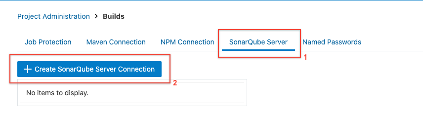
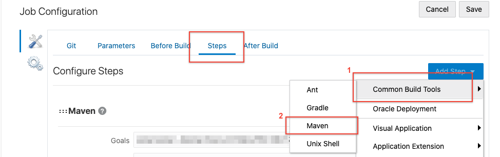
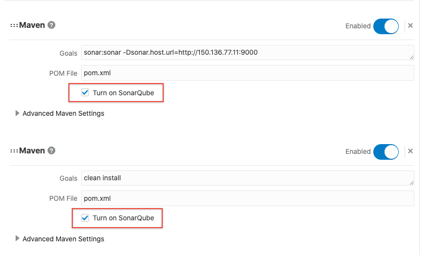
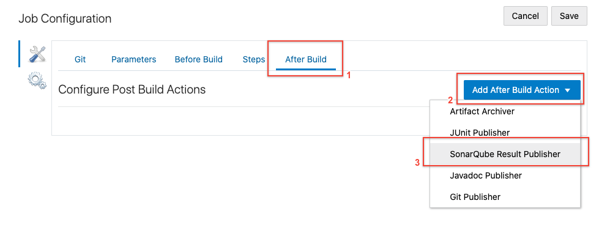
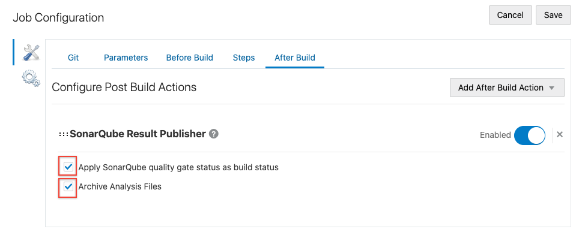
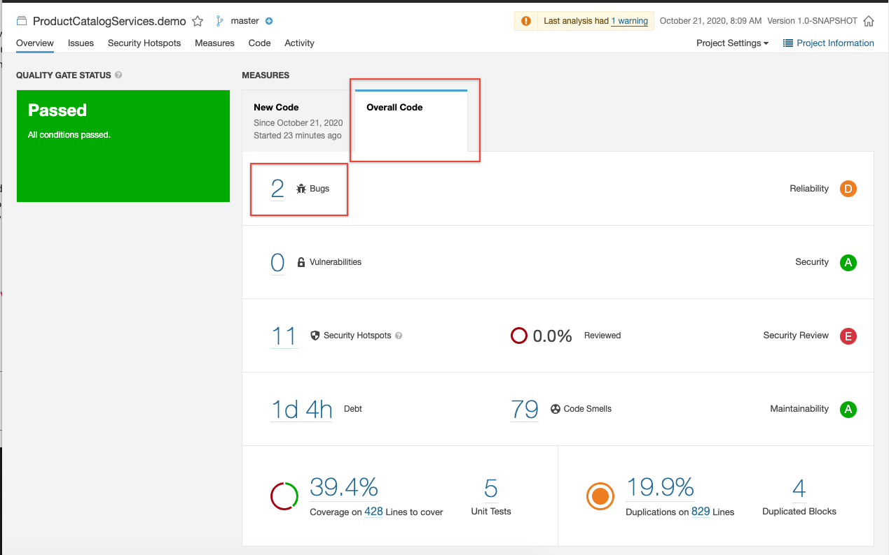

# Deploying SonarQube Application to Compute Instance
## Before You Begin
### Introduction

Welcome to the Automated Code Inspection workshop. This workshop will walk you through application lifecycle management with embedded code review using SonarQube. It will showcase how SonarQube can save time and improve code quality directly inside the agile development process.

### Objectives

- Deploy the SonarQube server to the Compute Instance
- Verify the Server Deployment and run analysis

### Required Artifacts

For this lab you will need Oracle Cloud account and Developer Cloud service instance.

## **STEP 1**: Create Build Job to Deploy SonarQube Docker Image in Compute Instance.

1. Click on **Build** in the left panel and then click on **Create Job**

    

2. Give the name for Job. We name it ```deploySonarQube``` but you can give any name of your choice. Make sure to select template and then click **Create**.

    

3. In the Job configuration page, click on **Before Build** in Job Configuration, next click on **Add Before Build Action** and then select **SSH Configuration**.

    

4. Paste the Private Key downloaded when creating Sonar-Compute Instance in Lab 0. Also select **Setup files in ~/.ssh for command-line tools**

    

5. Next, click on **Steps** and then **Add Step** and select **Unix Shell** under **Common Build Tools**.

    

6. Paste the following commands in the Unix Shell.  

```
<copy>
ssh -o StrictHostKeyChecking=no opc@<SONARQUBE_SERVER_URL> '
sudo yum install -y yum-utils \
  device-mapper-persistent-data \
  lvm2
sudo yum-config-manager \
    --add-repo \
    https://download.docker.com/linux/centos/docker-ce.repo
sudo yum -y install docker-ce docker-ce-cli containerd.io
sudo systemctl start docker
sudo docker pull sonarqube
sudo firewall-cmd --zone=public --permanent --add-port=9000/tcp
sudo firewall-cmd --reload
sudo docker run --detach -p 9000:9000 sonarqube
'
</copy>
```

7. NOTE: In the above commands what we are doing is:
    - SSH into the instance
    - Install docker in instance
    - Start docker
    - Pull sonarQube docker image
    - Open firewall  
    - open port 9000 and run docker image
    - exit ssh

    

8. **Enter your public IP** on line 2, for the virtual machine called sonar_compute that you created earlier.

  

9. Click **Save**

    

## **STEP 2**: Run the Build Job and Check Server Deployment

1. Click on **Build now**

    

2. Once the job is running click on **Build Log** to check the log and see what steps are being performed.

    

3. Scroll down till the end of log to see success message.

    

## **STEP 3**: Configure Developer Cloud Service to Use SonarQube

1. Click on **Project Administration** from the left panel and select **Build**.

  

2. Then click on **Add SonarQube Server Connection**

    

3. In the form fill out details and click **Create**.

  ```
  <copy>
  Server Name: SonarQubeServer
  SonarQube Server URL: http://<SONARQUBE_SERVER_URL>:9000
  Username: admin
  Pasword: admin
  </copy>
  ```
  

4. Once added let's test if the connection works. **Click on the connection** you just created so it is highlighted. Select **Test Connection** and then check the message for the status.

    

5. Go back to Build tab in the left panel and click on the **Job created in Lab 100** (i.e build_maven) and click on **Configure**

    

    

6. Click on **Before Build**, then click on **Add Before Build Action** and select **SonarQube Settings**.

    

7. Select the Sonar Server which we created in previous step from the dropdown list.

    

8. Go the **Steps** and the click **Add Step** and select **Maven**.

    

9. Here add the sonarQube server URL in **Goals** using the following command and then click **Save** once done.

  ```
  sonar:sonar -Dsonar.host.url=http://<SONARQUBE_SERVER_URL>:9000
  ```

10. NOTE: Make sure to change the URL in the above command. It should Public IP address of the compute instance and the port which is 9000 for accessing SonarQube server.

    

11. Go the **After Build** and the click **Add After Build Action** and select **SonarQube Result Publisher**. After adding make sure to check both checkbox.

    
    

12. Click on **Build Now** and once the job starts building click on **Build Log**

    

13. Check the logs, scroll down to see the status.

    

14. Check the IP to see the dashboard.


## **STEP 4**: Check the Analysis

1. To check the analysis done by SonarQube, go to the _`SONARQUBE_SERVER_URL`_ and port :9000 at the end of url.

    

Note: _`SONARQUBE_SERVER_URL`_ is public IP address of the instance used in previous step.

2. Click the **Login  Button** and enter:
  ```
  Username: admin
  Password: admin
  ```
  

3. Click on the **Projects** in the Navbar and then click on project which in our case is **jersey_example**

    

4. You will see the analysis report in the overview, to check the issues, bugs click on **Issues**.

    

5. The panel on the left side displays all the bugs reported in the code.

    

 **You are now ready to move to the next lab: Lab 3: Fix Issues in the Code**

## Acknowledgements

- **Authors/Contributors** - Varun Yadav
- **Last Updated By/Date** - October 21, 2021
- **Workshop Expiration Date** - October 15, 2021

## See an issue?
Please submit feedback using this [form](https://apexapps.oracle.com/pls/apex/f?p=133:1:::::P1_FEEDBACK:1). Please include the *workshop name*, *lab* and *step* in your request.  If you don't see the workshop name listed, please enter it manually. If you would like for us to follow up with you, enter your email in the *Feedback Comments* section. 