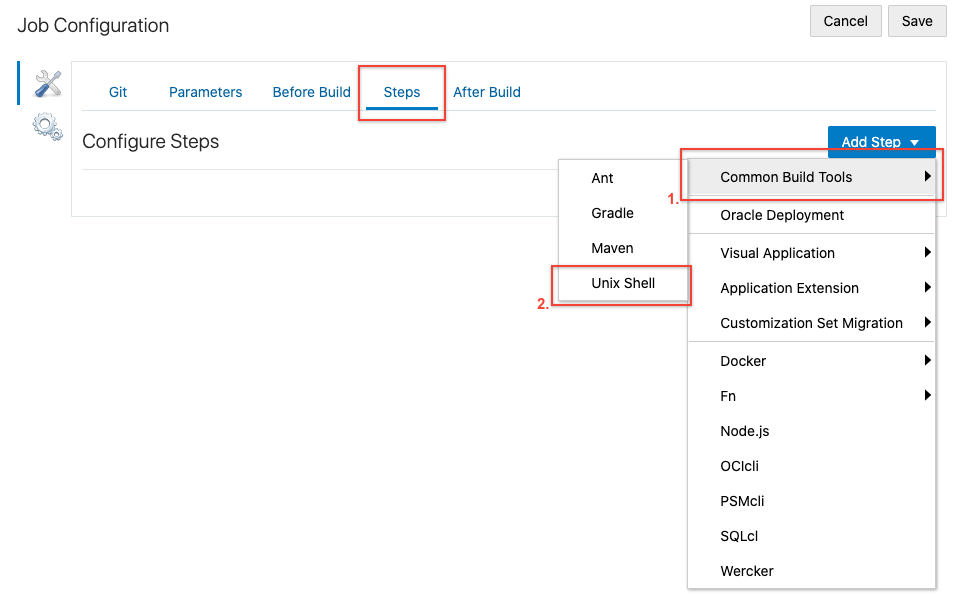

# Containerize and Deploy Application in Compute Instance

## Before You Begin

### Introduction

Welcome to the Automated Code Inspection workshop. This workshop will walk you through application lifecycle management with embedded code review using SonarQube. It will showcase how SonarQube can save time and improve code quality directly inside the agile development process.

### Objectives

- Create docker image and push it to Docker Hub.
- Create compute instance using Docker image.
- Test the application.

### Required Artifacts

For this lab you will need Github and Oracle Cloud account Hub Accounts. Use the following links to set up:

## **STEP 1**: Create Build Job to Create and Push Docker Image to Registry

1. Continuing the previous lab, make sure to be in Visual Builder Studio Instance.
2. Create Build Job. Click on **Builds** in left panel and then click **Create Job**.

    

3. Give name to job and select template.

    

4. Click on **git** in the Job configuration, click on **add Git** and then make sure to select correct git repository.

    

5. Click on **Steps** , **Add step** , select Docker and then **Docker login**.

    

6. Enter username and password of the docker hub account. **Note: If you don't have docker account, create one from [Docker Hub website](https://hub.docker.com)**

    

7. Again click on **Steps** , **Add step** , select Docker and then **Docker build**.

    

8. Enter Registry host, desired name for the image (twitter-feed), tag (latest) and source (we have it in git repo)

    

9. Once again click on **Steps** , **Add step** , select Docker and then **Docker push**.

    

10. Enter registry host and name of the image and then click **Save** on top of the page.

    

11. Click on **Build Now** to run the job and see the build logs to see if it is successful.

    

12. To confirm go to [Docker Hub website](https://hub.docker.com) and click on **repositories** in navigation bar.

    

## **STEP 2**: Create Build Job to Run Docker Image in Compute Instance

1. Create another Build Job. Click on **Builds** in left panel and then click **Create Job**.

    

2. Give name to job and select template.

    

3. Click on **Before Build** in Job configuration, **Add Before Build Action** and then select **SSH configuration**.

    

4. Paste the private key used to create javaWebService Compute Instance in Lab 0 and select option **Setup files in ~/.ssh for command line tools**.

5. Note: You can use your own keys but to keep the lab guide easy we are providing one for you.

    

6. Next, click on **Steps** and then **Add Step** and select **Unix Shell** under **Common Build Tools**.

    

7. Paste the below command to the shell.

  _NOTE: Replace the IP address with the IP address of your JavaWebService compute image created in lab 050, docker image name from your docker hub._

  ```
  <copy>
  ssh -o StrictHostKeyChecking=no opc@ENTER_THE_IP_ADDRESS_HERE_OF_JavaWebService_INSTANCE '
  sudo yum install -y yum-utils \
    device-mapper-persistent-data \
    lvm2
  sudo yum-config-manager \
      --add-repo \
      https://download.docker.com/linux/centos/docker-ce.repo
  sudo yum -y install docker-ce docker-ce-cli containerd.io
  sudo systemctl start docker
  sudo docker pull DOCKER_IMAGE_NAME
  sudo firewall-cmd --zone=public --permanent --add-port=8080/tcp
  sudo firewall-cmd --reload
  sudo docker run --detach -p 8080:8080 DOCKER_IMAGE_NAME
'
  ```

8. Paste the commands in Unix Shell and click **Save**.

    

9. Click on **Build Now** to run the Job. Check the logs for message.

    

10. To confirm everything is deployed successfully. Go to your **IP_address:8080/statictweets**.

    


## Acknowledgements

- **Authors/Contributors** - Varun Yadav
- **Last Updated By/Date** - 
- **Workshop Expiration Date** - October 15, 2021

## See an issue?
Please submit feedback using this [form](https://apexapps.oracle.com/pls/apex/f?p=133:1:::::P1_FEEDBACK:1). Please include the *workshop name*, *lab* and *step* in your request.  If you don't see the workshop name listed, please enter it manually. If you would like for us to follow up with you, enter your email in the *Feedback Comments* section. 