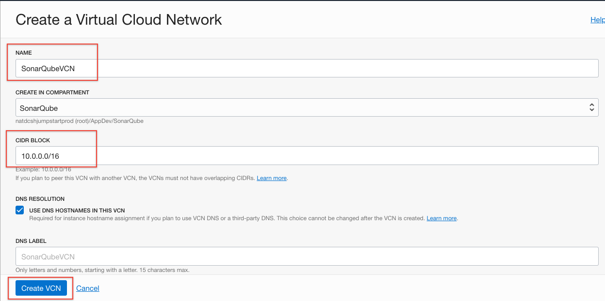
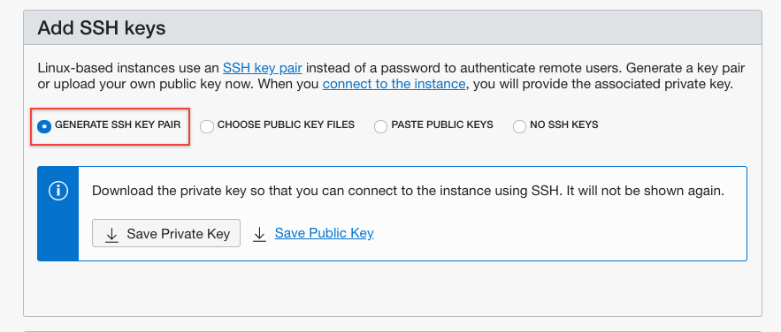
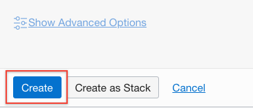

# Setup trial account

## Before You Begin
### Introduction

Welcome to the Automated Code Inspection workshop. This workshop will walk you through application lifecycle management with embedded code review using SonarQube. It will showcase how SonarQube can save time and improve code quality directly inside the agile development process.

### Objectives

- Get Started With Oracle Cloud Infrastructure
- Create Developer Cloud instance
- Create VCN, compartment and compute instance.

## **Step 1:** Login to your Tenancy

1. Once you see the page, click on **Create Instance**

    

2. In the form give the name to the Instance, we give it name Demo but you can choose whatever you prefer. In region select **No Preference**, click **Next**

    

3. Confirm the details and click on **Create**

    

## **STEP 2**: Create Compartment

1. Click on the hamburger menu on the top left and then scroll to **Identity** and then click **Compartments** .

    

2. Click on create compartment

    

3. Fill out the details Name, description and then click **Create Compartment**

    

## **STEP 3**: Create VCN and Edit Security Rules

1. Once the Compartment is ready, we will create VCN. Click on the hamburger menu on the top left, **Networking** and then click on **Virtual Cloud Networks**

    

2. Make sure to select **sonarQube** compartment and then click on **Create Virtual Cloud Network**

    

3. Add a Name for your VCN and select the second option **CREATE VIRTUAL CLOUD NETWORKS PLUS RELATED RESOURCES**

    

4. Once you see the VCN created click select the close button to proceed.

    

5. Click on **Security List**

    

6. By default one security list is created when you create the VCN, click on it.

    

7. Click on **Add Ingress Rules**.
    

8. Enter Source CIDR 0.0.0.0/0 and destination port range **9000,8080**. We are opening port 9000 which is default port for running SonarQube, which we will deploy in next lab, and port 8080 which is default for our web service which we will deploy in lab 400.

    

9.  Once saved you can see the Ingress Rules as below.

    

## **STEP 4**: Create SonarQube Instances

1. Click on the hamburger menu on top right, then Compute and then click on **Instances**.

    

2. Once you see the instances page, make sure to select right compartment and then click on **Create Instance**

    

3. Give name of the instance, select availability domain.

    

4. Click on **Generate SSH Key Pair** and download Private and Public Key.
    
    

5. - Click **Create**

    

## **STEP 5**: Create Compute Instance for hosting Java Web Service

1. Click on the hamburger menu on top right, then Compute and then click on **Instances**.

    

2. Once you see the instances page, make sure to select right compartment and then click on **Create Instance**

    

3. Give name of the instance, select availability domain.

    

4. Click on **Generate SSH Key Pair** and download Private and Public Key.

   

5. Click **Create**

    

- **You are now ready to move to the next lab: Lab 1:Configure Visual Builder Studio**

## Acknowledgements

- **Authors/Contributors** - Varun Yadav
- **Last Updated By/Date** - October 21, 2021
- **Workshop Expiration Date** - October 15, 2021

## See an issue?
Please submit feedback using this [form](https://apexapps.oracle.com/pls/apex/f?p=133:1:::::P1_FEEDBACK:1). Please include the *workshop name*, *lab* and *step* in your request.  If you don't see the workshop name listed, please enter it manually. If you would like for us to follow up with you, enter your email in the *Feedback Comments* section. 