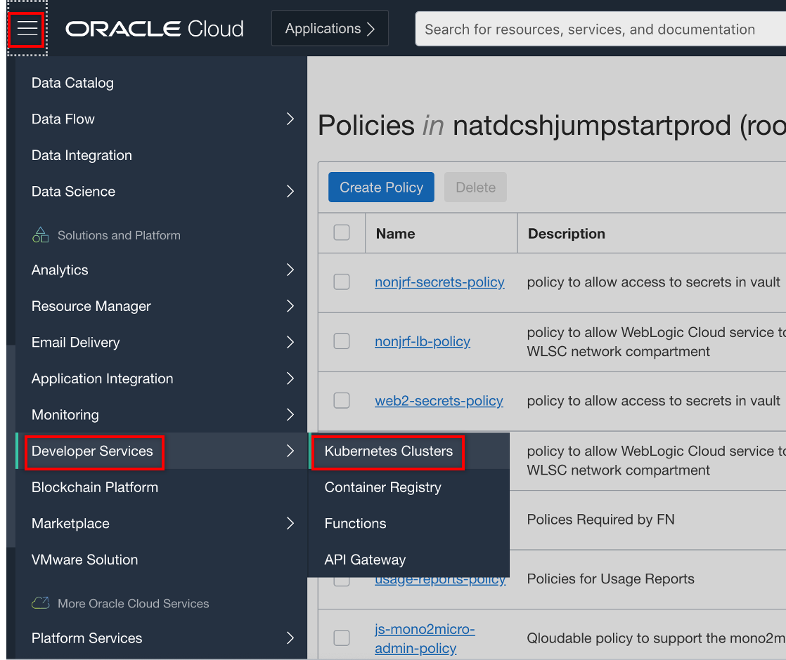
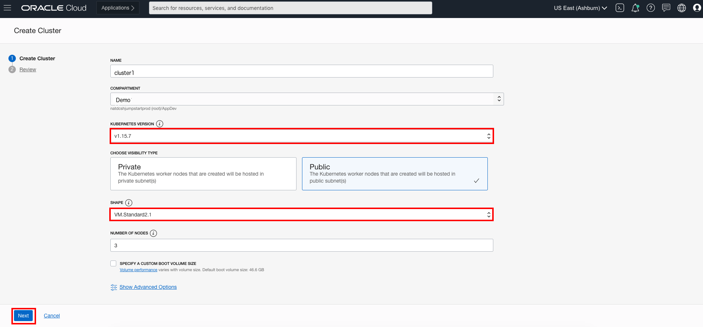
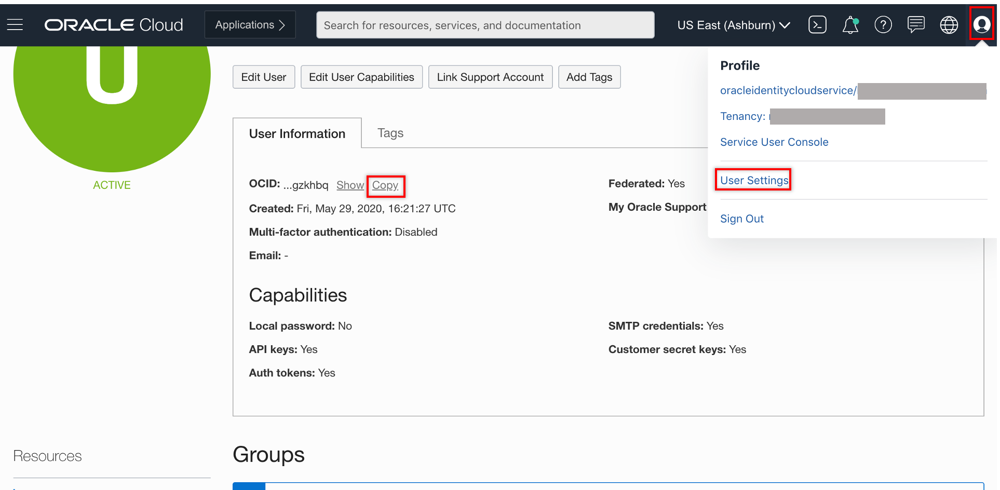

# Create Oracle Container Engine for Kubernetes (OKE) on Oracle Cloud Infrastructure (OCI) #

## Introduction
This lab shows you the way the **Quick Start** feature creates and configures all the necessary resources for a three node Kubernetes cluster. All the nodes will be deployed in different availability domains to ensure high availability.

Estimated Lab Time: 15 minutes

### About OKE
Oracle Cloud Infrastructure Container Engine for Kubernetes is a fully-managed, scalable, and highly available service that you can use to deploy your container applications to the cloud. A Kubernetes cluster is a group of nodes. The nodes are the machines running applications. Each node can be a physical machine or a virtual machine. The node's capacity (its number of CPUs and amount of memory) is defined when the node is created. You can access Container Engine for Kubernetes to define and create Kubernetes clusters using the Console and the REST API. You can access the clusters you create using the Kubernetes command line (kubectl), the Kubernetes Dashboard, and the Kubernetes API.

### Objectives
- Create Compartment
- Create a policy
- Create an OKE cluster
- Startup OCI Cloud Shell
- Configure kubectl
- Set up the RBAC policy for the OKE cluster

### Prerequisites

* An Oracle Paid or LiveLabs Cloud account.
* Google Chrome browser (preferred)
* Lab: Prerequisites

## **STEP 1**: Create a Compartment for your Kubernetes nodes

Compartments are used to isolate resources within your OCI tenant. Role-based access policies can be applied to manage access to compute instances and other resources within a Compartment.

  1.  Login to Oracle Cloud
   
  2. Click the **hamburger icon** in the upper left corner to open the navigation menu. Under the **Identity** section of the menu, click **Compartments**

    

  3. If you have a **Demo** compartment already, _**SKIP THIS STEP**_. Otherwise, Click **Create Compartment**

    

  4. In the **Name** field, enter `Demo`. Enter a description of your choice. In the **Parent Compartment** field, ensure that the `root` compartment is selected (it will have the same name as your Oracle Cloud Account). Click **Create Compartment**.

    


## **STEP 2**: Create a policy 
A service policy allows OKE to create resources in your tenancy, such as compute. An OKE resource policy or policies let you specify which groups in your tenancy can perform certain tasks with the OKE API.

Optionally, create more resource policies if you want to control which groups can access different parts of the OKE service.

1.  Open the navigation menu. Under **Identity**, select **Policies**.

  

2.  In the left side menu, select a "root" compartment for your account (see screenshot below). A list of the policies in the compartment you're viewing is displayed. If you want to attach the policy to a compartment other than the one you're viewing, select the desired compartment from the drop down list on the left. Click **Create Policy**.

  

    Enter the following:

    - **Name:** A unique name for the policy. The name must be unique across all policies in your tenancy. You cannot change this later.
    - **Description:** A user friendly description.
    - **Policy Versioning:** Select **Keep Policy Current**. It ensures that the policy stays current with any future changes to the service's definitions of verbs and resources.
    - **Statement:** A policy statement. It MUST be: `allow service OKE to manage all-resources in tenancy`.
    - **Tags:** Don't apply tags.

3.  Click **Create**.

  

## **STEP 3**: Create an OKE cluster 

The *Quick Create* feature uses the default settings to create a *quick cluster* with new network resources as required. This approach is the fastest way to create a new cluster. If you accept all the default values, you can create a new cluster in just a few clicks. New network resources for the cluster are created automatically, along with a node pool and three worker nodes.

1.  In the Console, open the navigation menu. Under *Solutions, Platform and Edge*, go to *Developer Services* and select **Kubernetes Clusters**.

  

2.  On the Cluster List page, click **Create Cluster**.

  

3.  In the Create Cluster Solution dialog, select *Quick Create* and click **Launch Workflow**.

  

4. Select **Quick Create** to create a new cluster with the default settings, along with new network resources for the new cluster.

  The Create Virtual Cloud Network panel shows the network resources that will be created for you by default, namely a VCN, two load balancer subnets, and three worker node subnets.

5. Specify the following configuration details on the Cluster Creation page:
      - **Name**: The name of the cluster. Leave the default value.
      - **Compartment**: The name of the compartment. Leave the default value.
      - **Kubernetes version**: The version of Kubernetes. **Select 15.7 or lower** (Don't select version 16 even if it is default version; please select version 15 in such cases.)
      - **Choose Visibility Type**: Is the cluster going to be routable or not. Select Public.
      - **Shape**: The shape to use for each node in the node pool. The shape determines the number of CPUs and the amount of memory allocated to each node. The list shows only those shapes available in your tenancy that are supported by OKE. Select the available *VM.Standard2.1*.
      - **Number of nodes**: The number of worker nodes to create. Leave the default value, *3*


4.  Click **Next** to review the details you entered for the new cluster.

  

5.  On the *Review* page, click **Submit** to create the new network resources and the new cluster.

  
  

6.  You see the network resources being created for you.

  

7.  Click **Close** and the new cluster is shown on the *Cluster Details* page. When it has been created, the new cluster has a status of *Active*.

## **STEP 4**:  OCI Cloud Shell 

Oracle Cloud Infrastructure (OCI) Cloud Shell is a web browser-based terminal, accessible from the Oracle Cloud Console. Cloud Shell provides access to a Linux shell, with a pre-authenticated Oracle Cloud Infrastructure CLI and other useful tools (*Git, kubectl, helm, OCI CLI*) to complete the operator tutorials. Cloud Shell is accessible from the Console. Your Cloud Shell will appear in the Oracle Cloud Console as a persistent frame of the Console, and will stay active as you navigate to different pages of the Console.

1.  Click the Cloud Shell icon in the Console header (top right area in the browser).

  

2.  Wait a few seconds for the Cloud Shell to appear.

  

You can minimize and restore the terminal size at any time.

## **STEP 5**: Configure kubectl

Your Cloud Shell comes with the OCI CLI pre-authenticated, so there’s no setup to do before you can start using it.

1.  To complete the `kubectl` configuration, click **Access Kubeconfig** on your cluster detail page. (If you moved away from that page, then open the navigation menu and under **Developer Services**, select **Clusters**. Select your cluster and go the detail page.

  

  A dialog appears which contains the customized OCI command that you need to execute, to create a Kubernetes configuration file.

2.  Select the **Copy** link to copy the `oci ce...` command to Cloud Shell, then close the configuration dialog before you paste the command into the terminal.

  
3. For example, the command looks like the following:
  ```bash
  $ oci ce cluster create-kubeconfig --cluster-id ocid1.cluster.oc1.THIS_IS_EXAMPLE_DONT_COPY_PASTE_FROM_HERE --file $HOME/.kube/config --region us-phoenix-1 --token-version 2.0.0
  New config written to the Kubeconfig file /home/peter_nagy/.kube/config
  ```
4. Now check that `kubectl` is working, for example, using the `get node` command:
  ```
  bash
  $ <copy>kubectl get node</copy>
  NAME        STATUS   ROLES   AGE    VERSION
  10.0.10.2   Ready    node    117m   v1.15.7
  10.0.10.3   Ready    node    116m   v1.15.7
  10.0.10.4   Ready    node    117m   v1.15.7
  ```
3.  If you see the node's information, then the configuration was successful.
  

## **STEP 6**:  Set up the RBAC policy for the OKE cluster 

In order to have permission to access the Kubernetes cluster, you need to authorize your OCI account as a cluster-admin on the OCI Container Engine for Kubernetes cluster. This will require your user OCID.

1.  In the Console, select your OCI user name and select User Settings. On the user details page, you will find the user OCID. Select Copy and paste it temporarily in a text editor.

  

2.  Then execute the role binding command using your user OCID:
  ```
  <copy>
  kubectl create clusterrolebinding my-cluster-admin-binding --clusterrole=cluster-admin --user=<YOUR_USER_OCID>
  </copy>
  ```

  For example:
  ```bash
  $ kubectl create clusterrolebinding my-cluster-admin-binding --clusterrole=cluster-admin --user=ocid1.user.oc1..AGAIN_THIS_IS_EXAMPLE
  clusterrolebinding.rbac.authorization.k8s.io/my-cluster-admin-binding created
  ```

You may now **proceed to the next lab**.

## Acknowledgements
* **Author** - Sasanka Abeysinghe, August 2020
* **Last Updated By/Date** - Kay Malcolm, August 2020

## See an issue?
Please submit feedback using this [form](https://apexapps.oracle.com/pls/apex/f?p=133:1:::::P1_FEEDBACK:1). Please include the *workshop name*, *lab* and *step* in your request.  If you don't see the workshop name listed, please enter it manually. If you would like for us to follow up with you, enter your email in the *Feedback Comments* section.