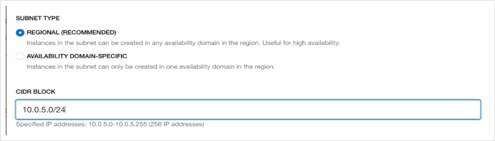

# Lab 400: Provision the Database on OCI

## Introduction: 

While the WebLogic instances are provisioning, it's possible to move forward with the Application Database provisioning as soon as the VCN is provisioned.

Before we can provision the Application Database, we need to provision a **private subnet** for the **Database System** with appropriate **Security Lists** to open up the required ports: 
- port 1521 for the database, 
- port 22 for SSH.

## Step 1) Create a Security List for the database subnet

In this section we will create a Security List for the WebLogic subnet to be able to reach the Database subnet on port 1521 (the Oracle Database default port)

- Go to **Networking -> Virtual CLoud Network** in the compartment where WebLogic was provisioned.

  

- Click the VCN that was created by the stack, which would be called `nonjrf-wls` if you used the same naming conventions.

  

  You should find 2 subnets: a `nonjrf-lb-subnet` and a `nonjrf-wls-subnet`, both public subnets since the WebLogic server instances were provisioned in a public subnet.

- Copy the CIDR block of the `nonjrf-wls-subnet` (which should be 10.0.3.0/24) and click **Security Lists** on the left-side menu

  

- Click **Create Security List**

  

- **Name** the security list `nonjrf-db-security-list`

  

- Click **Additional Ingress Rule**

  

- For **Source CIDR**, paste the CIDR block of the `nonjrf-wls-subnet` copied earlier (`10.0.3.0/24`) and for **Destination Port Range** enter **1521**

  

- Click **Additional Ingress Rule** and enter `0.0.0.0/0` for the **Source CIDR** and enter `22` for the **Destination Port Range** to authorize SSH from outside (through the bastion host) 

  

## Step 2) Create the database subnet

- Click **Subnets** on the left-side menu

  

- Click **Create Subnet**

  

- **Name** the subnet `nonjrf-db-subnet`

  

- Keep the defaults for the **Subnet Type** and enter a CIDR block of `10.0.5.0/24`

  

- **Select** the `Default Routing Table for nonjrf-wls` for the **Routing Table**

  

- Select **Private Subnet**

  

- Keep the defaults for the DNS resolution and label and select `Default DHCP Options for nonjrf-wls` for **DHCP Options**

  

- **Select** the `nonjrf-db-security-list` created earlier for the **Security List**

  

- and click **Create Subnet**

  

## Step 3) Provision the Database System

- Go to **Database -> Bare Metal, VM and Exadata**

  

- Click **Create DB System**

  

- Make sure you are in the **Compartment** where you created the DB subnet, and name your **Database System**

  

- Select an Availability Domain or keep the default, keep the default **Virtual Machine** and select a **Shape** that is available.

  

- Keep the defaults for **Total node count** and **Database Edition**

  

- Select **Logical Volume Manager** 

  

- Keep defaults for **Storage**

  

- **Upload** the **SSH public key** created earlier, and if you have another, upload it as well for safety.
  The key created in the container can be found in the folder `./on-prems-setup/common`

  

- Keep the default **License Included**

  

- Select the **Virtual cloud network** `nonjrf-wls`, the **Client subnet** `nonjrf-db-subnet` and set a **Hostname prefix** of `db`

  

- Click **Next**

- Name the Database `RIDERS` like the database on-premises (required for proper migration)

  

- Keep the default **Database version** 19c

  

- Name the **PDB** `pdb` as it is on premises

  

- Enter and confirm the **SYS Database password** as it is on-premises: `YpdCNR6nua4nahj8__`
This is found in the `env` file under `DB_PWD` in the `on-prems-setup/weblogic` folder

  

- Keep the default of **Transaction Processing** for **Workload type** and **Backup**, and click **Create DB System**

  

This will take 20 to 40 minutes to provision.

  

## Step 4) Gather the OCI database information

Once the database system is provisioned

- Go to the `nodes` left-side menu and note the **private IP address** of the node provisioned for later use

  

- Go to **DB Connection** 

  

- Copy the **DB connection string** for later use

  
