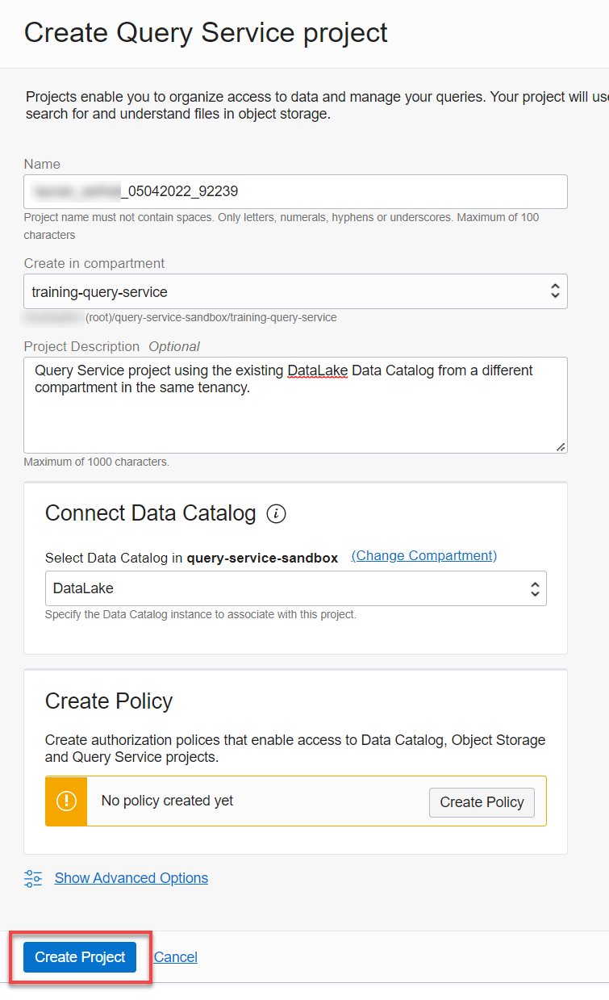
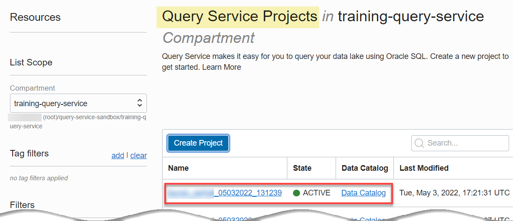
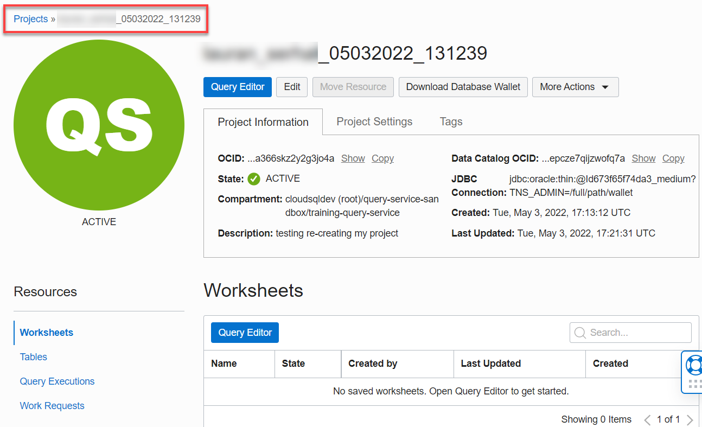

# How do I create an OCI Query Service project?
Duration: 5 minutes

### Prerequisites
* An Oracle Cloud Account.
* An optional compartment for your Query Service project and resources.
* An OCI Data Catalog that contains at least one Oracle Object Storage data asset that have been harvested to generate the logical data entities that will be used by Query Service. For a detailed instructions on creating a Data Catalog data asset and harvesting it, see **Lab 2: Harvest Technical Metadata from Oracle Object Storage** in the [Access the Data Lake using Autonomous Database and Data Catalog](https://apexapps.oracle.com/pls/apex/dbpm/r/livelabs/view-workshop?wid=877&clear=180&session=103071880685237) Livelabs workshop.

* The required policies to allow access to the Data Catalog, Object Storage, and Query Service projects.

## Create a Query Service Project

1. Sign in to the Oracle Cloud Infrastructure Console.

2. Open the **Navigation** menu and click **Analytics & AI**. Under **Data Lake**, click **Query Service**. For LA, I might say Use the URL that was provided to you by Oracle to access Query Service.    
_**Note: Petr submitted a ticket to add Query Service under Data Lake, Jira # CSQL-3724. Currently, Query Service is only accessible from the Slack channel link.**_

3. On the **Query Service Projects** page, click **Create Project**.

4. In the **Create Query Service project** panel, specify the following:
    * **Name:** Accept the default name.
    * **Create in compartment:** Select the compartment where you'd like to create this project. Click the **Create In Compartment** drop-down list and start typing the compartment's name in the **Search compartments** text field. Once you see your compartment, click it. In this example, we selected the **`training-query-service`** compartment.
    * **Project Description:** Enter a description which is at least 6 characters long.
    * **Connect Data Catalog:** Select the compartment that contains the Data Catalog to which you want to connect from the drop-down list. Click the **Change Compartment** link to search for Data Catalog if it's in a different compartment. In this example, we selected the **`query-service-sandbox`** compartment which contains a data catalog named **DataLake**.

    >**Note:** If you don't have a Data Catalog instance, click **Create Data Catalog** to create a new one. Next, see **Lab 2: Harvest Technical Metadata from Oracle Object Storage** in the [Access the Data Lake using Autonomous Database and Data Catalog](https://apexapps.oracle.com/pls/apex/dbpm/r/livelabs/view-workshop?wid=877&clear=180&session=103071880685237) Livelabs workshop for detailed information on how to create and harvest a data asset..

      

    * **Create Policy:** In **Query Service LA** version, this section doesn't work. You will have to create the required policies manually. You can click **Create Policy** to view the required policies that you need to create. This is covered in another workshop that you can select from the **Contents** menu on the left.  

      

5. The Query Service project is created and displayed in the **Query Service Projects** page.   

    

6. To use the newly created Query Service project, click the project's name link in the **Name** column.

    

7. From the **Query Service Projects** page, you can also click **Query Editor** in the **Actions** column.

      

    The Scratchpad worksheet is displayed. This will be explained in another workshop that you can select from the **Contents** menu on the left.  

      

## Learn More

* [Signing In to the Console](https://docs.cloud.oracle.com/en-us/iaas/Content/GSG/Tasks/signingin.htm).
* [Data Catalog Documentation](https://docs.oracle.com/en-us/iaas/data-catalog/home.htm)
* [Data Catalog Policies](https://docs.oracle.com/en-us/iaas/data-catalog/using/policies.htm)
* [Oracle Cloud Infrastructure Documentation](https://docs.oracle.com/en-us/iaas/Content/GSG/Concepts/baremetalintro.htm)
* [Access the Data Lake using Autonomous Database and Data Catalog Workshop](https://apexapps.oracle.com/pls/apex/dbpm/r/livelabs/view-workshop?wid=877)
