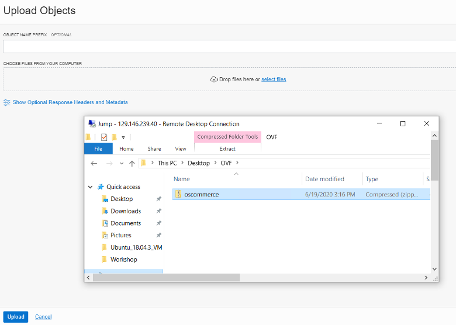

# Exporting the Snapshot of an Application Virtual Machine

## Introduction

In this lab, we will export the on-premises workload into a format that can be imported into OCVS. For this, we will simulate an on-premise environment using VMWare Workstation. The VMWare Workstation can be easily installed on a laptop or another virtual machine. After that, we will configure an e-Commerce application on the infrastructure and export the workload in the form of a .ovf file and upload it to a bucket in Object Storage. This .ovf file be downloaded and imported into OCVS in the next lab. 

**This lab is optional. Should you wish to skip this part, please download the zipped VMDK files contained [here](https://objectstorage.us-ashburn-1.oraclecloud.com/p/H3bRU5d3eP76yjLry558pwp9tmpcbLxbNdyxWo_VRWI/n/orasenatdpltintegration02/b/OCVSDemo/o/oscommerce.zip).**

## Objectives
- Export a VM as a .ovf file from on-premises VMWare infrastructure.
- Create an object storage bucket and upload the OVF file 

## Required Artifacts
- [VMWare Workstation](https://www.vmware.com/go/getworkstation-win) on a Windows Laptop or [VMWare Fusion Pro](https://www.vmware.com/products/fusion/fusion-evaluation.html) for Mac
- An Object Storage bucket with the required IAM privileges.

## Additional Resources
To learn more about the some of terms that we will be using, please follow the relevant links.
- [Object storage](https://docs.cloud.oracle.com/iaas/Content/Object/Concepts/objectstorageoverview.htm)
- [ovf format](https://docs.vmware.com/en/VMware-vSphere/6.5/com.vmware.vsphere.vm_admin.doc/GUID-AE61948B-C2EE-436E-BAFB-3C7209088552.html) 

## Steps

### STEP 1: Download VMware Workstation and Import Ubuntu Instance

This section outlines the installation of VMWare workstation and how to configure an e-Commerce application. 

- Download and Install the latest VMWare for your platform ([Windows](https://www.vmware.com/go/getworkstation-win), [Mac OS](https://www.vmware.com/products/fusion/fusion-evaluation.html))

**Note**: Mac users need to download the Pro version from the page.

- Download the [Ubuntu.ovf](https://objectstorage.us-ashburn-1.oraclecloud.com/p/sOmBe0So96uG2zYVIjywBSXp_wSgfolSvYj3_0JJF8M/n/orasenatdhubsred01/b/oscommerce-workshop/o/ubuntu.zip) file. 

- Open VMware Workstation and click on **File** and then **Open**. Select the **ubuntu.ovf** file that you downloaded, earlier.

- Provide a name for the virtual machine. We will be using the name **oscommerce** going forward. Also, specify a path for the VM. After that, click on **Import**.

- The VMware Workstation will read the settings from the ovf file, automatically and will take you to the settings for the VM. You should be able to see the following settings: 

- Once complete, you will see the osCommerceDemo VM listed. Hit the **Green Start Arrow** to boot up the VM. 

- You will see a login screen for the user **oscommerce**. Enter **oscommerce** in the password field. This completes the import of Ubuntu to VMware Workstation. 

We we will now use this virtual machine to host the osCommerce application.
 
### STEP 2: Install and Setup LAMP (Linux, Apache, MySQL, PHP) & SSH

Before we begin, please verify that internet is working on the oscommerce VM. We will need to connect to the internet to install the required packages. In case of issues, shut down the virtual machine and disable/turn off any VPN applications/programs. After doing so, power up the Ubuntu virtual machine. This will allow the Ubuntu Virtual Machine to download and install Linux packages.

- Install MySQL5

    Open up a terminal session. The keyboard shortcut for the same is Ctrl + Atl + T. Now, run the following command in the terminal to install MySQL:
        
        sudo apt-get install mysql-server mysql-client

    You will be prompted to provide a password for the MySQL **root** user. This password would be valid for the user, root@localhost, as well as, root@server1.example.com. Hence, we would not be required to manually specify a MySQL root password, later on. 
    
    **NOTE**: Write this password down in a secure location. You will need it for multiple times, going forward.

    Run the following command to complete the installation:

        mysql_secure_installation

    After running this command, you will be asked to answer a few questions within the terminal window. Your current password would be the one that you just set.

        Enter current password for root (enter for none): Type Root Password

        Change The Root Password? N

        Remove Anonymous Users? Y

        Disallow Root Login Remotely? Y

        Remove test database and access to it? Y

        Reload Privilege Tables now? Y

- Install Apache2

    Run the following command within the terminal on the VMware Workstation.

        sudo apt-get install apache2

    Once Apache is installed, open your browser and navigate to localhost. You should be able to see the Apache2 placeholder page.

    

- Install PHP7

    Install PHP7 and Apache PHP7 modules with the command, below:

        sudo apt-get install php libapache2-mod-php php-mysql.

    If the command above doesn't work, use the following command:

        sudo apt-get install php7.4.3 libapache2-mod-php7.4.3 php7.4.3-mysql

    Restart Apache:

        sudo service apache2 restart

- Configure osCommerce Database and User

    Log into the database as an administrator using the terminal within the VMware Workstation environment:

        mysql -u root -p

    Create a database named **oscommerce**.

        CREATE DATABASE oscommerce;

    We will also create a database user named **oscommerceuser**. Replace the **type password here** with a password of your choosing. In this example, we used oscommerce as our password for the sake of simplicity. Regardless of what you choose, it is highly recommended that you write down the password, as you will need it for other portions of the lab. 
    
    Please type the following commands, manually, to avoid formatting issues. 

        CREATE USER oscommerceuser@localhost IDENTIFIED BY 'type_password_here';

    Grant the user access to the database and flush the privileges:

        GRANT ALL PRIVILEGES ON oscommerce.* TO oscommerceuser@localhost;
        
        FLUSH PRIVILEGES;

    Exit mysql with command exit;

- Configure Ubuntu to accept SSH Connections

    Setup SSH:

        sudo apt-get install openssh-server
        
        sudo apt-get install ssh

    Install the package below to save persistent iptables updates. Select **Yes** to save Firewall rules.

        sudo apt-get install iptables-persistent

    Allow SSH Connections:

        sudo iptables -A INPUT -p tcp --dport 22 -j ACCEPT

        sudo iptables -A INPUT -p tcp --dport 80 -j ACCEPT

    Check your iptables to see the updated SSH access rules and save the updated rules:

        sudo iptables -L
        
        sudo netfilter-persistent save

        sudo netfilter-persistent reload    

    

### STEP 3: Setup OSCommerce Application

- Make a temporary folder named **tmp** and switch to the new directory. You will download osCommerce files in this folder. 

        mkdir tmp

        cd /tmp/ && wget http://www.oscommerce.com/files/oscommerce-2.3.4.1.zip

    Extract the application from the zip file.

        unzip oscommerce-2.3.4.1.zip

- Run the commands below to copy osCommerce content to the default root directory for Apache2. You can choose to customize Apache2 root directory, but for this lab, we will be using the default location which is **/var/www/html**

        sudo cp -rf oscommerce-2.3.4.1/* /var/www/html/

- Change permissions on the files and give apache2 ownership of the root directory. Restart Apache:

        sudo chmod 777 /var/www/html/catalog/includes/configure.php
    
        sudo chmod 777 /var/www/html/catalog/admin/includes/configure.php
    
        sudo chown www-data:www-data -R /var/www/html/
    
        sudo service apache2 start

Open firefox and navigate to localhost/catalog. You should see the setup wizard; all steps in this installation need to be completed before we can move on. Follow the screenshots below to make sure that the settings are consistent.

- Start the new installation and log in to the MySQL database using the credentials created earlier. If the values differ from those in the screenshot, please make sure that you enter the appropriate values.

    

- Set the location of the **www address** and **web server root directory**.

    

- Finally, set the OSCommerce online store settings info. We recommend that you make a note of the administrator username and password for later reference.

    

- After installation, remove the installation directory to protect your site and change the permissions on sensitive files:

        sudo rm -rf /var/www/html/catalog/install
    
        sudo chmod 644 /var/www/html/catalog/includes/configure.php
    
        sudo chmod 644 /var/www/html/catalog/admin/includes/configure.php

### STEP 4: Configure osCommerce for End User

- Type **localhost/catalog/admin** in the address bar of the browser. You will need to log in with the admin username and password that you entered while setting up your osCommerce Online Store. 

    
  
- Create a New Manufacturer, Category & Product

    Click on **Catalog** in the menu on the left of the page and click on **Manufacturers**. On the next page, click on **Insert** and proceed to enter **Oracle** as the name of the manufacturer. Also, search for Oracle's pretty logo and download it to your machine. You will upload it to be used as the icon for the manufacturer. Once you do so, click **save** to  complete the listing. 

    

    Go to **Categories/Products**, **Hardware** and then click on **New Category**. Name the category **Oracle Hardware**. Upload the same image of the Oracle logo or some other image and click **save**.
    
    

    Now, go to **Categories/Products**, and select **Hardware**. Click on **Oracle Hardware**, then click on **New Product**. Fill out the fields using your imagination. Download another image for the product and attach it to the new product. In the example below, we selected **Oracle Exadata** as the product.

    

    Navigate to **localhost/catalog/index.php**. Your final product would look something like this:

    

### STEP 5: Export OVF File from VMWare Workstation to Object Storage

- From VMware Workstation, shut down the osCommerce     virtual machine (quitting will also have the same result). Export the appliance from VMware Workstation. Set the file location for the .ovf export. Export should take about 5 minutes. While the export is in progress, let us proceed to the next steps.
    
    
    

- Login to your Oracle Cloud tenancy. Click on the hamburger menu in the top left to open the navigation bar. Under **Core Infrastructure**, select **Object Storage**. 

    

- Choose the appropriate compartment from the drop down on the left side of the console.

    

- Click on **Create Bucket**.

    

- In the Create Bucket dialog box, specify the attributes of the bucket:

    **Bucket Name**: Provide a name for your bucket. This name has to be unique within the tenancy.

    **Storage Tier**: Choose the **Standard** tier. 

    Leave the other fields untouched and click the **Create Bucket** button.

    

- Once the bucket is created, select the bucket.

    

- Click on the **Edit Visibility** button.

    

- In the **Edit visibility** box, change the **VISIBILITY** to **PUBLIC** and save the changes.
    
    

- Create a zip file containing the 3 OVF files and upload the zipped file to the bucket that you just created.

   

- Select the bucket you created and then click the blue button within Objects named **Upload Objects**. 

    

    

-  Click **Select Files** and then locate the zipped ovf file.

    

The OVF file has been successfully exported and uploaded to the object storage. Click the three dots next to the .zip file and select **Create Pre-Authenticated Request**. Leave the default selections and click **Create Pre-Authenticated Request**. Copy the pre-authenticated request URL. This will be used later,  when creating the custom image.

