# Extending your Application deployed in OCVS with OCI Service

## Introduction

In this lab, we will extend the application that we deployed in the VMWare SDDC in Lab 300 by integrating it with OCI services like File Storage Service and Load Balancer.

## Objectives
- Setup a load balancer in front of your oscommerce application
- Provide Network file system capabilities through File Storage Service through a file storage mount point.
<!-- Enable REST end points for your application data using Oracle Integration Cloud -->

## Required Artifacts
- Required IAM permissions to create a File Storage Service instance, a Load Balancer and an Integration Cloud instance.

## Use Cases

### Use Case 1: Set up Load Balancer in front of osCommerce Application

- Create Load Balancer

    Navigate to the menu. Under **Networking**, select the Load Balancer. On the next page, hit the **Create Load Balancer** button.

    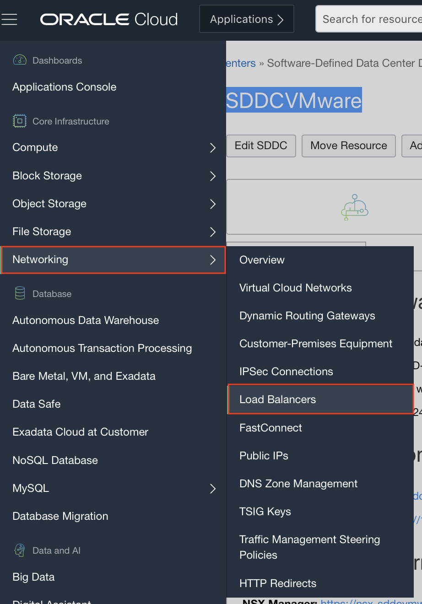
    

    In the details page, provide a name to your Load Balancer and set the **Visibility Type** to Public. Let the **Maximum Total Bandwidth** be Small. The VCN should be the same, as our VMWare solution. The subnet should be a regional subnet in the same VCN. Once, all of this done, click on **Next**. 

    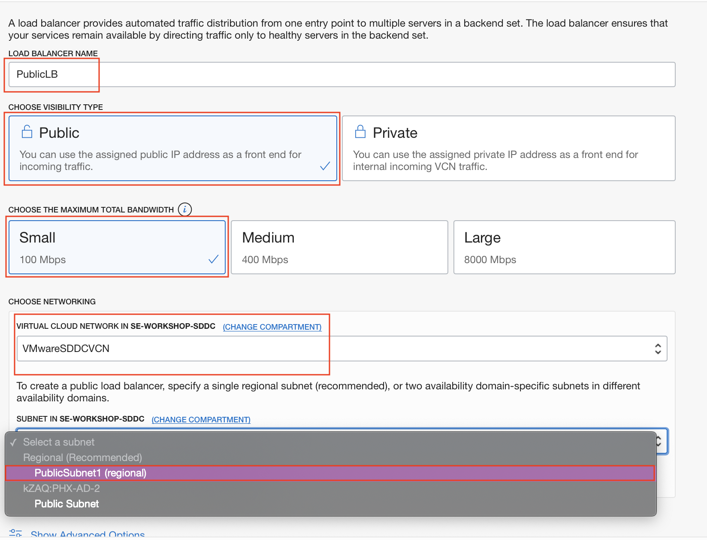

    Now, let **Load Balancer policy** be set to the default, **Weighted Round Robin**. **Health check Policy** will also be the default. We will add the backend sets, later. So, simply click on **Next**.

    
    

    On the next screen, provide a name for your listener. The Traffic will be **HTTP** and the port will be 80. Now, click on **Submit**.

    

    The load balancer should be up and running, shortly.
    
    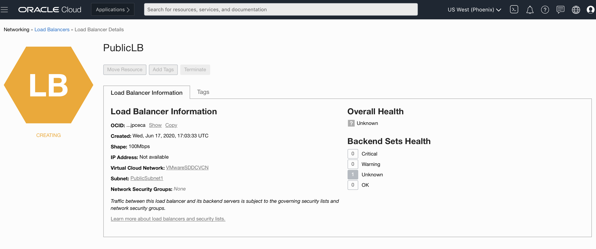

    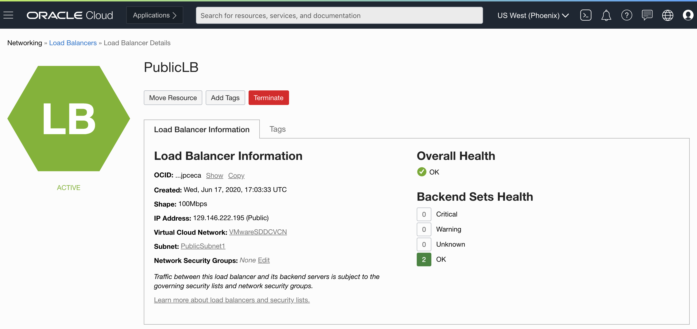

    We will now add our oscommerce application as the backend to this load balancer. CLick on **Backend Sets** on the panel to the left.
     
     

     Select your backend set from the list.

     

     Click on **Add Backends**. 

     
    
    Navigate to your SDDC vSpehere and copy the IP address of the oscommerce VM you created in Lab 300.
     
     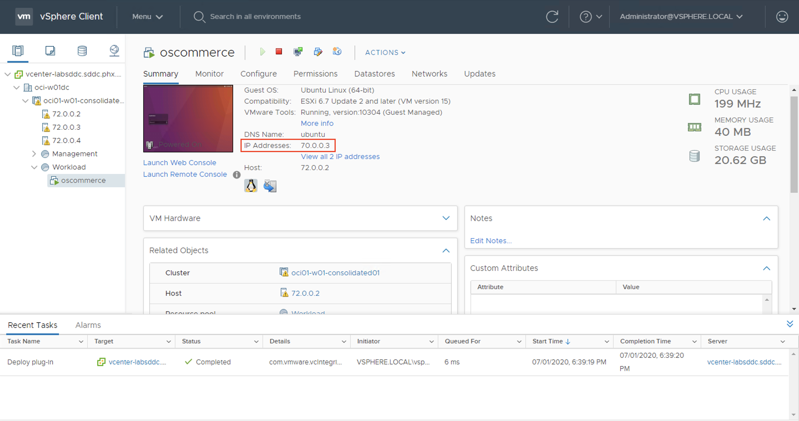
    
    Select IP addresses option and fill out the details as shown in the image. Click on **Add**.

     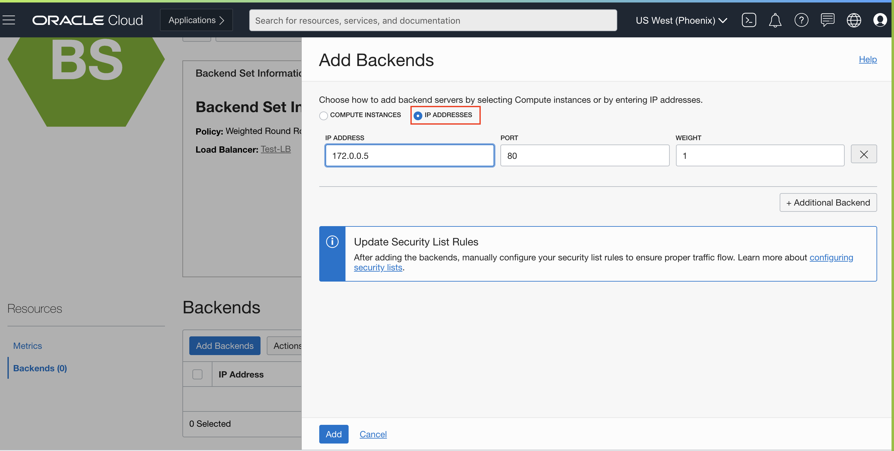

     Your oscommerce application has been added as a backend to the load balancer.
      
     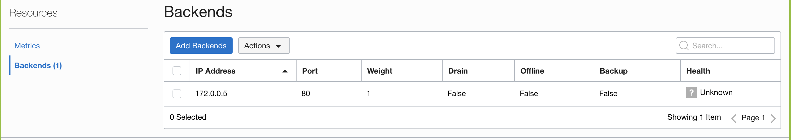

    We will now add a rule in the security list of the subnet with our load balancer to accept requests from  the internet.

    Return to your VCN and select the public subnet that you created. 
    
    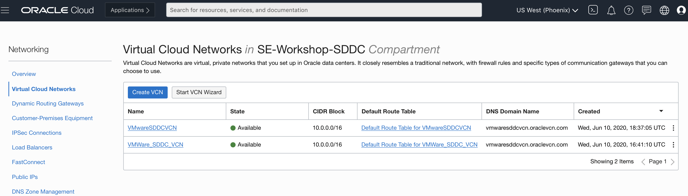
    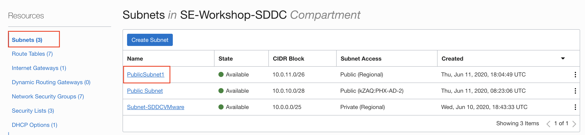
    
    Click on the **Security List** for the public subnet and go to **Ingress Rules**. Hit the **Add Ingress Rules** button and allow TCP traffic from 0.0.0.0/0 on port 80.

    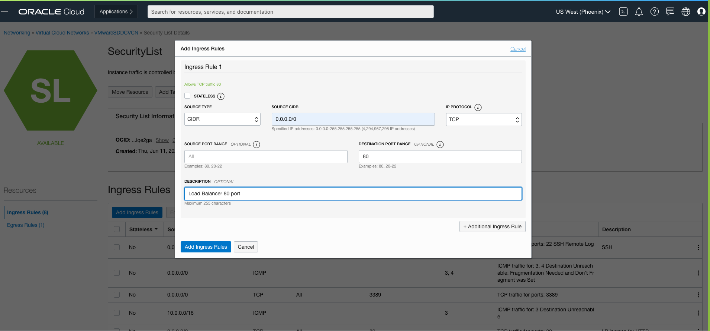

    Next, we will configure the Network Security Groups to allow traffic from the load balancer. . 

    In the **Resources** menu on the left side of the screen, click on **Network Security Groups**.

    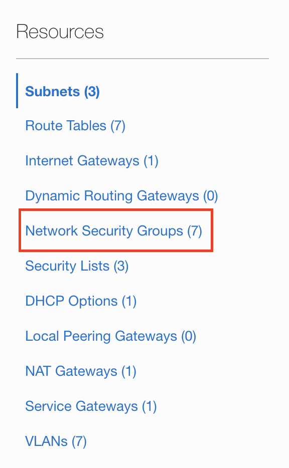

    Choose the **NSG for NSX Edge Uplink**.

    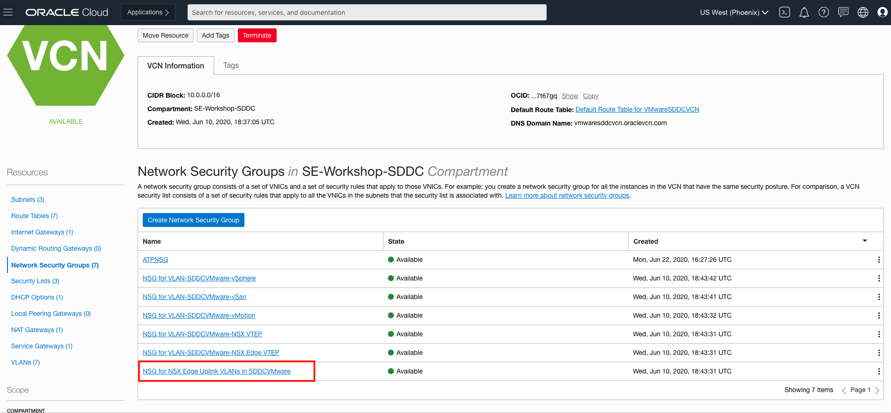

    Click the **Add Rule** button. Once, we add all the rules, your list would look similar to what we have below.

    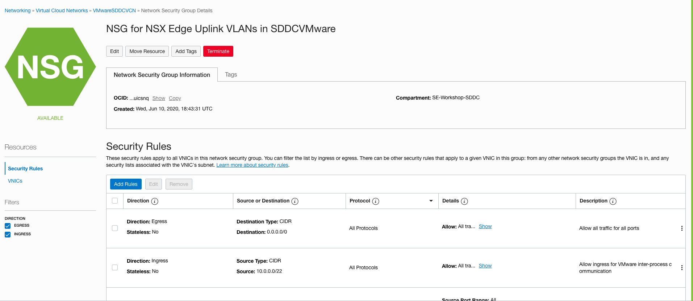

    Add the first rule, as shown in the screenshot below. The source CIDR is the CIDR range of your public subnet. Once you click on **Add**, you will see a rule in the list.

    
    

Your Load Balancer is now working on top of your application. You can use the public IP of the Load Balancer to access the Apache2's default homepage for Ubuntu. You can access the oscommcerce application by typing the <public IP>/catalog URL.
    
### Use Case 2: Create a File Storage Network accessible inside the SDDC and in OCI

- Create a file system.

    Click on the navigation menu. Under **Core Infrastructure**, click on **File Storage** and then **File Systems**.

    
    
    Click on the **Create File Systems** button.

    
    
    Click on the **Edit Details** option to the right of **File System Information**.

    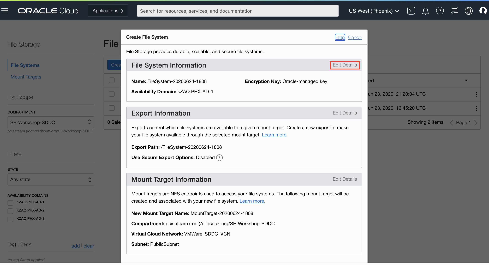

    Provide a name and select an **Availability Domain**. Let the **Encryption** be set to the default value. 

    

    Now, **Edit Details** for the **Mount Target**.

    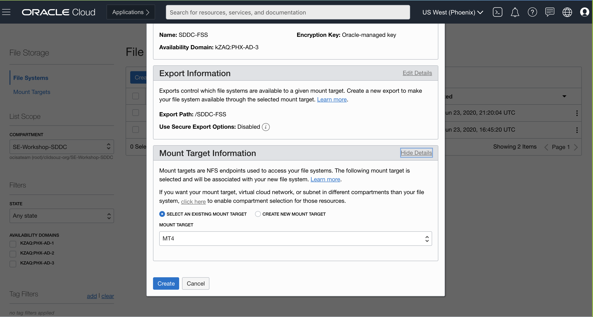

    Select the **Create New Mount Point Target** radio button. Give the Mount Point Target a name. Choose the same VCN, as your SDDC and select the **Private Regional** subnet and click on the **Create** button.

    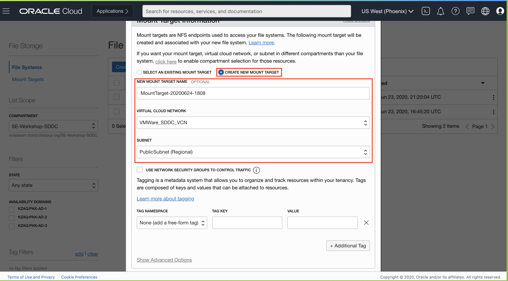
    
    
    
    You should be able to see a screen, similar to the one below.

    
    
    Click on the 3 vertical dots in front of the **Export** and select **Mount Commands** from the menu that pops up.

    

    Change the **Image** to **Ubuntu**.
    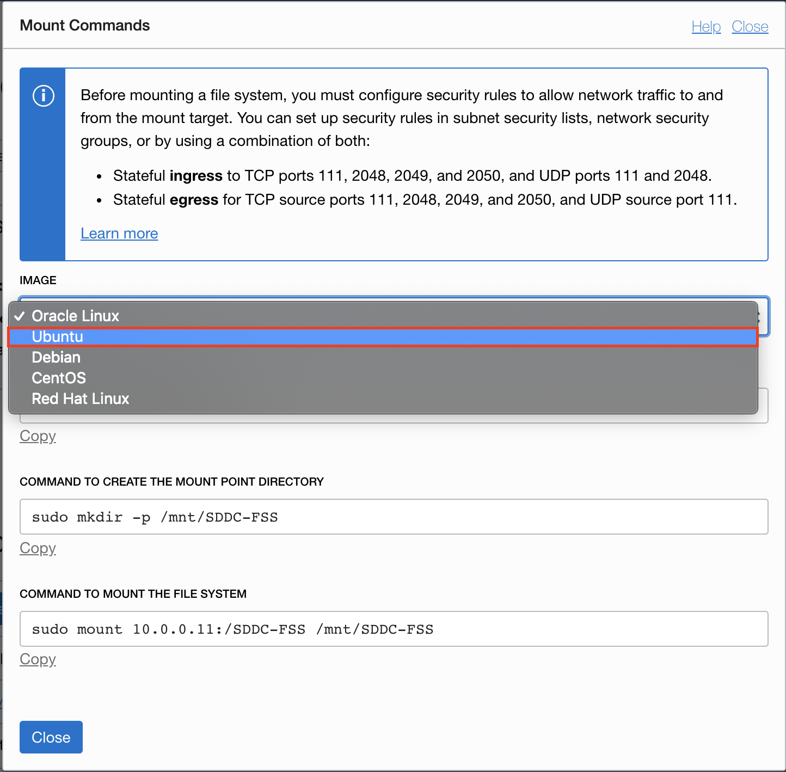

    As shown in the image above, we need to open the mentioned ports in the private subnet containing the SDDC and also in subnet containing your Linux machine that will be sharing this file system. 
    
    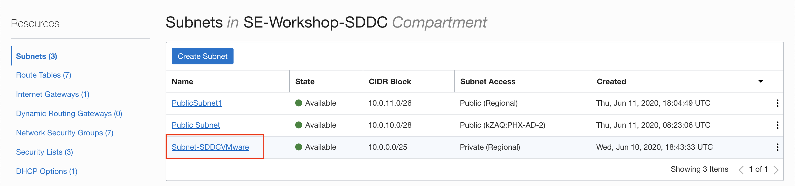

    Please note that you might not have to open the egress rules, if you already have traffic open to 0.0.0.0/0 on all ports. As shown previously add the required ingress rules, the source CIDR range is the workload CIDR created for the VMware NSX.
    
    
    

    Your subnets will have a long list of rules, all of which have a purpose.

    Subnet 1 Rules
    
    
    

    Subnet 2 Rules
    
    

    Now, access your SDDC, as shown in Lab 100 and launch your Ubuntu Instance.

    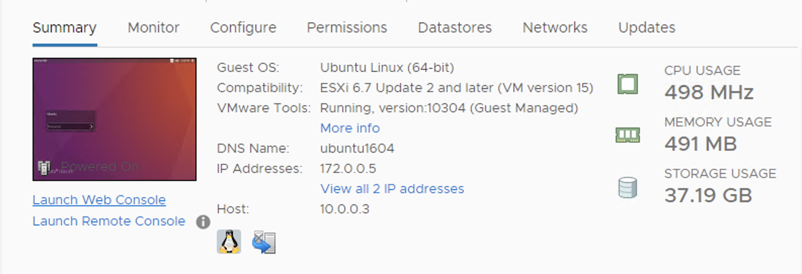
    

    After the log in to the machine. Run the three commands, as shown

        sudo apt-get install nfs-common

        sudo mkdir -p /mnt/SDDC-FSS

        sudo mount <replace with correct IP>:/SDDC-FSS /mnt/SDDC-FSS

    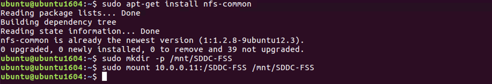

    After mounting the file system. Switch your directory to the file system and create a file. Use the ls command to confirm its presence.

        cd /mnt/SDDC-FSS

        sudo touch lab.txt

        ls

    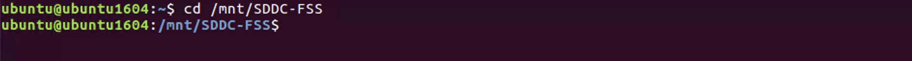
    

    Open the file for editing and enter a custom message. 

    
    

    We have successfully mounted the File system to an instance in VMware environment. As an extension we can also create a linux machine in the private subnet and mount the same FSS to that instance as well. 

    After you spin up an Oracle linux machine go back to the file system export and fetch the commands for Oracle Linux.

    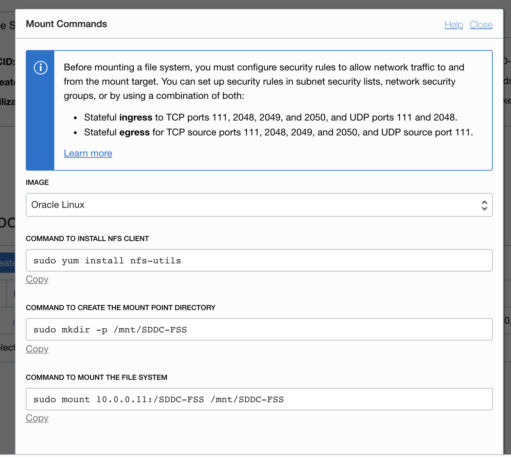

    Follow a similar process to login to your Oracle Linux machine and to mount the file system using the aforementioned commands. You can now access the FSS and see the same file there as well.

    

    This shows how you can deploy a hybrid environment for your application, with some servers running on VMware virtualization and the rest running on OCI VCN.
