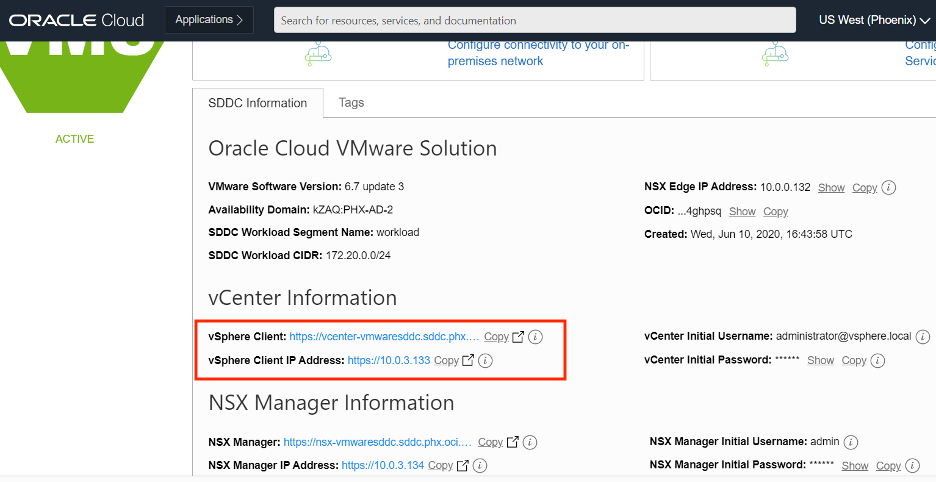
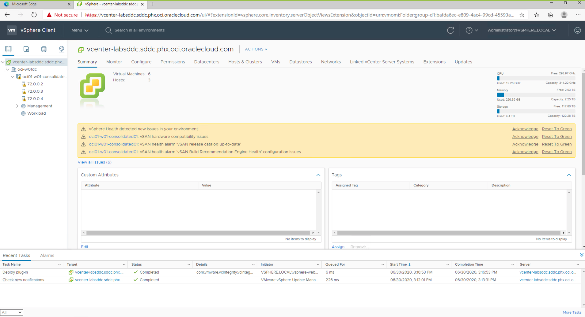
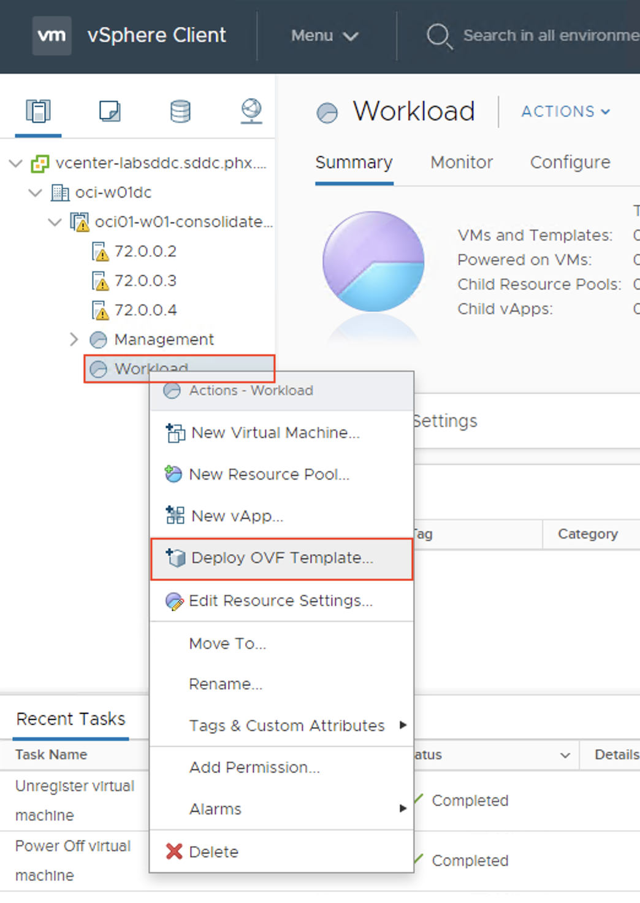
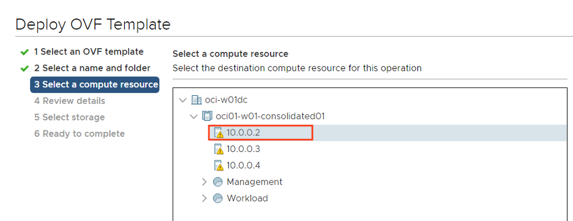
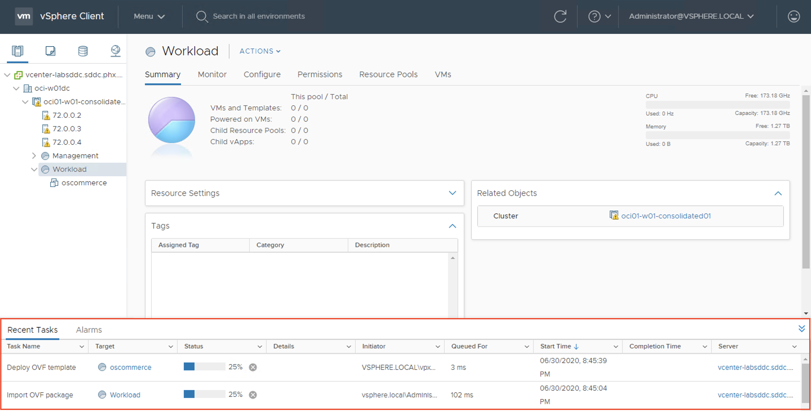
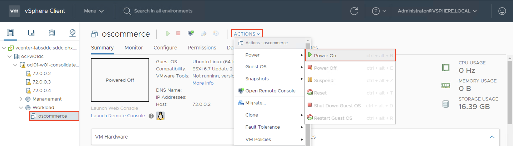
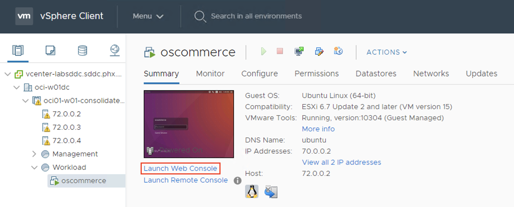
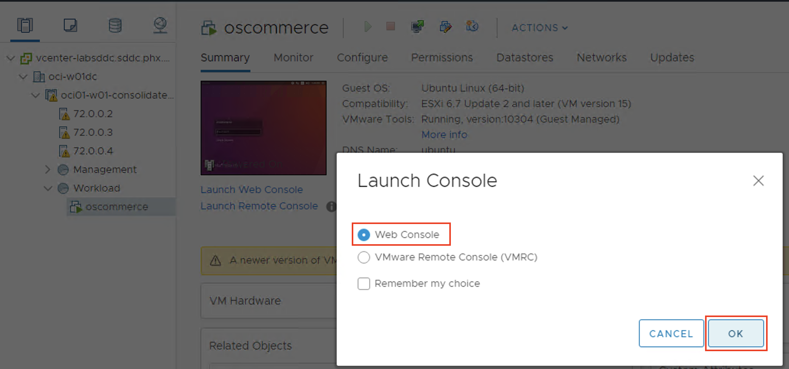
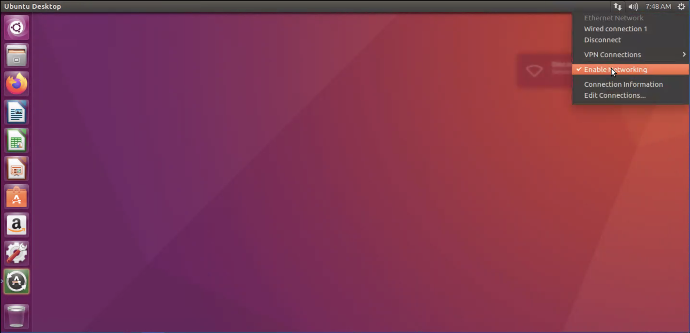

## Introduction

In this lab, we will import the on-premises VMWare environment that we had exported in Lab 200 to OCVS. 

## Objectives
- Import an OVF file and access the environment as part of the Oracle Cloud VMWare Service.

## Required Artifacts
- Access to the Object storage bucket used to store the exported workload from Lab 200.
- The deployed OCVS environment from Lab 100.

## Steps

### STEP 1: Import the osCommerce OVF into Oracle Cloud VMware Service

- Use the pre-authenticated request URL from Lab 200 to download the zipped ovf file.  Unzip to extract the 3 ovf files on your computer.

    

- Use the RDP client to connect to the bastion host. Now, login to the vSphere client of your OCVS platform and enter the credentials. You can get the vCenter server details from your OCVS page.

    
    
- Once logged into the vSphere Client, right click on **Workload** and select **Deploy OVF Template**.

    

    
    
- Select the .ovf and VMDK file from the unzipped folder.

    

- Enter a name and select a location for your VM and select a compute resource. Review the details.

    
    
    

- Now, select the storage. After doing so, choose the Workload network on the next screen.

    
    

- Click on **Finish** to complete the deployment.

    

**Note**: You can monitor the progress of the import from the panel bar at the bottom of the screen, under the **Recent Tasks** tab.

- Once the import OVF and deploy OVF tasks are complete, you can power on the VM, select the VM that you just imported and power it on by clicking on **Actions**, then selecting **Power On** under the Power sub-menu. Again, the status of the operation can be monitored from the **Recent Tasks** tab.

    

    

- Launch the web console by clicking on the link just below the VM's thumbnail. Choose **Web Console** and click on **OK**. 

    

    
    
- Login to the VM with the password 'oscommerce'. Then, open Firefox and enter **localhost/catalog/index.php** and check for the oscommerce index page.

     

### STEP 2: Enable Internet on the VM

- The VM does not have DNS settings. To add the DNS server click the network icon on the right top corner and click **Edit Connections**

    

- Open the **Wired Connections 1** and goto **IPv4 Settings**. Enter the google DNS server **8.8.8.8** in the **Additional DNS Servers** field and click **Save**

     

- Click the networking Icon again and disable network by toggling the **Enable Networking** settings.

    

- Enable the network by toggling the same button  **Enable Networking** again.

    

- Visit some website on the browser and the confirm that you have internet access.
