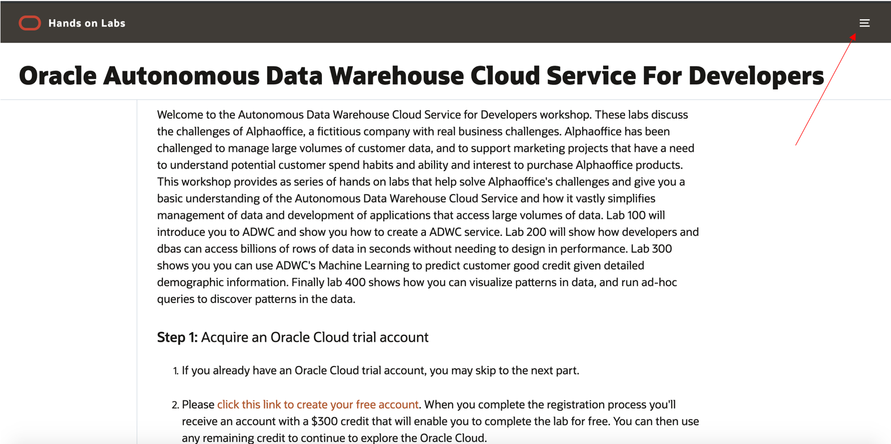
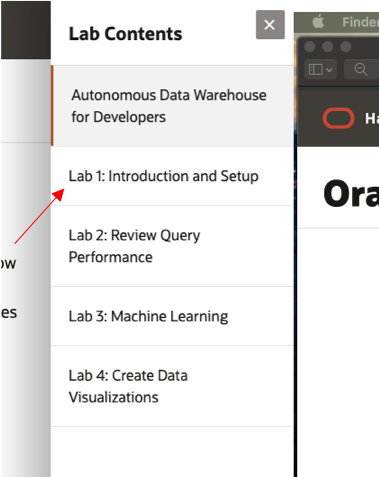

# Oracle Autonomous Data Warehouse Cloud Service For Developers

Welcome to the Autonomous Data Warehouse Cloud Service for Developers workshop.  These labs discuss the challenges of Alphaoffice, a fictitious company with real business challenges. Alphaoffice has been challenged to manage large volumes of customer data, and to support marketing projects that have a need to understand potential customer spend habits and ability and interest to purchase Alphaoffice products.  This workshop provides as series of hands on labs that help solve Alphaoffice's challenges and give you a basic understanding of the Autonomous Data Warehouse Cloud Service and how it vastly simplifies management of data and development of applications that access large volumes of data. Lab 100 will introduce you to ADWC and show you how to create a ADWC service. Lab 200 will show how developers and dbas can access billions of rows of data in seconds without needing to design in performance. Lab 300 shows you you can use ADWC's Machine Learning to predict customer good credit given detailed demographic information.  Finally lab 400 shows how you can visualize patterns in data, and run ad-hoc queries to discover patterns in the data.

### **Step 1:** Acquire an Oracle Cloud trial account

1. If you already have an Oracle Cloud trial account, you may skip to the next part.

2. Please <a href="https://myservices.us.oraclecloud.com/mycloud/signup?language=en&sourceType=:ow:lp:cpo::RC_NAMK190523P00161:APEX_ATP_HOL&intcmp=:ow:lp:cpo::RC_NAMK190523P00161:APEX_ATP_HOL" target="_trial_">click this link to create your free account</a>. When you complete the registration process you'll receive an account with a $300 credit that will enable you to complete the lab for free. You can then use any remaining credit to continue to explore the Oracle Cloud.

3. Soon after requesting your trial you will receive the following email. Once you receive this email you can proceed to Part 2.

  

### **Step 2:** Navigate to Lab 1

- Once the setup is complete you can move on to lab 100 by clicking on the Menu Icon in the upper left corner of the browser window. You're now ready to continue with Lab 100.

  

    
