# Zero Downtime Database Migration

## Introduction

This is the second of four labs that are part of the Oracle Public Cloud Database Cloud Service workshop. 

Since labs 2 and 3 will be migrating data, it is important to understand and keep track of what you're doing.  Briefly these will be the steps.
- Lab 1 creates source (`workshop1_db`) and target (`workshop1_db2`) databases and loads data into the `alpha` schema of the `workshop1_db pdb1` database.  The target database `workshop1_db2` has an empty `pdb1`.
- Lab 2 (this lab) overwrites the target `workshop1_db2` database (and all pdbs) with the data from `workshop1_db`.  After this both databases will be identical, containing `pdb1` and schema `alpha` with data.
- Lab 3:
	- ***Tablespace migration:***  You create a new tablespace `alpha_archive` and user `alpha_archive` in the source database `pdb1` and then migrates this to the target database `pdb1`.  
	- ***Database migration using data pump:***  You export data in pdb1 with users alpha and alpha_archive, and import that into a new `pdb2` in the target database. 
	- ***Copy tables using db links:***  Finally you copy a table in the source `pdb1` database into a new table in the target `pdb1` database.  
	These alternative migration approaches support different use cases that will be discussed in the lab steps.
- Labs 4 do not involve migration and can be done in either database. 

This lab will introduce you to the [zero downtime migration](https://www.oracle.com/database/technologies/rac/zdm.html) automated solution.  Zero Downtime Migration gives you a way to simplify moving your on-premise databases and Oracle Cloud Infrastructure Classic instances to Oracle Cloud Infrastructure, Exadata Cloud at Customer, and Exadata Cloud Service, without incurring any significant downtime, by leveraging technologies such as Oracle Active Data Guard.

Zero Downtime Migration uses mechanisms such as backing up the source database to Oracle Cloud Infrastructure Object Storage, creating a standby database (with Oracle Data Guard Maximum Performance protection mode and asynchronous (ASYNC) redo transport mode) in the target environment from the backup, synchronizing the source and target databases, and switching over to the target database as the primary database.

**Note:  It will be helpful to have a notepad open as a holding place to copy and paste various items throughout all the labs.** 

To log issues and view the Lab Guide source, go to the [github oracle](https://github.com/oracle/learning-library/tree/master/workshops/dbcs-dba-oci) repository.

## Objectives

-   Retrieve information required for the migration.
-	Confirm source and target database requirements.
-	Log into the ZDM compute image and download and configure ZDM.
-	Validate your configuration.
-   Migrate the database.
-   Confirm migration results and re-set the source database from standby read only to standalone read write.

## Required Artifacts

-   You must have successfully completed lab 1.

## **Step 1**:  Log into your Oracle Cloud Account, and collect information you will need to complete this lab.

- Navigate to Bare Metal, VM, and Exadata menu item in the Cloud Console.

	

- You will be migrating data from your source database to a target database.  The Target database is a placeholder, and will be replaced by the source database data (ie. if there is anything there it gets wiped out).  Collect the following for both the source and target databases.  You can get the Public IP from the Notes link.

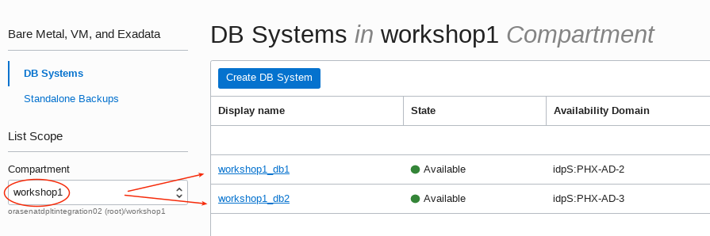

```
Display name:		eg: workshop1_db1
db name:			orcl
db unique name: 	orcl_phx273
Host domain name:	sub01092328510.vcn1.oraclevcn.com
Scan DNS Name:		workshop1-scan.sub01092328510.vcn1.oraclevcn.com
Public IP:		    &lt;source db public IP&gt;
```

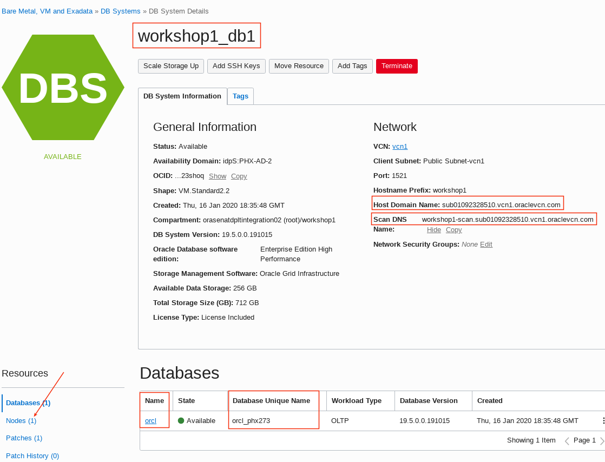
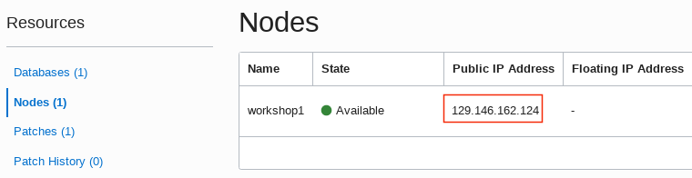

```
Display name:		workshop1_db2
db name:			orcl
db unique name: 	orcl_phx3r6
Host domain name:	sub01092328510.vcn1.oraclevcn.com
Scan DNS Name:		workshop1-2-scan.sub01092328510.vcn1.oraclevcn.com
Public IP:		    &lt;target db public IP&gt; 
```

- Generate a new pem (not SSH) public key.  Open a command terminal in your desktop and enter the following.
```
<copy>openssl genrsa -out private.pem 2048</copy>
Generating RSA private key, 2048 bit long modulus (2 primes)
.............+++++
......................................................................+++++
e is 65537 (0x010001)
```

- Generate a public key from the new private key.
```
<copy>openssl rsa -in private.pem -outform PEM -pubout -out public.pem</copy>
writing RSA key
```

- List the new private and public pem files:
```
<copy>ls *.pem</copy>
private.pem  public.pem
(base) [dcameron@dcameron-linux ~]$ 
```

- Navigate to Identity - Users and create an auth token that will return a password that will be used in the migrate step later on.  Navigate to Identity - Users.

	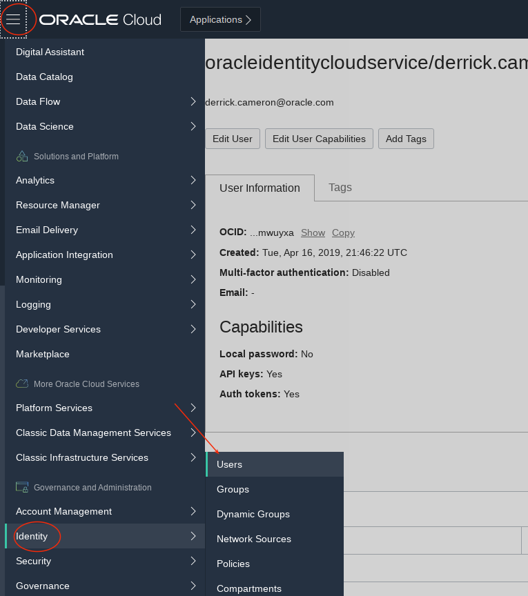

- Locate the userid you are using and select it.

- Generate a new auth token:

	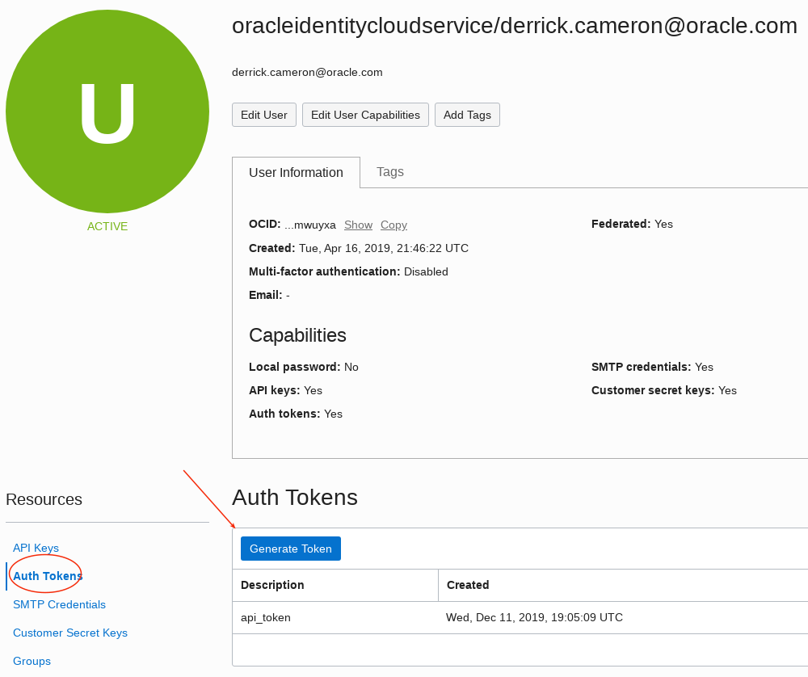

	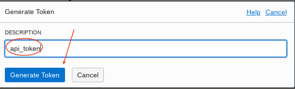

- Be sure to copy the token password and save for use later in the lab.  If you lose it you will need to generate a new token.

	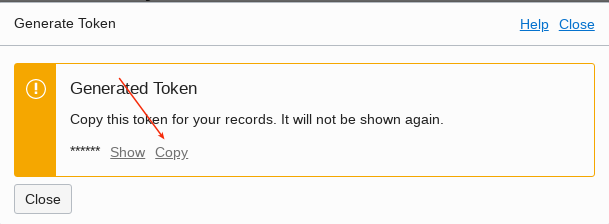

## **Step 2**:  Confirm source and target database requirements.

- Log into the source database and confirm archive logging is on (it will be if you created a DBCS OCI instance).
```
<copy>ssh -i id_rsa opc@&lt;source db public IP&gt
sudo su - oracle
sqlplus sys/&lt;password&gt; as sysdba
archive log list;</copy>
Database log mode                       Archive log Mode
Automatic archival                      Enabled
Archive destination                     USE_DB_RECOVERY_FILE_DEST
Oldest online log sequence              2
Next log sequence to archive            4
Current log sequence                    4
```

- Confirm the database uses an auto login master encryption key (Oracle DBCS should).
```
<copy>SELECT * FROM v$encryption_wallet;</copy>

WRL_TYPE   WRL_PARAMETER					   				        STATUS	WALLET_TYPE	  WALLET_OR KEYSTORE FULLY_BAC	CON_ID
FILE	   	/opt/oracle/dcs/commonstore/wallets/tde/orcl_phx273/    OPEN 	AUTOLOGIN	  SINGLE	 NONE	  NO		     1
FILE								   					            OPEN 	AUTOLOGIN	  SINGLE	 UNITED   NO		     2
FILE								   					            OPEN 	AUTOLOGIN	  SINGLE	 UNITED   NO		     3
```

- ***IF you see the following whereby the wallet is open with no master key follow the remaining steps in step 2 (this step).  Otherwise move on to step 3.***
```
<copy>select * from v$encryption_wallet;</copy>
FILE	/opt/oracle/dcs/commonstore/wallets/tde/orcl_phx273/	OPEN	AUTOLOGIN	SINGLE	NONE		NO		1
FILE		OPEN										AUTOLOGIN		SINGLE	UNITED	NO		2
FILE		OPEN										AUTOLOGIN		SINGLE	UNITED	NO		3
FILE		OPEN_NO_MASTER_KEY							AUTOLOGIN		SINGLE	UNITED	UNDEFINED	4
</copy>
```

```
<copy>exit -- from sqlplus</copy>
```

- Set the master encryption key.  Log into the source database server and rename the existing auto login key out of the way.

```
<copy>mv /opt/oracle/dcs/commonstore/wallets/tde/orcl_phx273/cwallet.sso ..</copy>
```

- Next enter the following commands.  You will log into the database with sys and create new password and auto login keys.  Use the database system password for everything.
```
<copy>sqlplus sys/<password> as sysdba
administer key management set keystore close;</copy>

keystore altered.
```

```
<copy>SELECT wrl_parameter, status, wallet_type FROM v$encryption_wallet;</copy>

WRL_PARAMETER
---------------------------------------------------
STATUS			       WALLET_TYPE
------------------------------ --------------------
/opt/oracle/dcs/commonstore/wallets/tde/orcl_phx273/
CLOSED			       UNKNOWN
CLOSED			       UNKNOWN
CLOSED			       UNKNOWN
CLOSED			       UNKNOWN
```

```
<copy>administer key management set keystore open identified by &lt;password&gt;;</copy>
keystore altered.
```

```
<copy>alter session set container=pdb1;</copy>
Session altered.
```

```
<copy>administer key management set keystore open identified by &lt;password&gt;;</copy>
keystore altered.
```

```
<copy>administer key management set key identified by &lt;password&gt; with backup;</copy>
keystore altered.
```

```
<copy>SELECT wrl_parameter, status, wallet_type FROM v$encryption_wallet;</copy>

WRL_PARAMETER
---------------------------------------------------
STATUS			       WALLET_TYPE
------------------------------ --------------------

OPEN			       PASSWORD
```

```
<copy>alter session set container=cdb$root;</copy>
Session altered.
```

```
<copy>administer key management create auto_login keystore from keystore '/opt/oracle/dcs/commonstore/wallets/tde/orcl_phx273' identified by &lt;password&gt;;</copy>
keystore altered.
```

```
<copy>shutdown immediate;
startup

SELECT * FROM v$encryption_wallet;</copy>

WRL_TYPE   WRL_PARAMETER					   				        STATUS	WALLET_TYPE	  WALLET_OR KEYSTORE FULLY_BAC	CON_ID
FILE	   	/opt/oracle/dcs/commonstore/wallets/tde/orcl_phx273/    OPEN 	AUTOLOGIN	  SINGLE	 NONE	  NO		     1
FILE								   					            OPEN 	AUTOLOGIN	  SINGLE	 UNITED   NO		     2
FILE								   					            OPEN 	AUTOLOGIN	  SINGLE	 UNITED   NO		     3
```

## **Step 3**:  Log into the ZDM compute image and download and configure ZDM.

- Get the workshop image IP address.  Navigate to the menu (upper left) and select your compute image.

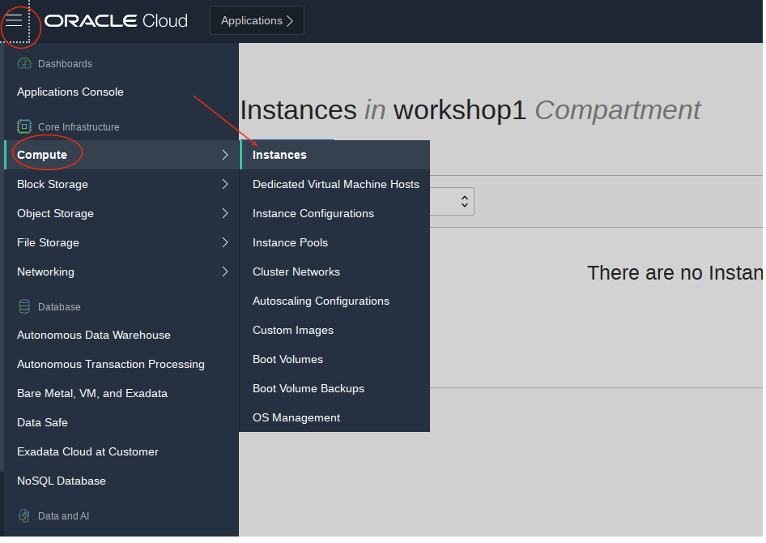

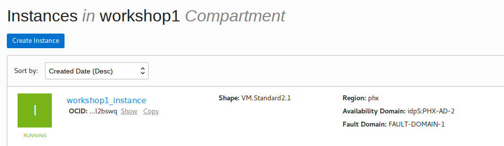

- Locate the public IP and copy it.

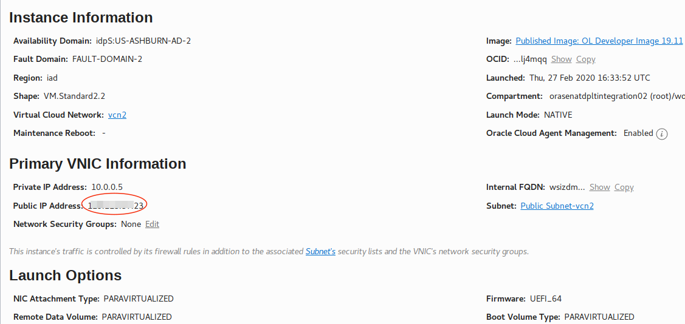

- SCP (copy) the private key to the workshop image.  id\_rsa is entered twice - once to authenticate and again as the file to copy to the image.  This id_rsa private key will be used to connect the workshop image to the source and target databases when the migration is run.  
```
<copy>scp -i id_rsa id_rsa opc@&lt;workshop image IP&gt;:/tmp</copy>
```

- SSH into the workshop compute instance now to prepare for and install the ZDM software.  Start by opening port 5901 and installing `expect`.
```
<copy>sudo firewall-cmd --state</copy>
running
```

```
<copy>sudo firewall-cmd --permanent --zone=public --add-port=5901/tcp</copy>
success
```

```
<copy>sudo firewall-cmd --reload</copy>
success
```

```
<copy>sudo yum install expect</copy>
```

- Create group zdm and add user oracle to that group.  Then create directores /u01/app and make oracle the owner of those directories.
```
<copy>sudo groupadd zdm
sudo usermod -a -G zdm oracle
sudo mkdir -p /u01/app
sudo chown oracle /u01/app
sudo chgrp oinstall /u01/app</copy>
```

- Start the vncserver and enter a vnc password.
```
<copy>vncserver</copy>
Password:
Verify:
Would you like to enter a view-only password (y/n)? n
A view-only password is not used
```

- Start your local vnc ***viewer*** and log into the ZDM image.

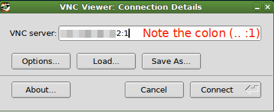

- Start firefox and download the software from [this](https://www.oracle.com/database/technologies/rac/zdm-downloads.html) location.

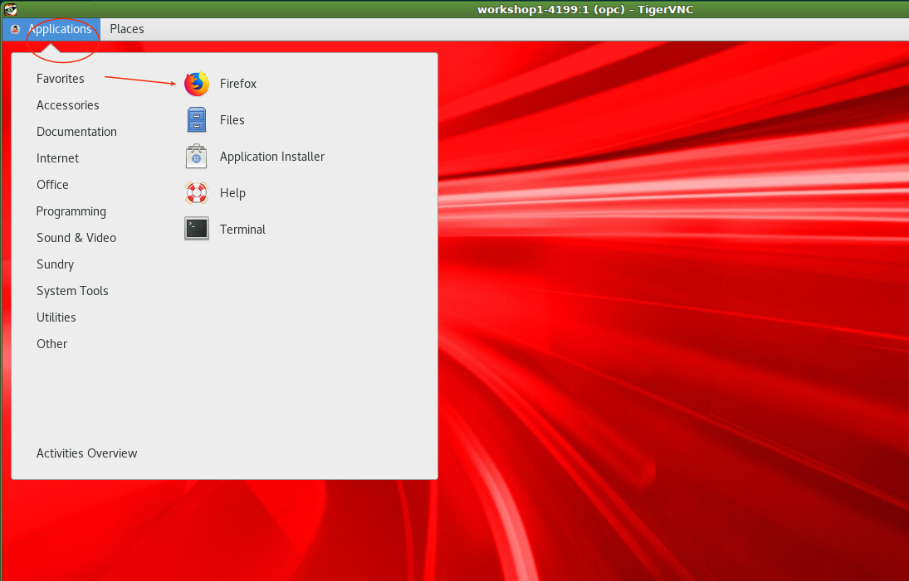

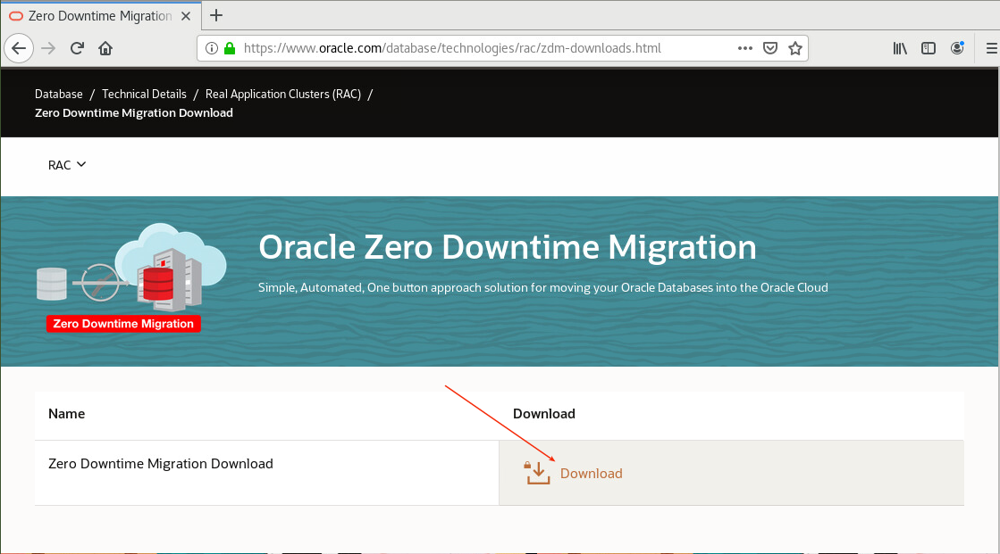

- Now that you have downloaded the software everything else is done in a terminal shell.  You can either continue working in your VNC session for this or close VNC and just ssh into the image.  Next you will mv the zip file to the /u01/app folder, unzip the file, switch to the user oracle, create the zdm homes, and then kick off the zdm install.  
```
<copy>sudo mv /home/opc/Downloads/zdm19.zip /u01/app
sudo chown oracle /u01/app/zdm19.zip
sudo chgrp oinstall /u01/app/zdm19.zip
sudo su - oracle
cd /u01/app
unzip zdm19.zip
mkdir -p zdmhome
mkdir -p zdmbase
./zdminstall.sh setup oraclehome=/u01/app/zdmhome oraclebase=/u01/app/zdmbase ziploc=zdm_home.zip -zdm</copy>
```

- Start the zdm service.
```
<copy>zdmhome/bin/zdmservice start</copy>
No instance detected, starting zdmservice

[jwcctl debug] Environment ready to start JWC
[jwcctl debug] Return code of initialization: [0]

[jwcctl debug] ... BEGIN_DEBUG [Action= start] ...
Start JWC
[jwcctl debug] Loading configuration file: /u01/app/zdmbase/crsdata/workshop1-4199/rhp/conf/jwc.properties
[jwcctl debug]     oracle.jmx.login.credstore = CRSCRED
[jwcctl debug]     oracle.jmx.login.args = DOMAIN=rhp
[jwcctl debug]     oracle.rmi.url = service:jmx:rmi://{0}:{1,number,#}/jndi/rmi://{0}:{1,number,#}/jmxrmi
[jwcctl debug]     oracle.http.url = http://{0}:{1,number,#}/rhp/gridhome
[jwcctl debug]     oracle.jwc.tls.clientauth = false
[jwcctl debug]     oracle.jwc.tls.rmi.clientfactory = RELOADABLE
[jwcctl debug]     oracle.jwc.lifecycle.start.log.fileName = JWCStartEvent.log
[jwcctl debug] Get JWC PIDs
[jwcctl debug] Done Getting JWC PIDs
[jwcctl debug] ... JWC containers not found ...
[jwcctl debug]     Start command:-server -Xms128M -Xmx384M -Djava.awt.headless=true -Ddisable.checkForUpdate=true -Djava.util.logging.config.file=/u01/app/zdmbase/crsdata/workshop1-4199/rhp/conf/logging.properties -Djava.util.logging.manager=org.apache.juli.ClassLoaderLogManager -DTRACING.ENABLED=true -DTRACING.LEVEL=2 -Doracle.wlm.dbwlmlogger.logging.level=FINEST -Duse_scan_IP=true -Djava.rmi.server.hostname=workshop1-4199 -Doracle.http.port=8896 -Doracle.jmx.port=8895 -Doracle.tls.enabled=false -Doracle.jwc.tls.http.enabled=false -Doracle.rhp.storagebase=/u01/app/zdmbase -Djava.security.egd=file:/dev/urandom -Doracle.jwc.wallet.path=/u01/app/zdmbase/crsdata/workshop1-4199/security -Doracle.jmx.login.credstore=WALLET -Dcatalina.home=/u01/app/zdmhome/tomcat -Dcatalina.base=/u01/app/zdmbase/crsdata/workshop1-4199/rhp -Djava.io.tmpdir=/u01/app/zdmbase/crsdata/workshop1-4199/rhp/temp -Doracle.home=/u01/app/zdmhome -Doracle.jwc.mode=STANDALONE -classpath /u01/app/zdmhome/jlib/cryptoj.jar:/u01/app/zdmhome/jlib/oraclepki.jar:/u01/app/zdmhome/jlib/osdt_core.jar:/u01/app/zdmhome/jlib/osdt_cert.jar:/u01/app/zdmhome/tomcat/lib/tomcat-juli.jar:/u01/app/zdmhome/tomcat/lib/bootstrap.jar:/u01/app/zdmhome/jlib/jwc-logging.jar org.apache.catalina.startup.Bootstrap start
[jwcctl debug] Get JWC PIDs
[jwcctl debug] Done Getting JWC PIDs
[jwcctl debug] ... JWC Container (pid=2496) ...
[jwcctl debug] ... JWC Container running (pid=2496) ...
[jwcctl debug]     Check command:-Djava.net.preferIPv6Addresses=true -Dcatalina.base=/u01/app/zdmbase/crsdata/workshop1-4199/rhp -Doracle.wlm.dbwlmlogger.logging.level=FINEST -Doracle.jwc.client.logger.file.name=/u01/app/zdmbase/crsdata/workshop1-4199/rhp/logs/jwc_checker_stdout_err_%g.log -Doracle.jwc.client.logger.file.number=10 -Doracle.jwc.client.logger.file.size=1048576 -Doracle.jwc.wallet.path=/u01/app/zdmbase/crsdata/workshop1-4199/security -Doracle.jmx.login.credstore=WALLET -Doracle.tls.enabled=false -Doracle.jwc.tls.http.enabled=false -classpath /u01/app/zdmhome/jlib/jwc-logging.jar:/u01/app/zdmhome/jlib/jwc-security.jar:/u01/app/zdmhome/jlib/jwc-client.jar:/u01/app/zdmhome/jlib/jwc-cred.jar:/u01/app/zdmhome/jlib/srvm.jar:/u01/app/zdmhome/jlib/srvmhas.jar:/u01/app/zdmhome/jlib/cryptoj.jar:/u01/app/zdmhome/jlib/oraclepki.jar:/u01/app/zdmhome/jlib/osdt_core.jar:/u01/app/zdmhome/jlib/osdt_cert.jar:/u01/app/zdmhome/tomcat/lib/tomcat-juli.jar oracle.cluster.jwc.tomcat.client.JWCChecker localhost 8896 -1
[jwcctl debug] ... JWC Container is ready ...
[jwcctl debug] ... START - Return code = 0 ...
[jwcctl debug]  ... END_DEBUG [Action=start] ...
[jwcctl debug] Return code of AGENT: [0]

Return code is 0
Server started successfully.
```

- Verify the install succeeded.
```
<copy>zdmhome/bin/zdmcli query image</copy>
workshop1-4199.sub01092328510.vcn1.oraclevcn.com: Audit ID: 3
No image has been configured
```

- Retrieve server status.
```
<copy>zdmhome/bin/zdmservice status</copy>

---------------------------------------
	Service Status
---------------------------------------

 Running: 	true
 Tranferport: 	5000-7000
 Conn String: 	jdbc:derby:/u01/app/zdmbase/derbyRepo;create=true
 Repo Path: 	/u01/app/zdmbase/derbyRepo
 RMI port: 	8895
 HTTP port: 	8896
 Wallet path: 	/u01/app/zdmbase/crsdata/workshop1-4199/security
 ```

 - Edit the response file `zdmhome/rhp/zdm/template/zdm_template.rsp` and update the following fields.  Ignore all others.
 ```
TGT_DB_UNIQUE_NAME=orcl_phx3r6 -- update with your db name
MIGRATION_METHOD=DG_OSS
PLATFORM_TYPE=VMDB       
TGT_DATADG=+DATA
TGT_REDODG=+RECO
TGT_RECODG=+RECO
HOST=https://swiftobjectstorage.us-phoenix-1.oraclecloud.com/v1/orasenatdpltintegration02 -- update with your tenancy (in this case orasenatdpltintegration02) and region (in this case phoenix)
OPC_CONTAINER=zdm -- update with your object storage bucket (in lab 1 you created zdm)
NONCDBTOPDB_CONVERSION=FALSE
SKIP_FALLBACK=TRUE
SHUTDOWN_SRC=FALSE
SRC_RMAN_CHANNELS=6
```

- Update the `/etc/hosts` file and enter the IP addresses and scan IPs of the source and target databases.  You collected this information in the beginning of this lab.  Your values will be different that those below.  Edit the /etc/hosts file and add the following
```
<copy>exit -- exiting from oracle to opc
sudo vim /etc/hosts</copy>
&lt;source db IP&gt;	    workshop1-scan.sub01092328510.vcn1.oraclevcn.com workshop1-scan
&lt;target db IP&gt;		workshop1-2-scan.sub01092328510.vcn1.oraclevcn.com workshop1-2-scan
```

- SSH into the source database image and update the `/etc/hosts` file and enter the target IP and scan dns.  Then log in as the oracle user and test connectivity.  Edit the /etc/hosts file and add the following
```
<copy>sudo vim /etc/hosts</copy>
&lt;target db IP&gt;		workshop1-2-scan.sub01092328510.vcn1.oraclevcn.com workshop1-2-scan
```

- Save your changes.
```
<copy>sudo su - oracle
tnsping workshop1-2-scan:1521</copy>
TNS Ping Utility for Linux: Version 19.0.0.0.0 - Production on 17-JAN-2020 18:24:25
Copyright (c) 1997, 2019, Oracle.  All rights reserved.
Used parameter files:
/u01/app/oracle/product/19.0.0.0/dbhome_1/network/admin/sqlnet.ora
Used HOSTNAME adapter to resolve the alias
Attempting to contact (DESCRIPTION=(CONNECT_DATA=(SERVICE_NAME=))(ADDRESS=(PROTOCOL=tcp)(HOST=&lt;source db IP&gt;)(PORT=1521)))
OK (0 msec)
```

- SSH into the target database image and update the `/etc/hosts` file and enter the source IP and scan dns.  Then log in as the oracle user and test connectivity.  Edit the /etc/hosts file and add the following.
```
<copy>sudo vim /etc/hosts</copy>
&lt;source db IP&gt;	workshop1-scan.sub01092328510.vcn1.oraclevcn.com workshop1-scan
```

- Save your changes.
```
<copy>sudo su - oracle
tnsping workshop1-2-scan:1521</copy>
TNS Ping Utility for Linux: Version 19.0.0.0.0 - Production on 17-JAN-2020 18:24:25
Copyright (c) 1997, 2019, Oracle.  All rights reserved.
Used parameter files:
/u01/app/oracle/product/19.0.0.0/dbhome_1/network/admin/sqlnet.ora
Used HOSTNAME adapter to resolve the alias
Attempting to contact (DESCRIPTION=(CONNECT_DATA=(SERVICE_NAME=))(ADDRESS=(PROTOCOL=tcp)(HOST=&lt;target db IP&gt;)(PORT=1521)))
OK (0 msec)
```

## **Step 4**:  Validate your configuration.

- Test the migration configuration.  These are the parameters.  Ensure they are correct (next step).
```
-sourcedb source_db_unique_name_value  (note if classic source - sourcesid is the parameter)
-sourcenode source_database_server_name 
-srcauth zdmauth 
-srcarg1 user:source_database_server_login_user_name (eg: opc)
-srcarg2 identity_file:ZDM_installed_user_private_key_file_location (eg: /tmp)
-srcarg3 sudo_location:/usr/bin/sudo 
-targetnode target_database_server_name (eg: workshop1-scan)
-targethome target_database_ORACLE_HOME_value (eg: /u01/app/oracle/product/19.0.0.0/dbhome_1)
-backupuser Object_store_login_user_name (eg: oracleidentitycloudservice/derrick.cameron@oracle.com)
-rsp response_file_location (eg: /u01/app/zdmhome/rhp/zdm/template/zdm_template.rsp)
-tgtauth zdmauth 
-tgtarg1 user:target_database_server_login_user_name (eg: opc)
-tgtarg2 identity_file:ZDM_installed_user_private_key_file_location (eg: /tmp)
-tgtarg3 sudo_location:/usr/bin/sudo 
-eval -- this last parm indicates test but don't migrate
```

-  Enter the following.  You will be prompted for the sys database password and the userid auth token.  When the job kicks off it will return a job id, which you can then query to review the progress.  This will take a few minutes.  You should see `COMPLETED` status for all steps, otherwise you may have an error.  ***Be sure to replace values to reflect your environment (eg: sourcedb, backupuser, etc).  Also be sure you sudo su - oracle, and then go to /u01/app direcotry.***
```
<copy>zdmhome/bin/zdmcli migrate database -sourcedb orcl_phx273 -sourcenode workshop1 -srcauth zdmauth -srcarg1 user:opc -srcarg2 identity_file:/tmp/id_rsa -srcarg3 sudo_location:/usr/bin/sudo -targetnode workshop1-2 -targethome /u01/app/oracle/product/19.0.0.0/dbhome_1 -backupuser oracleidentitycloudservice/derrick.cameron@oracle.com -rsp /u01/app/zdmhome/rhp/zdm/template/zdm_template.rsp -tgtauth zdmauth -tgtarg1 user:opc -tgtarg2 identity_file:/tmp/id_rsa -tgtarg3 sudo_location:/usr/bin/sudo -ignore ALL -eval</copy>

Enter source database orcl_phx273 SYS password:
Enter user "oracleidentitycloudservice/derrick.cameron@oracle.com" password:
Operation "zdmcli migrate database" scheduled with the job ID "1".
```

- Review progress.  Get the job ID from the output above.
```
<copy>zdmhome/bin/zdmcli query job -jobid 1</copy>

workshop1-4199.sub01092328510.vcn1.oraclevcn.com: Audit ID: 209
Job ID: 36
User: oracle
Client: workshop1-4199
Scheduled job command: "zdmcli migrate database -sourcedb orcl_phx273 -sourcenode workshop1 -srcauth zdmauth -srcarg1 user:opc -srcarg2 identity_file:/tmp/id_rsa -srcarg3 sudo_location:/usr/bin/sudo -targetnode workshop1-2 -targethome /u01/app/oracle/product/19.0.0.0/dbhome_1 -backupuser oracleidentitycloudservice/derrick.cameron@oracle.com -rsp /u01/app/zdmhome/rhp/zdm/template/zdm_template.rsp -tgtauth zdmauth -tgtarg1 user:opc -tgtarg2 identity_file:/tmp/id_rsa -tgtarg3 sudo_location:/usr/bin/sudo -ignore ALL -eval"
Scheduled job execution start time: 2020-01-23T17:41:32Z. Equivalent local time: 2020-01-23 17:41:32
Current status: SUCCEEDED
Result file path: "/u01/app/zdmbase/chkbase/scheduled/job-36-2020-01-23-17:41:43.log"
Job execution start time: 2020-01-23 17:41:43
Job execution end time: 2020-01-23 17:46:03
Job execution elapsed time: 4 minutes 19 seconds
ZDM_GET_SRC_INFO .......... COMPLETED
ZDM_GET_TGT_INFO .......... COMPLETED
ZDM_SETUP_SRC ............. COMPLETED
ZDM_SETUP_TGT ............. COMPLETED
ZDM_GEN_RMAN_PASSWD ....... COMPLETED
ZDM_PREUSERACTIONS ........ COMPLETED
ZDM_PREUSERACTIONS_TGT .... COMPLETED
ZDM_VALIDATE_SRC .......... COMPLETED
ZDM_VALIDATE_TGT .......... COMPLETED
```

- If you get an error review the following log:
```
<copy>more /u01/app/zdmbase/crsdata/workshop1-4199/rhp/rhpserver.log.0</copy>
```

## **Step 5**:  Run the migration.

- If you have no errors you can run the migration using the command above, but without the `-eval` parameter.
```
<copy>zdmhome/bin/zdmcli migrate database -sourcedb orcl_phx273 -sourcenode workshop1 -srcauth zdmauth -srcarg1 user:opc -srcarg2 identity_file:/tmp/id_rsa -srcarg3 sudo_location:/usr/bin/sudo -targetnode workshop1-2 -targethome /u01/app/oracle/product/19.0.0.0/dbhome_1 -backupuser oracleidentitycloudservice/derrick.cameron@oracle.com -rsp /u01/app/zdmhome/rhp/zdm/template/zdm_template.rsp -tgtauth zdmauth -tgtarg1 user:opc -tgtarg2 identity_file:/tmp/id_rsa -tgtarg3 sudo_location:/usr/bin/sudo -ignore ALL</copy>

Scheduled job execution start time: 2020-01-22T19:46:10Z. Equivalent local time: 2020-01-22 19:46:10
Current status: SUCCEEDED
Result file path: "/u01/app/zdmbase/chkbase/scheduled/job-35-2020-01-22-19:46:31.log"
Job execution start time: 2020-01-22 19:46:31
Job execution end time: 2020-01-22 20:11:03
Job execution elapsed time: 24 minutes 32 seconds
ZDM_GET_SRC_INFO .............. COMPLETED
ZDM_GET_TGT_INFO .............. COMPLETED
ZDM_SETUP_SRC ................. COMPLETED
ZDM_SETUP_TGT ................. COMPLETED
ZDM_GEN_RMAN_PASSWD ........... COMPLETED
ZDM_PREUSERACTIONS ............ COMPLETED
ZDM_PREUSERACTIONS_TGT ........ COMPLETED
ZDM_VALIDATE_SRC .............. COMPLETED
ZDM_VALIDATE_TGT .............. COMPLETED
ZDM_OBC_INST_SRC .............. COMPLETED
ZDM_OBC_INST_TGT .............. COMPLETED
ZDM_BACKUP_FULL_SRC ........... COMPLETED
ZDM_BACKUP_INCREMENTAL_SRC .... COMPLETED
ZDM_DISCOVER_SRC .............. COMPLETED
ZDM_COPYFILES ................. COMPLETED
ZDM_PREPARE_TGT ............... COMPLETED
ZDM_SETUP_TDE_TGT ............. COMPLETED
ZDM_CLONE_TGT ................. COMPLETED
ZDM_FINALIZE_TGT .............. COMPLETED
ZDM_CONFIGURE_DG_SRC .......... COMPLETED
ZDM_SWITCHOVER_SRC ............ COMPLETED
ZDM_SWITCHOVER_TGT ............ COMPLETED
ZDM_NONCDBTOPDB_PRECHECK ...... COMPLETED
ZDM_NONCDBTOPDB_CONVERSION .... COMPLETED
ZDM_POSTUSERACTIONS ........... COMPLETED
ZDM_POSTUSERACTIONS_TGT ....... COMPLETED
ZDM_CLEANUP_SRC ............... COMPLETED
ZDM_CLEANUP_TGT ............... COMPLETED
```

## **Step 6**:  Confirm migration results and re-set the source database from standby read only to standalone read write.

- SSH into the source database and change the status from standby to standalone.
```
<copy>ssh -i id_rsa opc@&lt;source db IP&gt;</copy>
Last login: Wed Mar 11 18:43:39 2020 from 73.37.46.25
```

```
<copy>sudo su - oracle</copy>
Last login: Wed Mar 11 19:01:31 UTC 2020
```

```
<copy>sqlplus sys/&lt;password&gt; as sysdba</copy>   

SQL*Plus: Release 19.0.0.0.0 - Production on Wed Mar 11 19:02:43 2020
Version 19.6.0.0.0

Copyright (c) 1982, 2019, Oracle.  All rights reserved.

Connected to:
Oracle Database 19c EE High Perf Release 19.0.0.0.0 - Production
Version 19.6.0.0.0
```

```
<copy>alter database recover managed standby database cancel;

alter database activate physical standby database;</copy>

Database altered.
```

```
<copy>shutdown immediate;</copy>
ORA-01109: database not open

Database dismounted.
ORACLE instance shut down.
```

```
<copy>startup</copy>
ORACLE instance started.

Total System Global Area 1.6106E+10 bytes
Fixed Size		    9154008 bytes
Variable Size		 2248146944 bytes
Database Buffers	 1.3824E+10 bytes
Redo Buffers		   24399872 bytes
Database mounted.
Database opened.
SQL> 
```

- Confirm access to source data.
```
<copy>connect alpha/&lt;password&gt;@pdb1;</copy>
SQL*Plus: Release 19.0.0.0.0 - Production on Thu Jan 23 18:01:44 2020
Version 19.5.0.0.0

Copyright (c) 1982, 2019, Oracle.  All rights reserved.

Last Successful login time: Wed Jan 22 2020 21:57:33 +00:00

Connected to:
Oracle Database 19c EE High Perf Release 19.0.0.0.0 - Production
Version 19.5.0.0.0
```

```
<copy>select table_name from user_tables;</copy>

TABLE_NAME
--------------------------------------------------
ADDRESSES
ADDRESS_USAGES
ALPHA_SERVICES_STATS
COUNTRY_CODES
COUPON_USAGES
CUSTOMERS
CUSTOMER_IDENTIFICATIONS
CUSTOMER_INTERESTS
DISCOUNTS
LOOKUP_CODES
ORDERS
ORDER_ITEMS
PAYMENT_OPTIONS
PRODUCTS
PRODUCT_CATEGORIES
PRODUCT_STOCK_LEVELS
SALES_ORDER_HEADER
SALES_ORDER_LINE_ITEM
PRODUCT_IMAGES
```

- Exit out of source datbase.
```
<copy>exit -- from sqlplus
exit -- from oracle
exit -- from opc</copy>
```

- Now SSH into the target database and open the pluggable databases.  Then log into user alpha (created from the migration) in pluggable database pdb1 and view the migrated tables.
```
<copy>sudo su - oracle
sqlplus sys/&lt;password&gt; as sysdba</copy>

SQL*Plus: Release 19.0.0.0.0 - Production on Wed Mar 11 18:57:40 2020
Version 19.6.0.0.0

Copyright (c) 1982, 2019, Oracle.  All rights reserved.

Connected to:
Oracle Database 19c EE High Perf Release 19.0.0.0.0 - Production
Version 19.6.0.0.0
```

```
<copy>alter pluggable database all open;</copy>

Pluggable database altered.
```

```
<copy>connect alpha/&lt;password&gt;@pdb1;</copy>
Connected.
SQL> 
```

```
<copy>select table_name from user_tables;</copy>

TABLE_NAME
--------------------------------------------------
ADDRESSES
ADDRESS_USAGES
ALPHA_SERVICES_STATS
COUNTRY_CODES
COUPON_USAGES
CUSTOMERS
CUSTOMER_IDENTIFICATIONS
CUSTOMER_INTERESTS
DISCOUNTS
LOOKUP_CODES
ORDERS
ORDER_ITEMS
PAYMENT_OPTIONS
PRODUCTS
PRODUCT_CATEGORIES
PRODUCT_STOCK_LEVELS
SALES_ORDER_HEADER
SALES_ORDER_LINE_ITEM
PRODUCT_IMAGES
```

- Exit out of target datbase
```
<copy>exit -- from sqlplus
exit -- from oracle
exit -- from opc</copy>
```

***

This completes Lab 2.  You can proceed to Lab 3.
