# Data Recovery using the Command Line Interface to manage DBCS instances

## Introduction

While the Oracle Cloud has greatly simplified DBA tasks, the DBA still has a role to play in the development and maintenance of DBCA instances.  In this lab you will recover lost data and then use the Command Line Interface (CLI) to retrieve information about the configuration and status of various cloud services without the need to use the Cloud Console.  

This lab supports the following use cases:
- Recovery of lost data
- Scripting tasks for automated execution.

To log issues and view the Lab Guide source, go to the [github oracle](https://github.com/oracle/learning-library/tree/master/workshops/dbcs-dba-oci) repository.

## Objectives

- Learn how to backup and recover data using RMAN.
- Become familiar with the command line interface.

## Required Artifacts

- The following lab requires you complete lab 1.

## **STEP 1**:  Back up the Database

- SSH into the target database, log into user Oracle, and then log into RMAN and backup the database.  We will leave the RMAN default values.  Connect to the instance with RMAN (recovery manager).
```
<copy>sudo su - oracle
rman target /</copy>
[oracle@workshop1-2 ~]$ rman target /

Recovery Manager: Release 19.0.0.0.0 - Production on Fri Jan 31 18:15:54 2020
Version 19.5.0.0.0

Copyright (c) 1982, 2019, Oracle and/or its affiliates.  All rights reserved.

connected to target database: ORCL (DBID=1557651837)
```

- Show the RMAN default configuration parameters.  We will leave them as is.
```
<copy>show all;</copy>
RMAN> show all;

using target database control file instead of recovery catalog
RMAN configuration parameters for database with db_unique_name ORCL_PHX3R6 are:
CONFIGURE RETENTION POLICY TO REDUNDANCY 1; # default
CONFIGURE BACKUP OPTIMIZATION OFF; # default
CONFIGURE DEFAULT DEVICE TYPE TO DISK; # default
CONFIGURE CONTROLFILE AUTOBACKUP ON; # default
CONFIGURE CONTROLFILE AUTOBACKUP FORMAT FOR DEVICE TYPE DISK TO '%F'; # default
CONFIGURE DEVICE TYPE DISK PARALLELISM 1 BACKUP TYPE TO BACKUPSET; # default
CONFIGURE DATAFILE BACKUP COPIES FOR DEVICE TYPE DISK TO 1; # default
CONFIGURE ARCHIVELOG BACKUP COPIES FOR DEVICE TYPE DISK TO 1; # default
CONFIGURE CHANNEL DEVICE TYPE DISK MAXPIECESIZE 2 G;
CONFIGURE MAXSETSIZE TO UNLIMITED; # default
CONFIGURE ENCRYPTION FOR DATABASE OFF; # default
CONFIGURE ENCRYPTION ALGORITHM 'AES128'; # default
CONFIGURE COMPRESSION ALGORITHM 'BASIC' AS OF RELEASE 'DEFAULT' OPTIMIZE FOR LOAD TRUE ; # default
CONFIGURE RMAN OUTPUT TO KEEP FOR 7 DAYS; # default
CONFIGURE ARCHIVELOG DELETION POLICY TO NONE; # default
CONFIGURE SNAPSHOT CONTROLFILE NAME TO '+RECO/ORCL_PHX3R6/controlfile/snapcf_orcl_phx3r6.f';
```

- Set encryption on and set archive log to current.
```
<copy>set encryption on;</copy>
RMAN> set encryption on;

executing command: SET encryption
```

```
<copy>alter system archive log current;</copy>
RMAN> alter system archive log current;

Statement processed
```

- Backup the database.
```
<copy>backup database plus archivelog;</copy>
RMAN> backup database plus archivelog;

Starting backup at 31-JAN-20
current log archived
allocated channel: ORA_DISK_1
channel ORA_DISK_1: SID=187 device type=DISK
channel ORA_DISK_1: starting archived log backup set
channel ORA_DISK_1: specifying archived log(s) in backup set
input archived log thread=1 sequence=8 RECID=1 STAMP=1030930215
input archived log thread=1 sequence=9 RECID=5 STAMP=1030930277
input archived log thread=1 sequence=10 RECID=4 STAMP=1030930276
input archived log thread=1 sequence=11 RECID=2 STAMP=1030930242
input archived log thread=1 sequence=12 RECID=3 STAMP=1030930247
input archived log thread=1 sequence=13 RECID=6 STAMP=1030930283
input archived log thread=1 sequence=14 RECID=7 STAMP=1030930291
input archived log thread=1 sequence=15 RECID=8 STAMP=1031163430
input archived log thread=1 sequence=16 RECID=9 STAMP=1031163443
channel ORA_DISK_1: starting piece 1 at 31-JAN-20
channel ORA_DISK_1: finished piece 1 at 31-JAN-20
piece handle=+RECO/ORCL_PHX3R6/BACKUPSET/2020_01_31/annnf0_tag20200131t181724_0.285.1031163445 tag=TAG20200131T181724 comment=NONE
channel ORA_DISK_1: backup set complete, elapsed time: 00:00:15
Finished backup at 31-JAN-20

Starting backup at 31-JAN-20
using channel ORA_DISK_1
channel ORA_DISK_1: starting full datafile backup set
channel ORA_DISK_1: specifying datafile(s) in backup set
input datafile file number=00001 name=+DATA/ORCL_PHX3R6/DATAFILE/system.280.1030929979
input datafile file number=00003 name=+DATA/ORCL_PHX3R6/DATAFILE/sysaux.287.1030929977
input datafile file number=00004 name=+DATA/ORCL_PHX3R6/DATAFILE/undotbs1.275.1030929975
input datafile file number=00011 name=+DATA/ORCL_PHX3R6/DATAFILE/users.291.1030929979
channel ORA_DISK_1: starting piece 1 at 31-JAN-20
channel ORA_DISK_1: finished piece 1 at 31-JAN-20
piece handle=+RECO/ORCL_PHX3R6/BACKUPSET/2020_01_31/nnndf0_tag20200131t181740_0.286.1031163461 tag=TAG20200131T181740 comment=NONE
channel ORA_DISK_1: backup set complete, elapsed time: 00:00:25
channel ORA_DISK_1: starting full datafile backup set
channel ORA_DISK_1: specifying datafile(s) in backup set
input datafile file number=00009 name=+DATA/ORCL_PHX3R6/9C47D64835F00F3BE0530700000A3085/DATAFILE/sysaux.288.1030929975
input datafile file number=00008 name=+DATA/ORCL_PHX3R6/9C47D64835F00F3BE0530700000A3085/DATAFILE/system.292.1030929977
input datafile file number=00014 name=+DATA/ORCL_PHX3R6/9C47D64835F00F3BE0530700000A3085/DATAFILE/alpha_archive.289.1030929975
input datafile file number=00046 name=+DATA/ORCL_PHX3R6/9C47D64835F00F3BE0530700000A3085/DATAFILE/test.274.1030929977
input datafile file number=00010 name=+DATA/ORCL_PHX3R6/9C47D64835F00F3BE0530700000A3085/DATAFILE/undotbs1.262.1030929975
input datafile file number=00012 name=+DATA/ORCL_PHX3R6/9C47D64835F00F3BE0530700000A3085/DATAFILE/users.263.1030929975
channel ORA_DISK_1: starting piece 1 at 31-JAN-20
channel ORA_DISK_1: finished piece 1 at 31-JAN-20
piece handle=+RECO/ORCL_PHX3R6/9C47D64835F00F3BE0530700000A3085/BACKUPSET/2020_01_31/nnndf0_tag20200131t181740_0.287.1031163487 tag=TAG20200131T181740 comment=NONE
channel ORA_DISK_1: backup set complete, elapsed time: 00:00:07
channel ORA_DISK_1: starting full datafile backup set
channel ORA_DISK_1: specifying datafile(s) in backup set
input datafile file number=00065 name=+DATA/ORCL_PHX3R6/9D64263EC0913583E0530800000AF2FC/DATAFILE/sysaux.272.1031092865
input datafile file number=00064 name=+DATA/ORCL_PHX3R6/9D64263EC0913583E0530800000AF2FC/DATAFILE/system.266.1031092865
input datafile file number=00067 name=+DATA/ORCL_PHX3R6/9D64263EC0913583E0530800000AF2FC/DATAFILE/alpha_archive.273.1031092929
input datafile file number=00068 name=+DATA/ORCL_PHX3R6/9D64263EC0913583E0530800000AF2FC/DATAFILE/users.294.1031092935
input datafile file number=00066 name=+DATA/ORCL_PHX3R6/9D64263EC0913583E0530800000AF2FC/DATAFILE/undotbs1.271.1031092865
channel ORA_DISK_1: starting piece 1 at 31-JAN-20
channel ORA_DISK_1: finished piece 1 at 31-JAN-20
piece handle=+RECO/ORCL_PHX3R6/9D64263EC0913583E0530800000AF2FC/BACKUPSET/2020_01_31/nnndf0_tag20200131t181740_0.288.1031163495 tag=TAG20200131T181740 comment=NONE
channel ORA_DISK_1: backup set complete, elapsed time: 00:00:07
channel ORA_DISK_1: starting full datafile backup set
channel ORA_DISK_1: specifying datafile(s) in backup set
input datafile file number=00006 name=+DATA/ORCL_PHX3R6/9C47B599375B63A7E0530700000A795D/DATAFILE/sysaux.282.1030929975
input datafile file number=00005 name=+DATA/ORCL_PHX3R6/9C47B599375B63A7E0530700000A795D/DATAFILE/system.286.1030929975
input datafile file number=00007 name=+DATA/ORCL_PHX3R6/9C47B599375B63A7E0530700000A795D/DATAFILE/undotbs1.267.1030929977
channel ORA_DISK_1: starting piece 1 at 31-JAN-20
channel ORA_DISK_1: finished piece 1 at 31-JAN-20
piece handle=+RECO/ORCL_PHX3R6/9C47B599375B63A7E0530700000A795D/BACKUPSET/2020_01_31/nnndf0_tag20200131t181740_0.289.1031163501 tag=TAG20200131T181740 comment=NONE
channel ORA_DISK_1: backup set complete, elapsed time: 00:00:07
Finished backup at 31-JAN-20

Starting backup at 31-JAN-20
current log archived
using channel ORA_DISK_1
channel ORA_DISK_1: starting archived log backup set
channel ORA_DISK_1: specifying archived log(s) in backup set
input archived log thread=1 sequence=17 RECID=10 STAMP=1031163507
channel ORA_DISK_1: starting piece 1 at 31-JAN-20
channel ORA_DISK_1: finished piece 1 at 31-JAN-20
piece handle=+RECO/ORCL_PHX3R6/BACKUPSET/2020_01_31/annnf0_tag20200131t181828_0.291.1031163509 tag=TAG20200131T181828 comment=NONE
channel ORA_DISK_1: backup set complete, elapsed time: 00:00:01
Finished backup at 31-JAN-20

Starting Control File and SPFILE Autobackup at 31-JAN-20
piece handle=+RECO/ORCL_PHX3R6/AUTOBACKUP/2020_01_31/s_1031163509.292.1031163509 comment=NONE
Finished Control File and SPFILE Autobackup at 31-JAN-20

RMAN> 
```

- List/confirm backup and create restore point.  Enter the following
```
<copy>list backup summary;</copy>
RMAN> list backup summary;

List of Backups
===============
Key     TY LV S Device Type Completion Time #Pieces #Copies Compressed Tag
------- -- -- - ----------- --------------- ------- ------- ---------- ---
1       B  F  X DISK        16-JAN-20       1       1       NO         TAG20200116T194457
2       B  F  X DISK        21-JAN-20       1       1       NO         TAG20200121T002828
3       B  F  X DISK        21-JAN-20       1       1       NO         TAG20200121T160409
4       B  F  X DISK        21-JAN-20       1       1       NO         TAG20200121T164307
...

9       B  F  X DISK        22-JAN-20       1       1       NO         TAG20200122T155444
10      B  0  A SBT_TAPE    22-JAN-20       1       1       YES        ZDM_ORCL_PHX273_DB
11      B  0  A SBT_TAPE    22-JAN-20       1       1       YES        ZDM_ORCL_PHX273_DB
12      B  0  A SBT_TAPE    22-JAN-20       1       1       YES        ZDM_ORCL_PHX273_DB
13      B  0  A SBT_TAPE    22-JAN-20       1       1       YES        ZDM_ORCL_PHX273_DB
14      B  0  A SBT_TAPE    22-JAN-20       1       1       YES        ZDM_ORCL_PHX273_DB
15      B  0  A SBT_TAPE    22-JAN-20       1       1       YES        ZDM_ORCL_PHX273_DB
16      B  0  A SBT_TAPE    22-JAN-20       1       1       YES        ZDM_ORCL_PHX273_DB
17      B  0  A SBT_TAPE    22-JAN-20       1       1       YES        ZDM_ORCL_PHX273_DB
18      B  0  A SBT_TAPE    22-JAN-20       1       1       YES        ZDM_ORCL_PHX273_DB
19      B  0  A SBT_TAPE    22-JAN-20       1       1       YES        ZDM_ORCL_PHX273_DB
20      B  0  A SBT_TAPE    22-JAN-20       1       1       YES        ZDM_ORCL_PHX273_DB
21      B  0  A SBT_TAPE    22-JAN-20       1       1       YES        ZDM_ORCL_PHX273_DB
22      B  0  A SBT_TAPE    22-JAN-20       1       1       YES        ZDM_ORCL_PHX273_DB
23      B  0  A SBT_TAPE    22-JAN-20       1       1       YES        ZDM_ORCL_PHX273_DB
24      B  0  A SBT_TAPE    22-JAN-20       1       1       YES        ZDM_ORCL_PHX273_DB
25      B  0  A SBT_TAPE    22-JAN-20       1       1       YES        ZDM_ORCL_PHX273_DB
26      B  0  A SBT_TAPE    22-JAN-20       1       1       YES        ZDM_ORCL_PHX273_DB
27      B  0  A SBT_TAPE    22-JAN-20       1       1       YES        ZDM_ORCL_PHX273_DB
28      B  0  A SBT_TAPE    22-JAN-20       1       1       YES        ZDM_ORCL_PHX273_DB
29      B  0  A SBT_TAPE    22-JAN-20       1       1       YES        ZDM_ORCL_PHX273_CTL
30      B  0  A SBT_TAPE    22-JAN-20       1       1       YES        ZDM_ORCL_PHX273_STBY
31      B  F  A SBT_TAPE    22-JAN-20       1       1       NO         TAG20200122T195305
...

109     B  F  A DISK        31-JAN-20       1       1       NO         TAG20200131T181829
```

- Create restore point and then exit from RMAN.
```
<copy>create restore point gold preserve;</copy>
RMAN> create restore point gold preserve;

Statement processed
```

```
<copy>exit -- from RMAN</copy>

Recovery Manager complete.
```

## **STEP 2**:  Drop a Table 'Accidently'

- Exit from RMAN and log into user alpha and drop table and then exit from sqlplus.
```
<copy>sqlplus alpha/&lt;password&gt;@pdb1;</copy>
[oracle@workshop1-2 ~]$ sqlplus alpha/&lt;password&gt;@pdb1 

SQL*Plus: Release 19.0.0.0.0 - Production on Fri Jan 31 18:30:53 2020
Version 19.5.0.0.0

Copyright (c) 1982, 2019, Oracle.  All rights reserved.

Last Successful login time: Thu Jan 23 2020 18:01:44 +00:00

Connected to:
Oracle Database 19c EE High Perf Release 19.0.0.0.0 - Production
Version 19.5.0.0.0
```

```
<copy>drop table order_items;</copy>

Table dropped.
```

```
<copy>exit</copy>
Disconnected from Oracle Database 19c EE High Perf Release 19.0.0.0.0 - Production
Version 19.5.0.0.0
```

## **STEP 3**:  Recover the Database.

- Log into the database with sys and restart the Database in `Mount` mode.
```
<copy>sqlplus sys/&lt;password&gt; as sysdba</copy>
[oracle@workshop1-2 ~]$ sqlplus sys/&lt;password&gt; as sysdba

SQL*Plus: Release 19.0.0.0.0 - Production on Fri Jan 31 18:31:40 2020
Version 19.5.0.0.0

Copyright (c) 1982, 2019, Oracle.  All rights reserved.

Connected to:
Oracle Database 19c EE High Perf Release 19.0.0.0.0 - Production
Version 19.5.0.0.0
```

```
<copy>shutdown immediate;</copy>
Database closed.
Database dismounted.
ORACLE instance shut down.
```

```
<copy>startup mount</copy>
SQL> startup mount 
ORACLE instance started.

Total System Global Area 1.6106E+10 bytes
Fixed Size		    9154008 bytes
Variable Size		 2315255808 bytes
Database Buffers	 1.3757E+10 bytes
Redo Buffers		   24399872 bytes
Database mounted.
```

- Open the keystore and then exit from sqlplus.
```
<copy>administer key management set keystore open identified by &lt;password&gt; container=all;</copy>
SQL> administer key management set keystore open identified by &lt;password&gt; container=all;

keystore altered.

SQL> exit -- from sqlplus
Disconnected from Oracle Database 19c EE High Perf Release 19.0.0.0.0 - Production
Version 19.5.0.0.0
```

- Log into RMAN to restore the database.
```
<copy>rman target /</copy>
[oracle@workshop1-2 ~]$ rman target /

Recovery Manager: Release 19.0.0.0.0 - Production on Fri Jan 31 19:12:40 2020
Version 19.5.0.0.0

Copyright (c) 1982, 2019, Oracle and/or its affiliates.  All rights reserved.

connected to target database: ORCL (DBID=1557651837, not open)
```

- Restore the database and then exit from RMAN.
```
<copy>run {restore database; recover database to restore point gold; alter database open resetlogs;}</copy>
RMAN> run {restore database; recover database to restore point gold; alter database open resetlogs;}

Starting restore at 31-JAN-20
using target database control file instead of recovery catalog
allocated channel: ORA_DISK_1
channel ORA_DISK_1: SID=13 device type=DISK

skipping datafile 14; already restored to file +DATA/ORCL_PHX3R6/9C47D64835F00F3BE0530700000A3085/DATAFILE/alpha_archive.289.1030929975
skipping datafile 5; already restored to file +DATA/ORCL_PHX3R6/9C47B599375B63A7E0530700000A795D/DATAFILE/system.286.1030929975
skipping datafile 6; already restored to file +DATA/ORCL_PHX3R6/9C47B599375B63A7E0530700000A795D/DATAFILE/sysaux.282.1030929975
skipping datafile 7; already restored to file +DATA/ORCL_PHX3R6/9C47B599375B63A7E0530700000A795D/DATAFILE/undotbs1.267.1030929977
channel ORA_DISK_1: starting datafile backup set restore
channel ORA_DISK_1: specifying datafile(s) to restore from backup set
channel ORA_DISK_1: restoring datafile 00001 to +DATA/ORCL_PHX3R6/DATAFILE/system.280.1030929979
channel ORA_DISK_1: restoring datafile 00003 to +DATA/ORCL_PHX3R6/DATAFILE/sysaux.287.1030929977
channel ORA_DISK_1: restoring datafile 00004 to +DATA/ORCL_PHX3R6/DATAFILE/undotbs1.275.1030929975
channel ORA_DISK_1: restoring datafile 00011 to +DATA/ORCL_PHX3R6/DATAFILE/users.291.1030929979
channel ORA_DISK_1: reading from backup piece +RECO/ORCL_PHX3R6/BACKUPSET/2020_01_31/nnndf0_tag20200131t181740_0.286.1031163461
channel ORA_DISK_1: piece handle=+RECO/ORCL_PHX3R6/BACKUPSET/2020_01_31/nnndf0_tag20200131t181740_0.286.1031163461 tag=TAG20200131T181740
channel ORA_DISK_1: restored backup piece 1
channel ORA_DISK_1: restore complete, elapsed time: 00:00:26
channel ORA_DISK_1: starting datafile backup set restore
channel ORA_DISK_1: specifying datafile(s) to restore from backup set
channel ORA_DISK_1: restoring datafile 00008 to +DATA/ORCL_PHX3R6/9C47D64835F00F3BE0530700000A3085/DATAFILE/system.292.1030929977
channel ORA_DISK_1: restoring datafile 00009 to +DATA/ORCL_PHX3R6/9C47D64835F00F3BE0530700000A3085/DATAFILE/sysaux.288.1030929975
channel ORA_DISK_1: restoring datafile 00010 to +DATA/ORCL_PHX3R6/9C47D64835F00F3BE0530700000A3085/DATAFILE/undotbs1.262.1030929975
channel ORA_DISK_1: restoring datafile 00012 to +DATA/ORCL_PHX3R6/9C47D64835F00F3BE0530700000A3085/DATAFILE/users.263.1030929975
channel ORA_DISK_1: restoring datafile 00046 to +DATA/ORCL_PHX3R6/9C47D64835F00F3BE0530700000A3085/DATAFILE/test.274.1030929977
channel ORA_DISK_1: reading from backup piece +RECO/ORCL_PHX3R6/9C47D64835F00F3BE0530700000A3085/BACKUPSET/2020_01_31/nnndf0_tag20200131t181740_0.287.1031163487
channel ORA_DISK_1: piece handle=+RECO/ORCL_PHX3R6/9C47D64835F00F3BE0530700000A3085/BACKUPSET/2020_01_31/nnndf0_tag20200131t181740_0.287.1031163487 tag=TAG20200131T181740
channel ORA_DISK_1: restored backup piece 1
channel ORA_DISK_1: restore complete, elapsed time: 00:00:15
channel ORA_DISK_1: starting datafile backup set restore
channel ORA_DISK_1: specifying datafile(s) to restore from backup set
channel ORA_DISK_1: restoring datafile 00064 to +DATA/ORCL_PHX3R6/9D64263EC0913583E0530800000AF2FC/DATAFILE/system.266.1031092865
channel ORA_DISK_1: restoring datafile 00065 to +DATA/ORCL_PHX3R6/9D64263EC0913583E0530800000AF2FC/DATAFILE/sysaux.272.1031092865
channel ORA_DISK_1: restoring datafile 00066 to +DATA/ORCL_PHX3R6/9D64263EC0913583E0530800000AF2FC/DATAFILE/undotbs1.271.1031092865
channel ORA_DISK_1: restoring datafile 00067 to +DATA/ORCL_PHX3R6/9D64263EC0913583E0530800000AF2FC/DATAFILE/alpha_archive.273.1031092929
channel ORA_DISK_1: restoring datafile 00068 to +DATA/ORCL_PHX3R6/9D64263EC0913583E0530800000AF2FC/DATAFILE/users.294.1031092935
channel ORA_DISK_1: reading from backup piece +RECO/ORCL_PHX3R6/9D64263EC0913583E0530800000AF2FC/BACKUPSET/2020_01_31/nnndf0_tag20200131t181740_0.288.1031163495
channel ORA_DISK_1: piece handle=+RECO/ORCL_PHX3R6/9D64263EC0913583E0530800000AF2FC/BACKUPSET/2020_01_31/nnndf0_tag20200131t181740_0.288.1031163495 tag=TAG20200131T181740
channel ORA_DISK_1: restored backup piece 1
channel ORA_DISK_1: restore complete, elapsed time: 00:00:15
Finished restore at 31-JAN-20

Starting recover at 31-JAN-20
using channel ORA_DISK_1
datafile 14 not processed because file is read-only

starting media recovery
media recovery complete, elapsed time: 00:00:02

Finished recover at 31-JAN-20

Statement processed
```

```
<copy>exit -- from RMAN</copy>

Recovery Manager complete.
```

## **STEP 4**:  Confirm Data Recovery

- Log into sys and open pluggable databases and password wallet.
```
s<copy>qlplus sys/&lt;password&gt; as sysdba;</copy>
[oracle@workshop1-2 ~]$ sqlplus sys/&lt;password&gt; as sysdba;

SQL*Plus: Release 19.0.0.0.0 - Production on Fri Jan 31 19:37:07 2020
Version 19.5.0.0.0

Copyright (c) 1982, 2019, Oracle.  All rights reserved.

Connected to:
Oracle Database 19c EE High Perf Release 19.0.0.0.0 - Production
Version 19.5.0.0.0
```

```
<copy>alter pluggable database all open;</copy>
Pluggable database altered.
```

```
<copy>alter session set container=pdb1;</copy>
Session altered.
```

```
<copy>administer key management set keystore open force keystore identified by &lt;password&gt;;</copy>
keystore altered.
```

- Connect as alpha and confirm order_items table is restored, then exit from sqlplus.
```
<copy>connect alpha/&lt;password&gt;@pdb1;</copy>
Connected.
```

```
<copy>select count(*) from order_items;</copy>

  COUNT(*)
----------
	 4
```

```
<copy>exit;</copy>
SQL> exit
Disconnected from Oracle Database 19c EE High Perf Release 19.0.0.0.0 - Production
Version 19.5.0.0.0
```

## **STEP 5**:  Collect Keys for use by the Oracle CLI

- The following keys will be needed.  Open a notepad and copy these keys from the cloud console.  Your keys will be different that these listed below.
```
tenancy ocid:       ocid1.tenancy.oc1..aaaaaaaa7l6wf...tufwjlwbaoxvajvkr6hyxmba
user ocid:          ocid1.user.oc1..aaaaaaaa443hu7igif...xu5vdy3l6tcmwmwuyxa
region:             us-phoenix-1
Compartment ocid:   ocid1.compartment.oc1..aaaaaaaajvin7fmi...5i3ouvifvvqtovwiymxsa
fingerprint:        58:a6:f3:d6:...:9a:4d
```

- Navigate to the cloud console to copy the keys.
  - `tenancy` Go to the menu in the upper left, scroll down and select `Administration`, then `Tenancy Details`.  Copy the key and put in a notepad.

  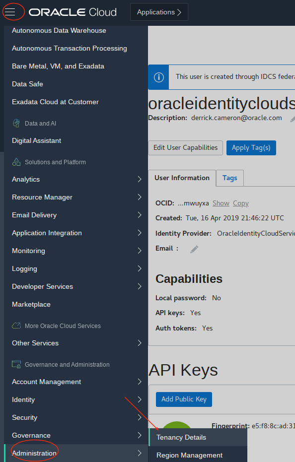

  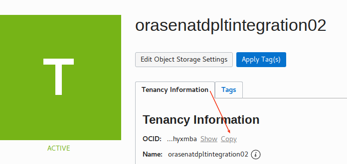

  - `user`  Navigate to `Identity` > `Users` and then locate the userid you are using/logged in as and copy the user ocid key.

  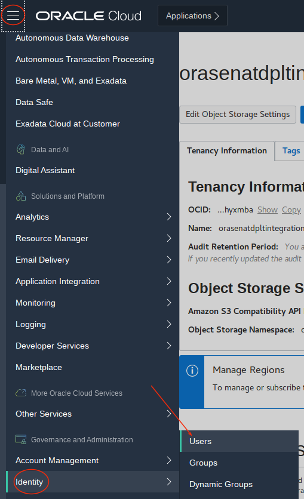

  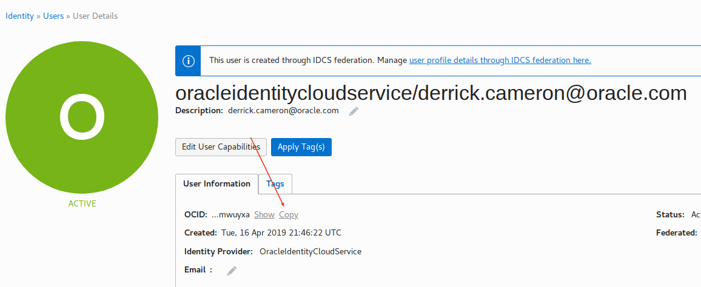

  - `region` Navigate to `Admministration` > `Region Management` and locate the region.  Note the region name is in the upper right at all times, but you need to enter the region identifier.

  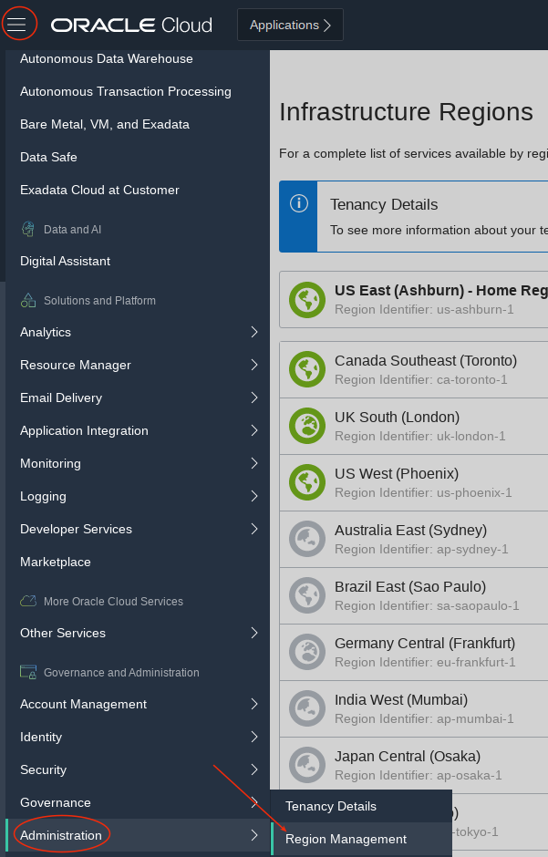

  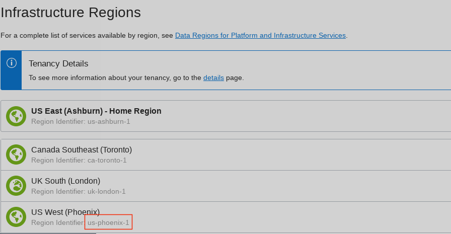

  - `compartment`  Navigate to `Identity` > `Compartments`.  We have been using the `Workshop1` compartment under the root tenancy compartment.

  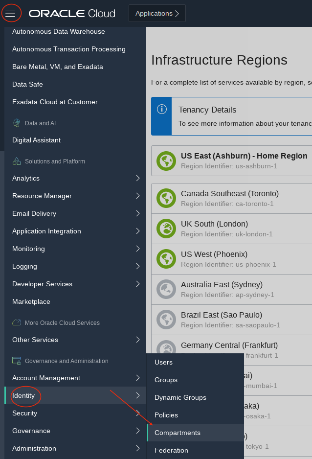

  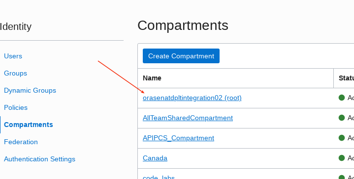

  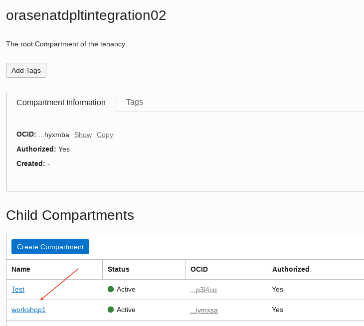

  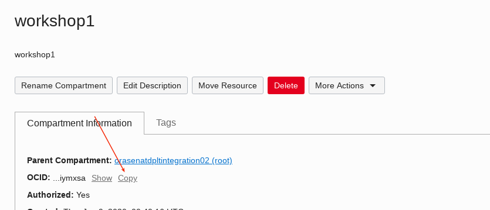

## **STEP 6**:  Configure the Oracle CLI

- SSH into the Developer Cloud Image to configure the CLI.  With **opc** user enter the following.  Respond to prompts with the OCIDs you copied in the previous step.  Accept Y to generate a new RSA key pair and accept location defaults.
```
<copy>oci setup config</copy>
[opc@workshop1-4199 ~]$ oci setup config
    This command provides a walkthrough of creating a valid CLI config file.

    The following links explain where to find the information required by this
    script:

    User OCID and Tenancy OCID:

        https://docs.cloud.oracle.com/Content/API/Concepts/apisigningkey.htm#Other

    Region:

        https://docs.cloud.oracle.com/Content/General/Concepts/regions.htm

    General config documentation:

        https://docs.cloud.oracle.com/Content/API/Concepts/sdkconfig.htm


Enter a location for your config [/home/opc/.oci/config]: 
Enter a user OCID: ocid1.user.oc1..aaaaaaaa443hu7igiflzxo6lbqnri7m67s6w4vprhxu5vdy3l6
Enter a tenancy OCID: ocid1.tenancy.oc1..aaaaaaaa7l6wfqydzz6otbjnhrloxf4tezittufwjlwbaoxvaj
Enter a region (e.g. ap-mumbai-1, ap-seoul-1, ap-sydney-1, ap-tokyo-1, ca-toronto-1, eu-frankfurt-1, eu-zurich-1, sa-saopaulo-1, uk-london-1, us-ashburn-1, us-gov-ashburn-1, us-gov-chicago-1, us-gov-phoenix-1, us-langley-1, us-luke-1, us-phoenix-1): us-phoenix-1
Do you want to generate a new RSA key pair? (If you decline you will be asked to supply the path to an existing key.) [Y/n]: Y
Enter a directory for your keys to be created [/home/opc/.oci]: 
Enter a name for your key [oci_api_key]: 
Public key written to: /home/opc/.oci/oci_api_key_public.pem
Enter a passphrase for your private key (empty for no passphrase): 
Private key written to: /home/opc/.oci/oci_api_key.pem
Fingerprint: 58:a6:f3:d6:11:e4:47:33:9c:eb:50:91:32
Config written to /home/opc/.oci/config


    If you haven't already uploaded your public key through the console,
    follow the instructions on the page linked below in the section 'How to
    upload the public key':

        https://docs.cloud.oracle.com/Content/API/Concepts/apisigningkey.htm#How2

```

- Navigate back to your userid (`Identity` > `Users`) and select your userid again.  Select `Add Public Key`.  Select the public key that was generated in the previous step (`/home/opc/.oci/oci_api_key_public.pem`).  Note that if your user already has three keys (maxiumum) then you may need to delete one.

  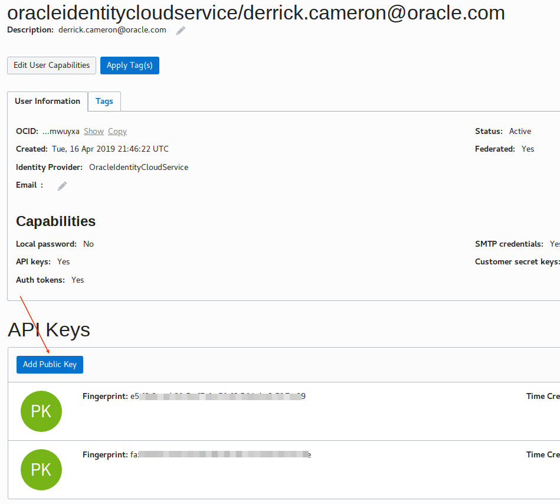

  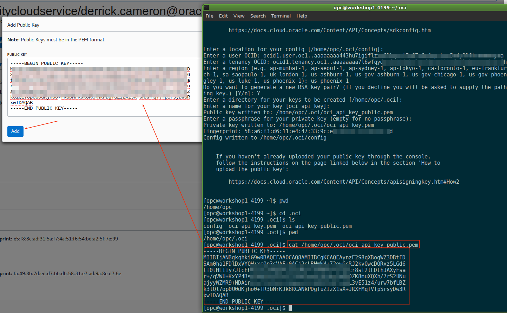

- Copy the Fingerprint - we'll use that later.

  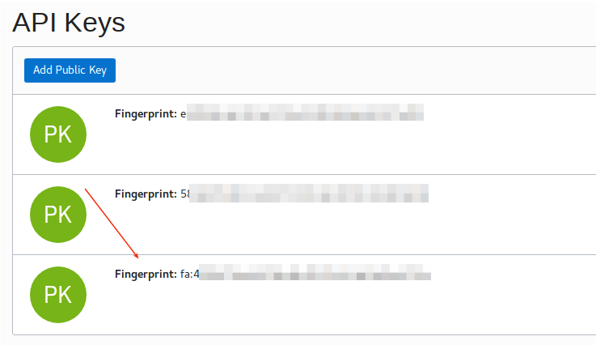

## **STEP 7**:  Run sample CLI commands.

- Retrieve a region list:
```
<copy>oci iam region list --output table</copy>
[opc@workshop1-4199 ~]$ oci iam region list --output table
+-----+----------------+
| key | name           |
+-----+----------------+
| BOM | ap-mumbai-1    |
| FRA | eu-frankfurt-1 |
| GRU | sa-saopaulo-1  |
| IAD | us-ashburn-1   |
| ICN | ap-seoul-1     |
| KIX | ap-osaka-1     |
| LHR | uk-london-1    |
| NRT | ap-tokyo-1     |
| PHX | us-phoenix-1   |
| SYD | ap-sydney-1    |
| YYZ | ca-toronto-1   |
| ZRH | eu-zurich-1    |
+-----+----------------+
[opc@workshop1-4199 ~]$ 
```

- List compute images. Substitute your compartment-id in the placeholder.
```
<copy>oci compute image list -c ocid1.compartment.oc1..aaaaaaaajvin7fmiq...j5abr5i3ouvifvvq --output table --query "data [*].{ImageName:\"display-name\", OCID:id}"</copy>
+------------------------------------------------------------------------+----------------------------------------------------------------------------------+
| ImageName                                                              | OCID                                                                             |
+------------------------------------------------------------------------+----------------------------------------------------------------------------------+
| Windows-Server-2016-Standard-Edition-VM-Gen2-2020.01.14-0              | ocid1.image.oc1.phx.aaaaaaaan57vn7nfbjtklcc2e46jzylum7d3jnb762erd26evl3xhnvoceya |
| Windows-Server-2016-Standard-Edition-VM-Gen2-2019.11.15-0              | ocid1.image.oc1.phx.aaaaaaaatte3vcpa7kkogul7zbvnxfjsgwzptmbx7n7qqrzk62skron5on7a |
| Windows-Server-2016-Standard-Edition-VM-B1-2020.01.14-0                | ocid1.image.oc1.phx.aaaaaaaaahvlltilsjyszj4egmwc2uswey2xnm5cidhcn6uw6nrcwfzftgwq |
| Windows-Server-2016-Standard-Edition-VM-B1-2019.12.13-0                | ocid1.image.oc1.phx.aaaaaaaaesufuvaxlwoowvi5vns73kvoiacmilt4vjtz4d34h42cjhy6f4ra |
| Windows-Server-2016-Standard-Edition-VM-2020.01.14-0                   | ocid1.image.oc1.phx.aaaaaaaacotjlxb3llr7oxgdljehptz4uvzakbqr6g3u6s526suncdkk3naa |
| Windows-Server-2016-Standard-Edition-VM-2019.11.15-0                   | ocid1.image.oc1.phx.aaaaaaaafqjf2y77ywfz5qzbwroudwtyx32o566ahtzinqsiaegxrjomu5nq |
| Windows-Server-2016-Datacenter-Edition-BM-Gen2-E2-2020.01.14-0         | ocid1.image.oc1.phx.aaaaaaaajb3gxdsiunxazovxgx4lq2a26tlgprgeoar6bihuhseg63phegxq |
|...
```

- When configuring the CLI tool a config file was generated and you entered some information in the prompts. This information can be entered in the command line as parameters, but this can become lengthy. Note that the install created a .oci (hidden) directory in the user's home directory. Review the contents - enter the following. We will be make more CLI requests that will have additional parameters. These parameters can be added to the config file to save typing in the future.
```
<copy>oci db database -h</copy>
[opc@workshop1-4199 ~]$ oci db database -h
Usage: oci db database [OPTIONS] COMMAND [ARGS]...

  An Oracle database on a bare metal or virtual machine DB system. For more
  information, see Bare Metal and Virtual Machine DB Systems. To use any of
  the API operations, you must be authorized in an IAM policy. If you're not
  authorized, talk to an administrator. If you're an administrator who needs
  to write policies to give users access, see [Getting Started with
  Policies]. **Warning:** Oracle recommends that you avoid using any
  confidential information when you supply string values using the API.

Options:
  -?, -h, --help  For detailed help on any of these individual commands, enter
                  <command> --help.

Commands:
  create              Creates a new database in the given DB...
  create-from-backup  Creates a new database in the given DB System...
  delete              Deletes a database.
  get                 Gets information about a specific database.
  list                Lists all databases in a given DB System.
  patch               Perform a patch action for a given patch and...
  restore             Restore a Database based on the request...
  update              Update a Database based on the request...
```

- To list databases (within database services) we'll need the db-system-id. Go to the cloud console to get that. Select the `Workshop1_db` system, and then select the OCID.  Be sure you are in compartment `workshop1` and in the region you are using.

  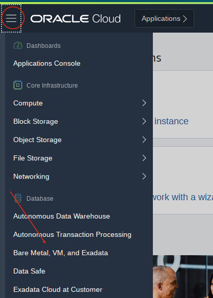

  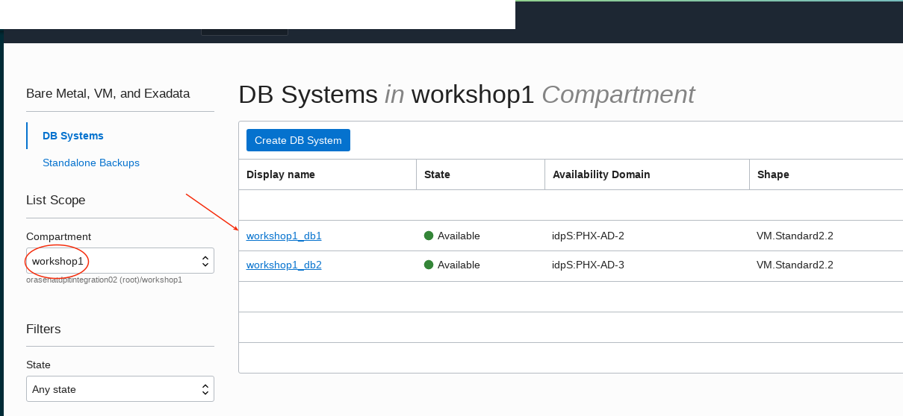

  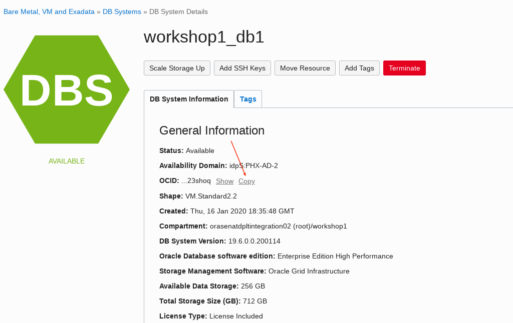

- Then go back to the terminal window and enter the following:
```
<copy>oci db database list --compartment-id ocid1.compartment.oc1..aaaaaaaaj...j5abr5i3ouvifvvqtov --db-system-id ocid1.dbsystem.oc1.phx.abyhqljr6hz...3ctezfd57gjqzapadpf</copy>
[opc@workshop1-4199 ~]$ oci db database list --compartment-id ocid1.compartment.oc1..aaaaaaaajvi...abr5i3ouvifvvqtovw --db-system-id ocid1.dbsystem.oc1.phx.abyhqljr6...d57gjqzapadpfq2
{
  "data": [
    {
      "character-set": "AL32UTF8", 
      "compartment-id": "ocid1.compartment.oc1..aaa...j5abr5i3ouvifvvqtovw", 
      "connection-strings": {
        "all-connection-strings": {
          "cdbDefault": "workshop1.sub01092328510.vcn1.oraclevcn.com:1521/orcl_phx273.sub01092328510.vcn1.oraclevcn.com", 
          "cdbIpDefault": "(DESCRIPTION=(CONNECT_TIMEOUT=5)(TRANSPORT_CONNECT_TIMEOUT=3)(RETRY_COUNT=3)(ADDRESS_LIST=(LOAD_BALANCE=on)(ADDRESS=(PROTOCOL=TCP)(HOST=10.0.0.7)(PORT=1521)))(CONNECT_DATA=(SERVICE_NAME=orcl_phx273.sub01092328510.vcn1.oraclevcn.com)))"
        }, 
        "cdb-default": "workshop1.sub01092328510.vcn1.oraclevcn.com:1521/orcl_phx273.sub01092328510.vcn1.oraclevcn.com", 
        "cdb-ip-default": "(DESCRIPTION=(CONNECT_TIMEOUT=5)(TRANSPORT_CONNECT_TIMEOUT=3)(RETRY_COUNT=3)(ADDRESS_LIST=(LOAD_BALANCE=on)(ADDRESS=(PROTOCOL=TCP)(HOST=10.0.0.7)(PORT=1521)))(CONNECT_DATA=(SERVICE_NAME=orcl_phx273.sub01092328510.vcn1.oraclevcn.com)))"
      }, 
      "db-backup-config": {
        "auto-backup-enabled": false, 
        "auto-backup-window": null, 
        "backup-destination-details": null, 
        "recovery-window-in-days": null
      }, 
      "db-home-id": "ocid1.dbhome.oc1.phx.abyhqljr...trvsy34dnhqvlkk2gfg", 
      "db-name": "orcl", 
      "db-unique-name": "orcl_phx273", 
      "db-workload": "OLTP", 
      "defined-tags": {}, 
      "freeform-tags": {}, 
      "id": "ocid1.database.oc1.phx.abyhqljr6h...re4nheieptpzkb", 
      "lifecycle-details": null, 
      "lifecycle-state": "AVAILABLE", 
      "ncharacter-set": "AL16UTF16", 
      "pdb-name": "pdb1", 
      "time-created": "2020-01-16T18:35:48.400000+00:00"
    }
  ]
}
[opc@workshop1-4199 ~]$ 
```

- List virtual cloud networks.
```
<copy>oci network vcn list -c ocid1.compartment.oc1..aaaaaaaajvin...5abr5i3ouvifvvqt (note that -c is a shortcut for --compartment-id)</copy>
[opc@workshop1-4199 ~]$ oci network vcn list -c ocid1.compartment.oc1..aaaaaaaajv....lnij5abr5i3ouvifvvq
{
  "data": [
    {
      "cidr-block": "10.0.0.0/16", 
      "compartment-id": "ocid1.compartment.oc1..aa...ouvifvvqt", 
      "default-dhcp-options-id": "ocid1.dhcpoptions.oc1.phx.aa...o3biycp5oq", 
      "default-route-table-id": "ocid1.routetable.oc1.phx.aaaaa...amhlqizv66q", 
      "default-security-list-id": "ocid1.securitylist.oc1.phx.aaa...jdtsuipzq", 
      "defined-tags": {}, 
      "display-name": "vcn1", 
      "dns-label": "vcn1", 
      "freeform-tags": {
        "VCN": "VCN-2020-01-09T23:26:57"
      }, 
      "id": "ocid1.vcn.oc1.phx.amaaaaaamr634...kuit7vbr44d", 
      "ipv6-cidr-block": null, 
      "ipv6-public-cidr-block": null, 
      "lifecycle-state": "AVAILABLE", 
      "time-created": "2020-01-09T23:29:56.371000+00:00", 
      "vcn-domain-name": "vcn1.oraclevcn.com"
    }
  ]
}
[opc@workshop1-4199 ~]$ 
```

- We have been retrieving information so far.  We can also create services.  Note that if you intend to create and manage several cloud services it is recommended you use terraform rather than the oci cli.
```
<copy>oci network vcn create -c ocid1.compartment.oc1..aaaa...vifvvqto --cidr-block "10.0.0.0/16"</copy>
[opc@workshop1-4199 ~]$ oci network vcn create -c ocid1.compartment.oc1..aaaa...ouvifvvqto --cidr-block "10.0.0.0/16"
{
  "data": {
    "cidr-block": "10.0.0.0/16", 
    "compartment-id": "ocid1.compartment.oc1..aaaaa...ifvvqto", 
    "default-dhcp-options-id": "ocid1.dhcpoptions.oc1.phx.aa...ku35relv6a", 
    "default-route-table-id": "ocid1.routetable.oc1.phx.aaa....hx4zp7mpq", 
    "default-security-list-id": "ocid1.securitylist.oc1.phx.aaaaaa...63ublyava", 
    "defined-tags": {}, 
    "display-name": "vcn20200131235024", 
    "dns-label": null, 
    "freeform-tags": {}, 
    "id": "ocid1.vcn.oc1.phx.amaaaa...3c4zq", 
    "ipv6-cidr-block": null, 
    "ipv6-public-cidr-block": null, 
    "lifecycle-state": "AVAILABLE", 
    "time-created": "2020-01-31T23:50:24.402000+00:00", 
    "vcn-domain-name": null
  }, 
  "etag": "a029238e"
}
[opc@workshop1-4199 ~]$
```

- Go back to the console to confirm the vcn was created.

  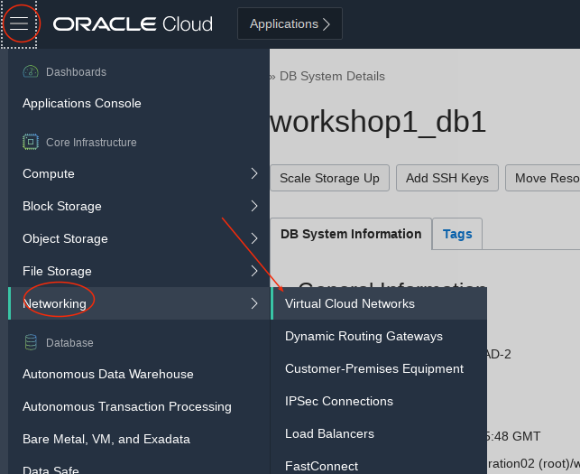

  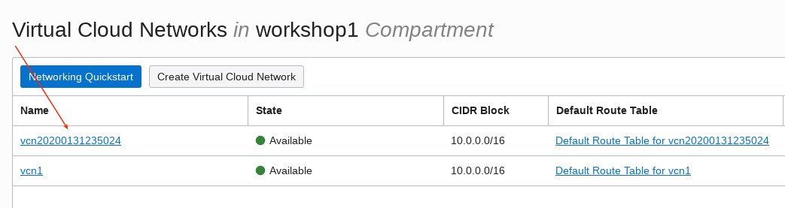
