# Lab 400: Low Code, Microservice Mobile Development

## Before You Begin
### Objectives
- Create a Mobile Application.
- Access the REST services you deployed in Lab 300 on OKE.
- Deploy the mobile application to your phone (Android based).

### Introduction

In this lab you will use Oracle Visual Builder which is a cloud-based software development Platform as a Service (PaaS) and a hosted environment for your application development infrastructure. It provides an open-source standards-based solution to develop, collaborate on, and deploy applications within Oracle Cloud. You will build on the previous labs using the REST points exposed by the AlphaOffice application to OKE in Lab 300.

## Required Artifacts

- Lab 300 needs to be completed with the Product REST application deployed.

- Use Chrome browser works best in it

## **STEP 1**: Configure Visual Builder Studio to create Mobile App

1. Click on the hamburger menu on top left , hover on **Platform Services**, and then click on **Developer**

    

2. Once the instance is ready open the instance by clicking on hamburger menu and then click on **Access Service Instance**

    

3. Click on hamburger menu, select your **Project** from the **Organization** and then click on **Environments**.

    

4. Click on **Create Enviornment**.
  
    

5. Give the name of Enviornment,such as appDevApp.
  
    

6. Click on **Add** to select the VBCS instance
        
    

7. Make sure Visual Builder is selected and then chose your Visual builder instance and then click **Add**
  
    

8. It will take few seconds for enviornment to get ready, once it is ready click on **Designer** tab

    

9. Click on **Create Workspace**

    

10. Select **New Visual Application**, enter a **Name**, check **Scratch repository**, select **appDevApp** for the Developement environment and click **Create Workspace**.

    

11. An initial page will show. Now you will begin to create the components used in the application.

    

## **STEP 2**: Create Service Connections

Service Connections are REST endpoints pointing to various services. In this step you will reference REST endpoints from the application deployment you created in Lab 300. We will create endpoints for GET, GET/{id}, POST.

1. If not already opened click on the **Navigator icon** near the upper left hand side of the web page. This will expand the pane. You can click the **X** on the Welcome tab to close it. Finally, click on the **Service Connections** icon.

    

2. Click **+** button to add new connection

    

3. Select **Define by Endpoint**
  
    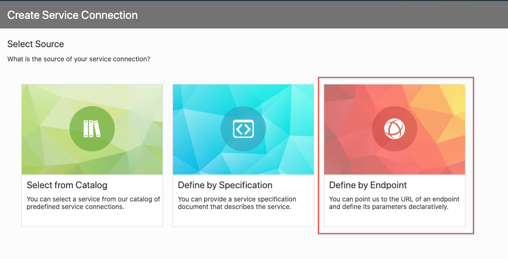

4. Leave the Method as **GET**. From Lab 300 **Copy and Paste the URL** used to test the REST endpoint that retrieved all of the Product Catalog records. 

    **Note:**  In this example:  `http://150.136.0.174:8080/product/list` into the URL field. Leave the Action Hint at **Get Many**:

    

5. Click **Next**.

6. Select the **Test** tab and click **Send**. The request should return all of the records (shown in the Response). If successful, click the **Save as Example Response** button.

    

7. Click **Create**.

    

8. Click the **Endpoints** tab to see the created GET. Click **+ Endpoint** to add another.

    

9. Create another **GET** method with the PATH having a **suffix** of **/{id}**. Set the Action Hint dropdown to **Get One**.

    

10. Click the **Test** tab. For the URL Parameter enter **1027**. Click **Send**. One record is returned with the PRODUCT_ID of `1027`. If successfull, Click the **Save as Example Response** button.

    

11. Click **Add**.

    

12. Create one more REST Endpoint for request info.

    

13. Select **Define by Endpoint**
  
    

14. Select **POST as method** and give the URL ending with **/user/request** and in Action Hint select **Create**, click **Next**.

    

15. Click on **Test** tab and copy the following JSON payload in body.

    ```
    <copy>
    {
      "request": {
        "product_id": "1040",
        "first_name": "ABC",
        "last_name": "XYZ",
        "email_address": "test @gmail.com ",
        "phone_number": "431 - 232 - 2212 ",
        "comments": "need more information regarding product 1027"
      }
    }
    </copy>
    ```

16. Click on Send button and if the response is 200, click on **Save as Example Request** and **Save as Example Response**. Click **Create**
   
    


## **STEP 3**: Import Mobile Application

1. First we will download the skeleton framework to create Mobile Application. Download from [here](https://objectstorage.us-ashburn-1.oraclecloud.com/n/natdcshjumpstartprod/b/spw-appDev-DevOps-files/o/alphaMobileAppSkeleton.zip)

2. Select the **Mobile Applications** icon on the left on side of the web page and then click **Upper Right-Hand menu** and select **Import**.

    

3. Drag the file which we just downloaded and then click **Import**

    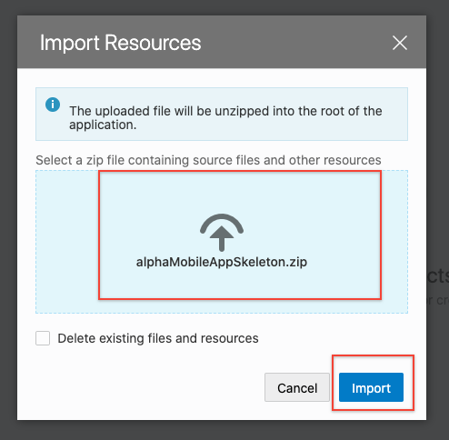

4. Click on Mobile Application and the select **main-start**

    

5. Make sure you are on  **Designer** tab and **Design** view. Here you will see the page. Currently is it blank.

    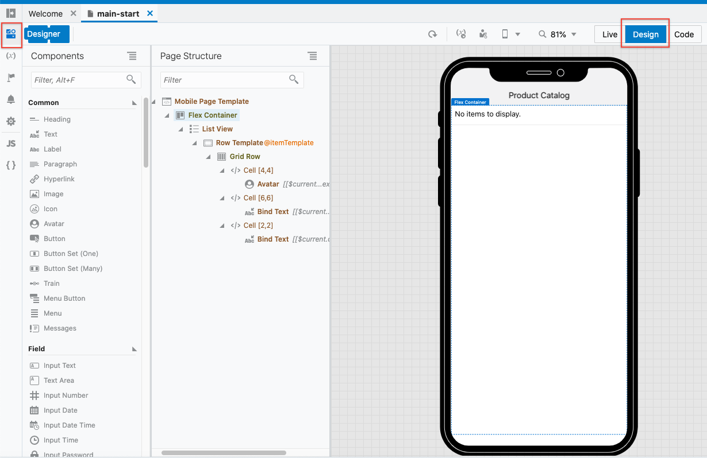

6. Now drag and drop a **Heading** component right below the image field. Your screen should look like:

    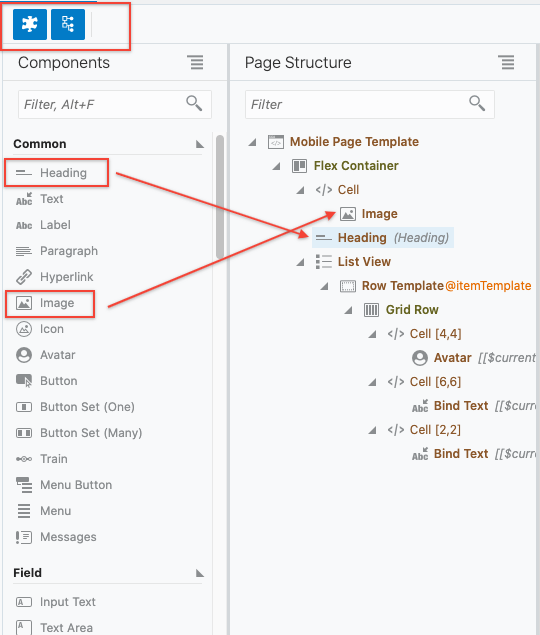

7. Your application should be in Design Mode:

    

8. Time to set some Properties. You can select the specific component who wish to set property values for by ether selecting from the Page Structure OR the display canvas. In some cases it will be easier to use one or the other...

9. Select the **Mobile Page Template** from the Page Structure pane and name it Products or Catalog anything you perefer.
  
    

10. ... which can be found under the **General** properties area on the right.

11. You'll notice the change does not take affect until you tab out of the Page Title field.

12. Click on the **Heading** field and set the text to:
  
    ```
    <copy>
    Products
    </copy>
    ```

13. ... leaving the Heading size to **H1**. You screen looks like:

    

14. Download a static image from here: [AlphaOffice Image](https://objectstorage.us-ashburn-1.oraclecloud.com/n/natdcshjumpstartprod/b/spw-appDev-DevOps-files/o/AlphaOfficeSupply.png). Click on this link and save the file locally.

15. Now, click on the **Image** component in the canvas and click the **Data** tab in the Properties section. 

    

16. Click on the **Drop an image here...** box and upload the static image; **AlphaOfficeSupply.PNG** you just downloaded:

    

17. The image is uploaded. If it doesn't display right away on the canvas click the **Refresh icon**.

    

18. Your screen should now look like:

    

## **STEP 4**: Configure Main page with all products information

1. Click on Variables and then click on **+Variable** to create new variable. Here we are creating variable to store all the product information we fetch from the rest endpoint. Give some meaningful name like getProducts and make sure type is **Service Data Provider** and then click **Create**

    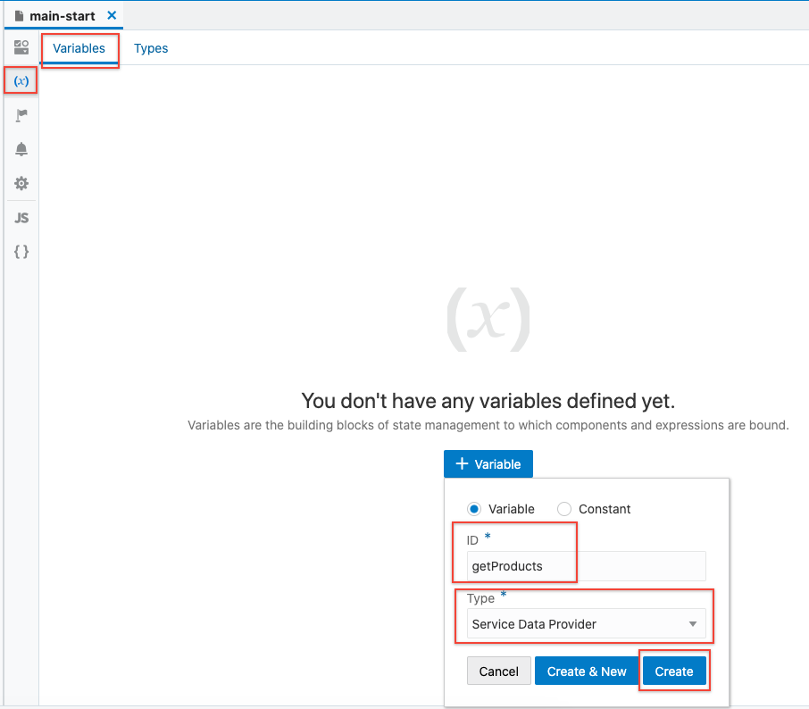

2. Once the variable is created on the left hand panel click **Select Endpoint**

    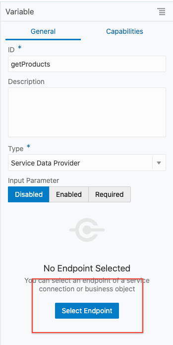

3. Under Service Connections select the get /list which will fetch all the products.

    

4. We already imported a variable type with the application so we can click on **Use Existing Type** and  select **getProducts** and then click **Finish**.

    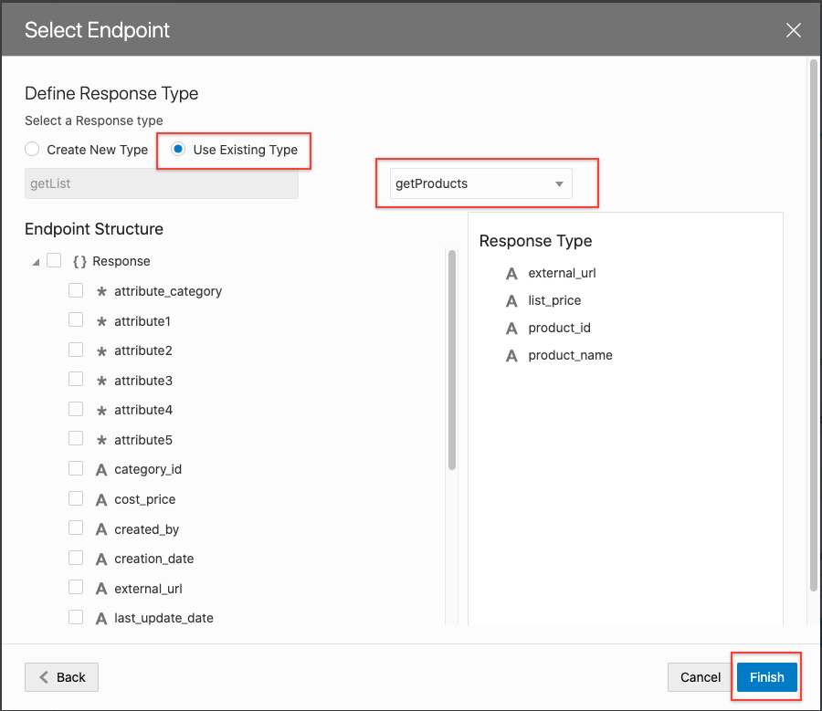

5. Once endpoint is configured variable will look something as below image. We need to provide **Key Attributes** which is **product_id** in this variable.

    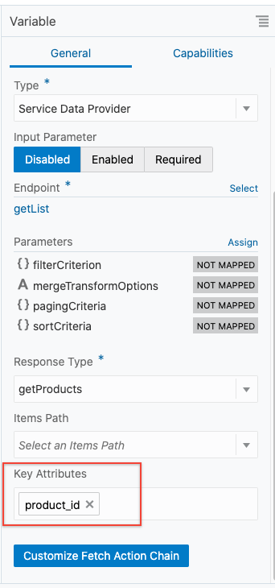

6. Go to **Designer Tab** and here you can now see the products are displayed.

    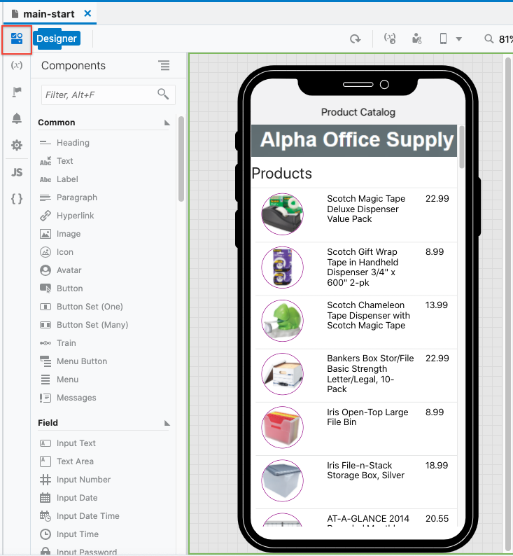


## **STEP 5**: Configure details page to show product details

1. In this step we are configuring product details page where we can see information of single product. For that we need to configure the page with REST Endpoint to fetch the single record.

2. Click on **main-get-id-detail** under pages Then click on Flag icon which is Actions. Click on **loadGetidChain**

    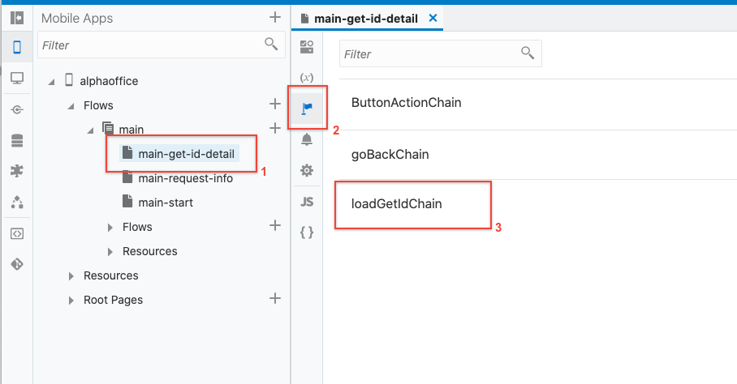

3. There click on **Call REST Endpoint** and finally click on **Select Endpoint**.

    

4. Click on **Service Connections** and select product endpoint with **get /{id}**. Click Select

    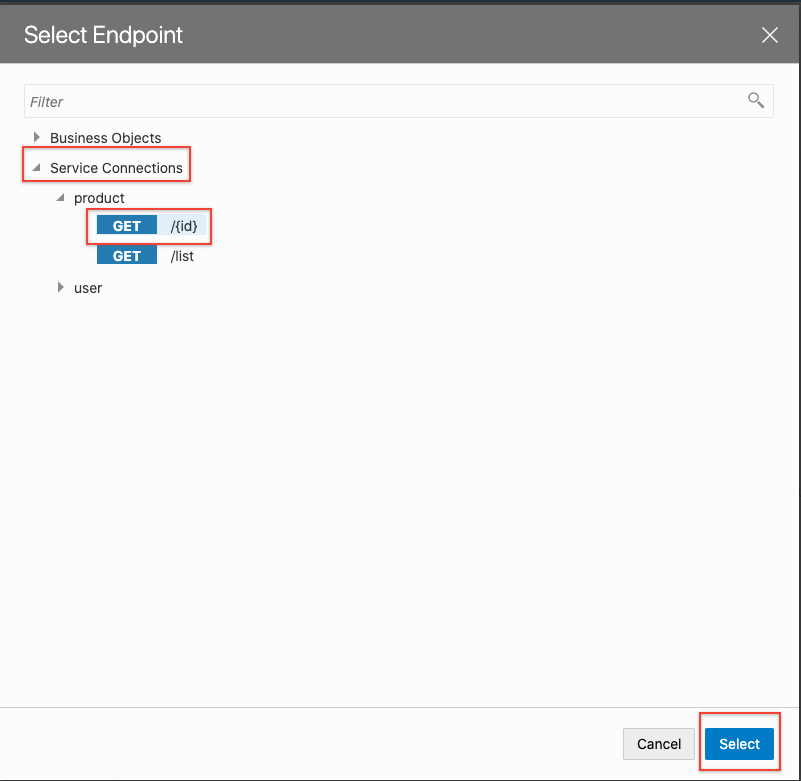

5. Once endpoint is configured, you will see the details. Here we need to map Input Parameter ID which is tell our REST Endpoint which product we want information about.

6. Click on **Assign** button aligned with Input Paramaters

    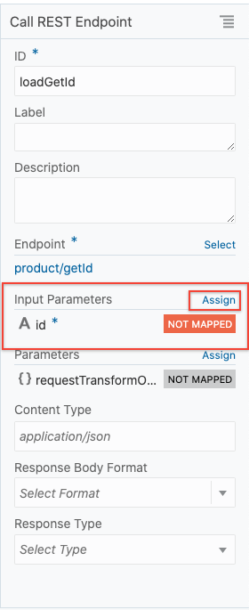

7. Drag getIdId from Sources to id in Target. Click **Save**
  
    

8. At this point to test the application so far, click on Play button in Navigation Bar 

    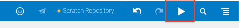

## **STEP 6**: Configure request more info page to submit product information request

1. In this Step we will configure request more info page.

2. If you click on **main-request-info** and then **Designer** tab. We can see the form. Our main goal for this step is to configure the Submit Button so that we can post the request information using POST REST Endpoint.

    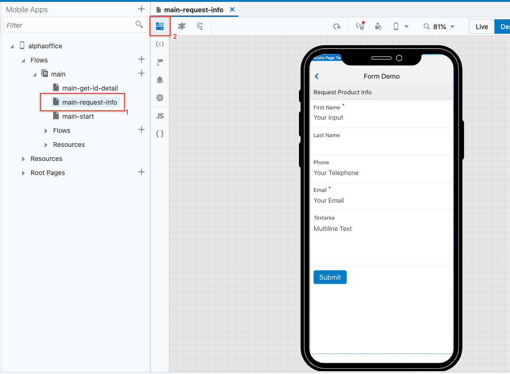

3. Click on **Actions** tab.

    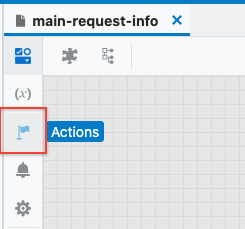

4. Under **Actions** page click on **SubmitButtonActionChain**

    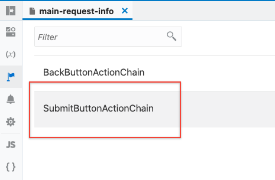

5. Click on **Call REST Endpoint** and then on right panel click **Select Endpoint**
  
    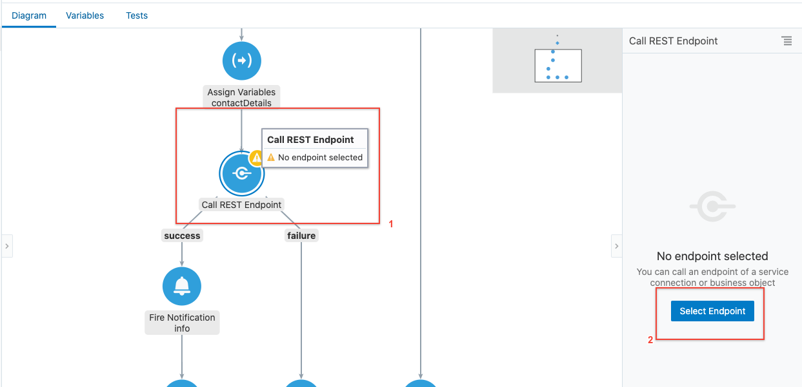

6. Click on **Service Connections** and select **POST /request** endpoint.
  
    

7. Once endpoint is configured, we need to set the body for POST method. Under Parameters click **Assign**

    

8. Drag and drop contactDetails from Source to Body in Target. Click **Save**

    


## **STEP 7**: Test

1. Now let's test the app to make sure everything works fine. Click on Play button in Navigation Bar 

    

2. In Home page you should be able to see all the products. Click on any product to show the detail page.

    

3. You should be able to see the product details. Click on **Request More Info** button.
  
    

4. Fill out the form, we have First name and email markes as required if you try to submit it empty it will throw error. You can try leaving empty. Once form is filled click **Submit**

    

5. If the form is submitted successfully, we will get notification and it will navigate to previous page which is details page.
  
    

## **STEP 8**: Save the app using Git

- From the navigation bar, click on git master, and form dropdown select push.
    
    

- Write the commit message and then click on **Push to Git**

    

- To see the changes go back to your Visual Builder instance and click on Git in left panel. Make sure you selected appropriate git repository to see the changes you pushed.

    


**This completes the Lab!**

**You are ready to proceed to** *Lab 500*

## Acknowledgements

- **Authors/Contributors** - Varun Yadav
- **Last Updated By/Date** - 
- **Workshop Expiration Date** - May 31, 2021

## See an issue?
Please submit feedback using this [form](https://apexapps.oracle.com/pls/apex/f?p=133:1:::::P1_FEEDBACK:1). Please include the *workshop name*, *lab* and *step* in your request.  If you don't see the workshop name listed, please enter it manually. If you would like us to follow up with you, enter your email in the *Feedback Comments* section.     
