## Lab 100 - Getting Started with Oracle Integration Cloud ERP Integration   (OIC-ERP Integration)

## Objectives

This document walks you through the steps needed to replicate this use case in your environment.

## BUILDING THE ERP CLOUD IMPORT JOURNAL ENTRIES (FBDI) USE CASE

This section works through the steps that are required to build the integration from scratch.

**Prerequisites:**

You will need access to the following applications and products:

• Oracle Integration Cloud (OIC)

• ERP Cloud R12+

• An FTP Server

• journalentries.zip

## Oracle Integration Cloud (OIC):

**Step 1:** 

Login into the Oracle Integration Cloud Home page , after which you see the home page as below:

 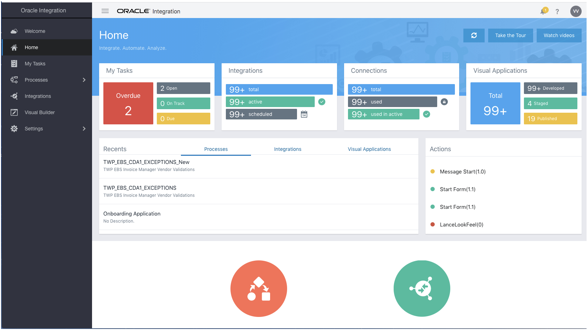

**Step 2:**

 Click on the left side panel under Integrations tab so you can start creating integrations

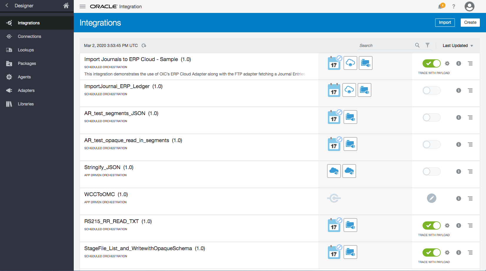

**Step 3:** 

On the left panel click on the connections and you will be able to see connections page as below:

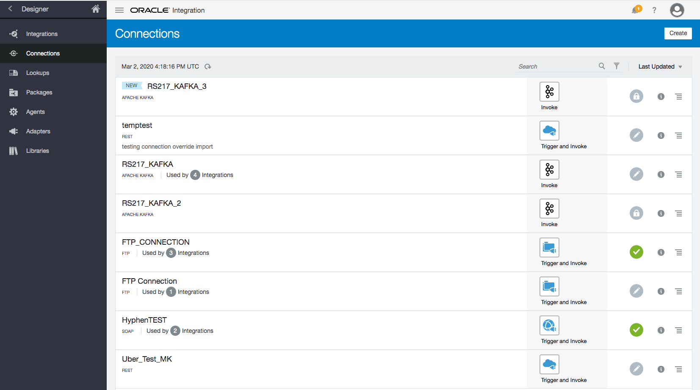

**Step 4:**

 Click on the create button and you will be able to see list of adapters available currently in OIC

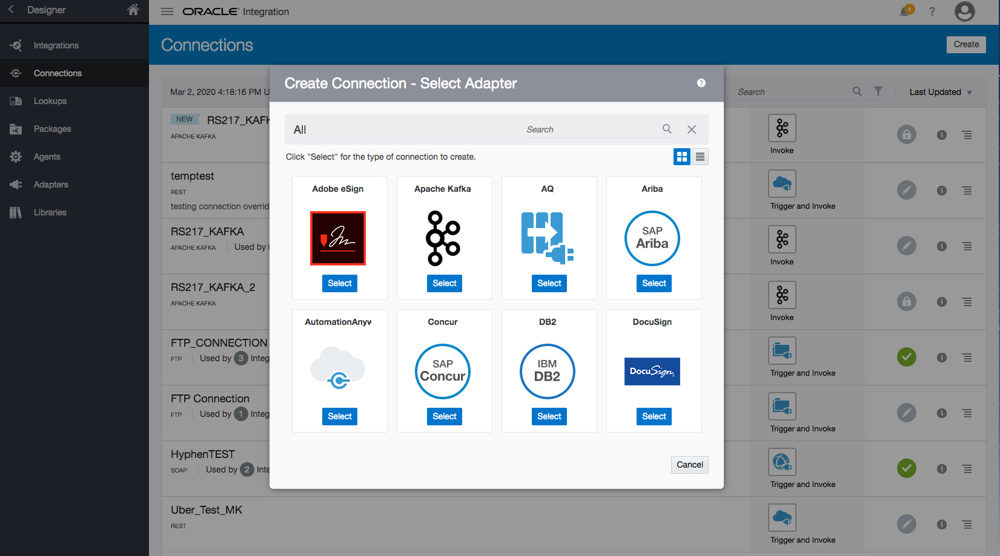

## FTP Connection SetUp:

**Step 5:** 

For Setting up **FTP Connection** on the search screen in **Step 4** type FTP and select the adapter as shown below:

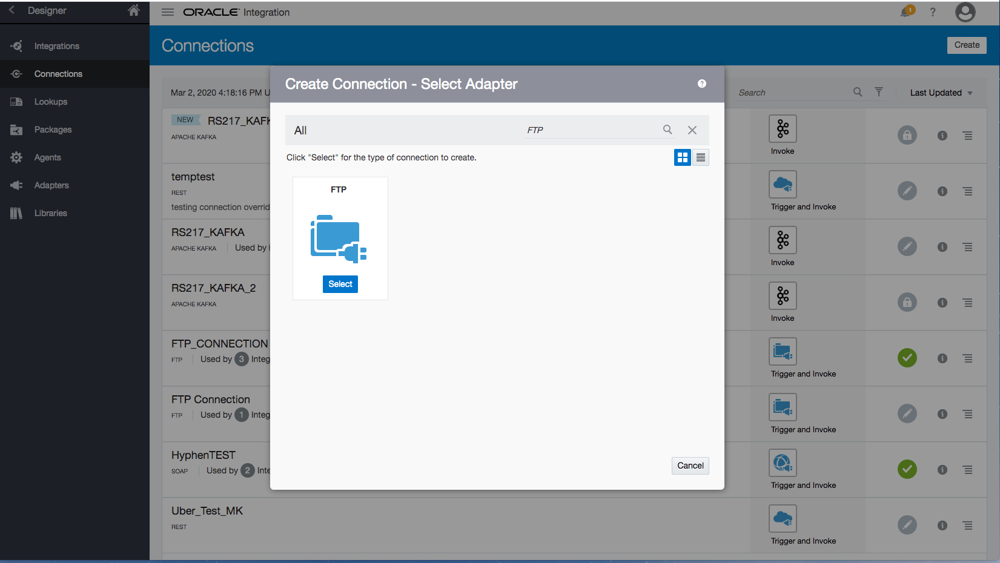

**Step 6:** 

Click on select button and you will be able to see a page to enter details of Name of the connection and enter a brief description and click on the create button

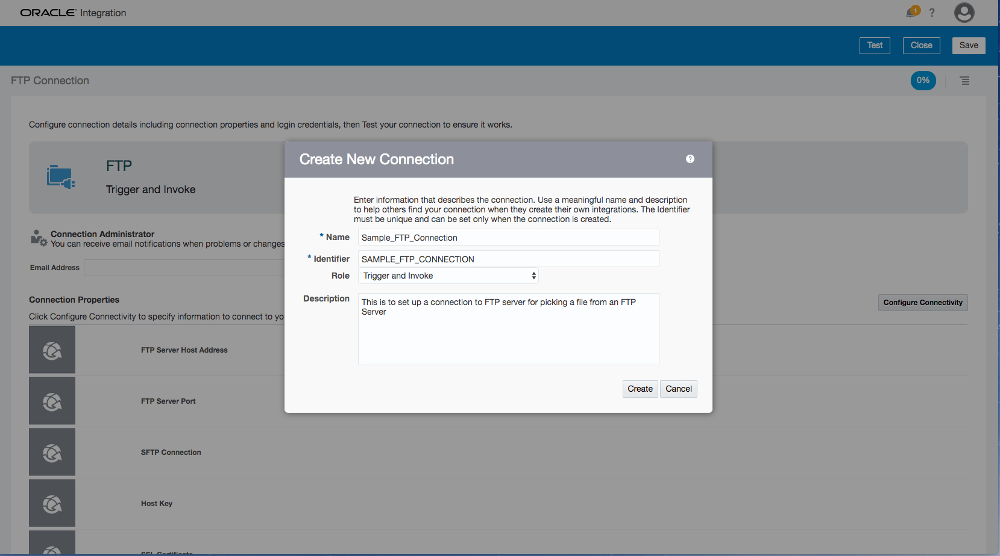

**Step 7.1:** 

Enter the **FTP Server Host Address**, **Port** and make sure the **SFTP Connection** is set to **Yes** .

 >**Details Picture 1:**

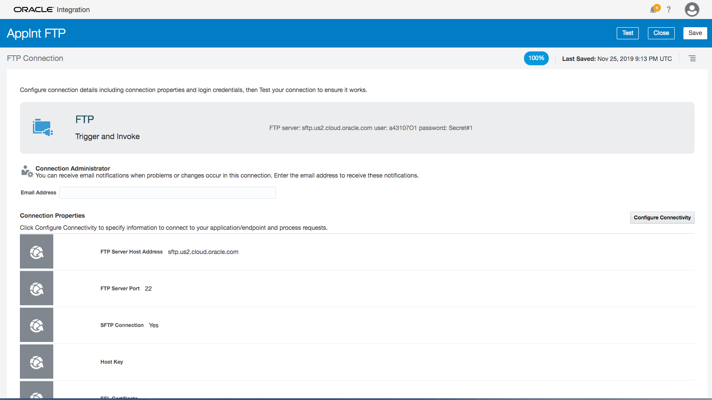

**Step 7.2:** 

Select the **Security Policy** as ***"FTP Server Access Policy"*** and Enter the **UserName** and **Password** details as well.

 >**Details Picture 2:**
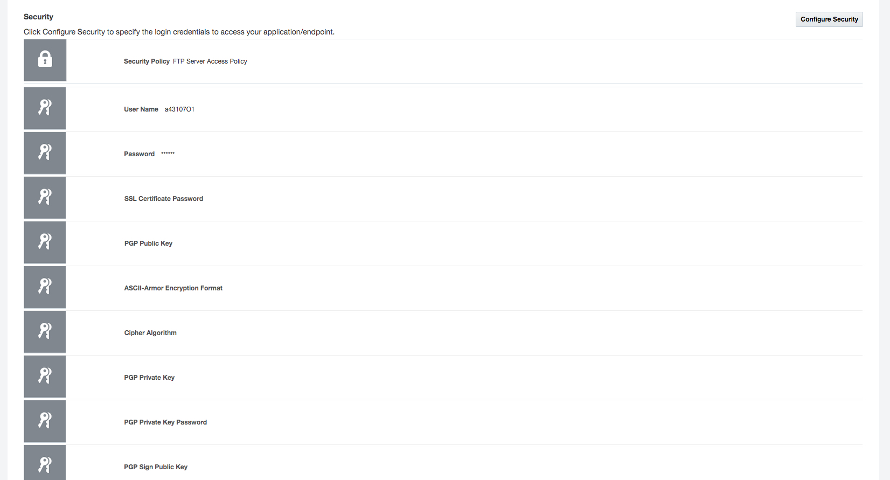

**Step 8:** 

Make sure the % on top is 85% and after clicking on Test it should become 100% and display the message as shown below

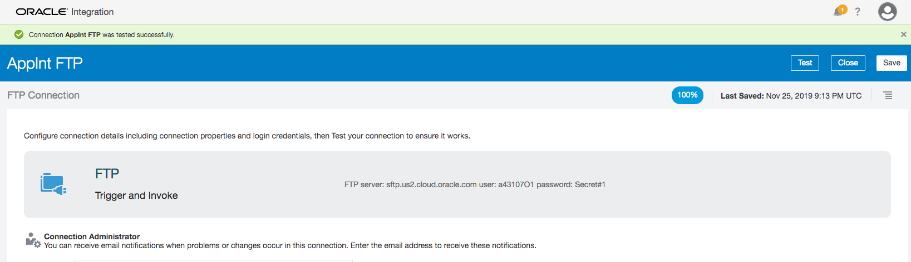

After this step hit the Save button and repeat the same until **Step 4** for ERP Connection.

## ERP Connection SetUp

**Step 9:** 

Type Oracle ERP Cloud in the list of adapters ***search*** section and you can see the ***ERP adapter*** listed as in the image below:

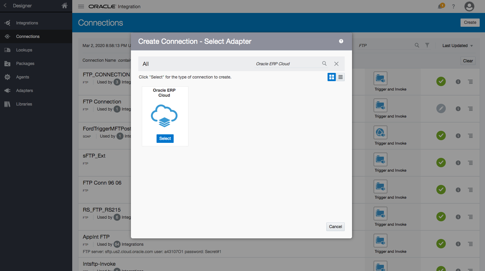 

**Step 10:** 

Enter the details into this adapter like ***"ERP Services Catalog WSDL URL","ERP Events Catalog URL (optional)","Interface Catalog URL (optional)"*** and chose the **Security Policy** as *** Username Password Token*** and enter **Username** and **Password**.

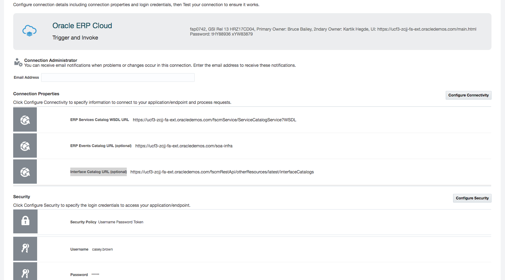

**Step 11:** 

After successful entering of details click on the Test Button on the top right corner and make sure it comes to a 100% and tested successfully.

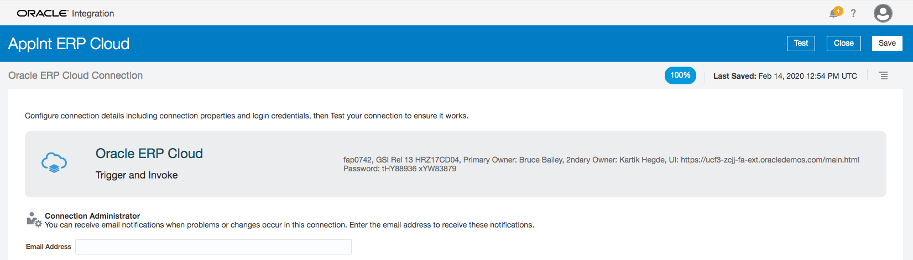
 

 
***Congratulations!*** Now that you  have succesfully set up connections, lets start orchestrating our **Integration!!**
