## Lab 200 - Orchestrating ERP Import Journals Integration

This section walks you through the process of Orachestrating an integration and having a dataflow between different systems making sure all of them are connected.

Key takeaways from this lab:
- Understanding the types of Orchestrations Oracle Offers
- Creating and Configuring the FTP and ERP adapters
- Activating and Triggering the Integration
- Monitoring Integration

## Creating an Integration:

**Step 1:**

 On the Oracle Integration Cloud home page, click **Integrations.**

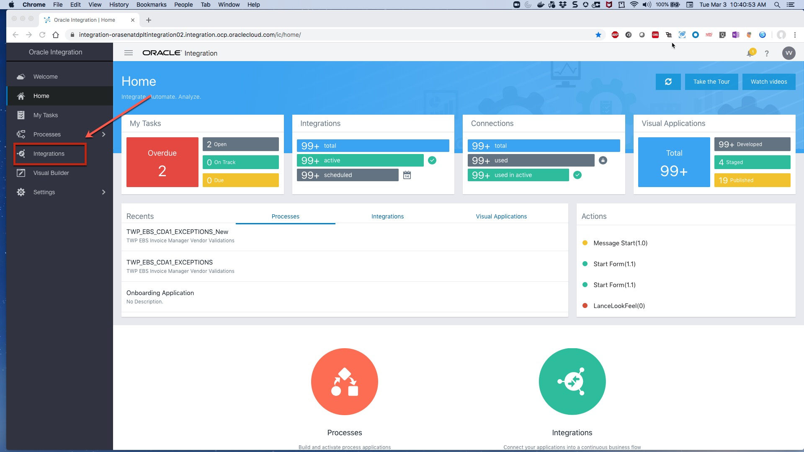

**Step 2:** 

On the Integrations page, click **Create**. The Create Integration - Select a Style/Pattern dialog is displayed.

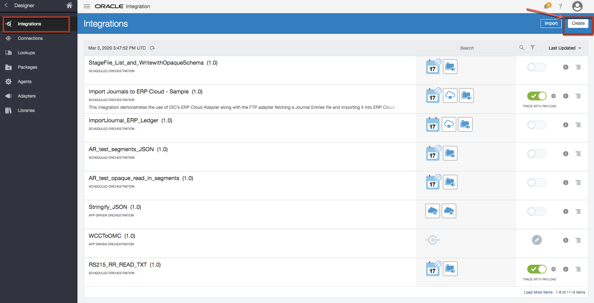

**Step 3:** 

Select the ***Scheduled Orchestration*** orchestration pattern, as this integration can be scheduled in frequent intervals as per the usecase.

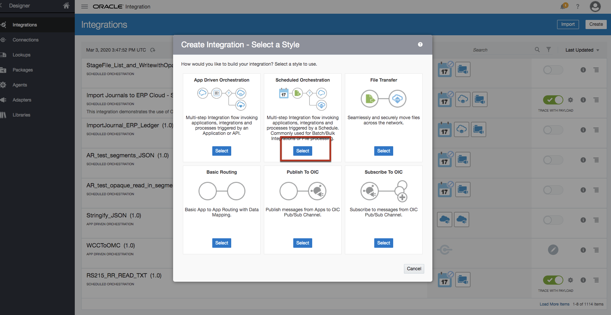

**Step 4:** 

After selecting ***Scheduled Orchestration*** type of integration.  The Create New Integration dialog is displayed.

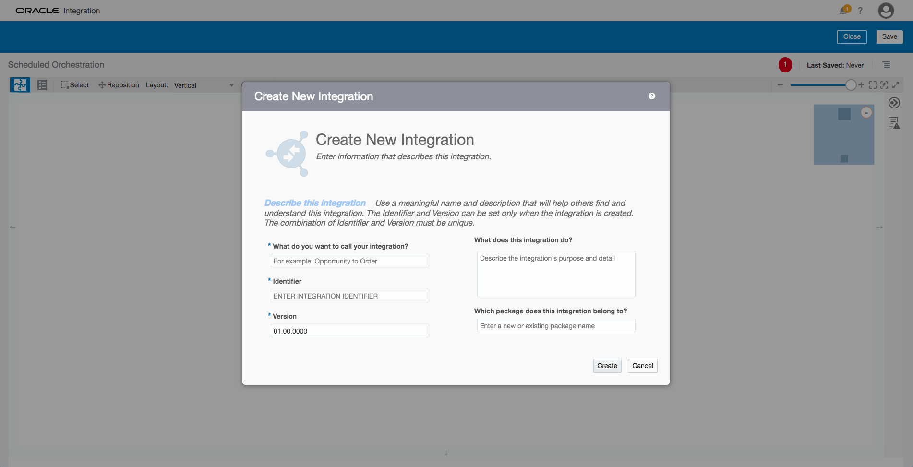

**Step 5:** 

Enter the details as mentioned below:

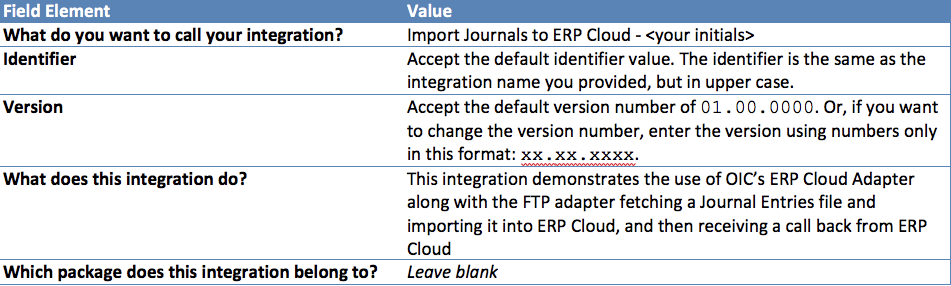

After entering the details as mentioned above, you can see click the create button in order to create an integration.

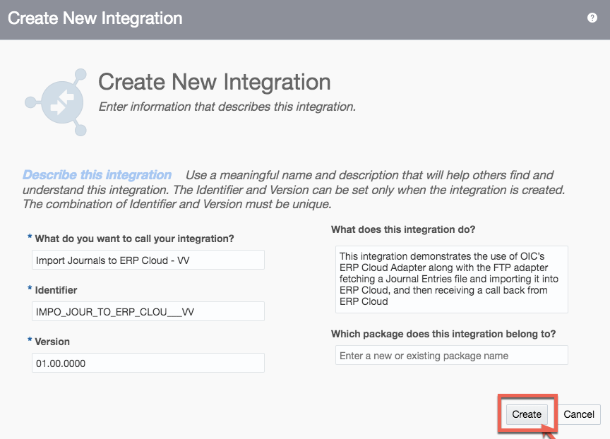

**Step 6:** 

After Clicking **Create** the integration canvas is displayed as below:

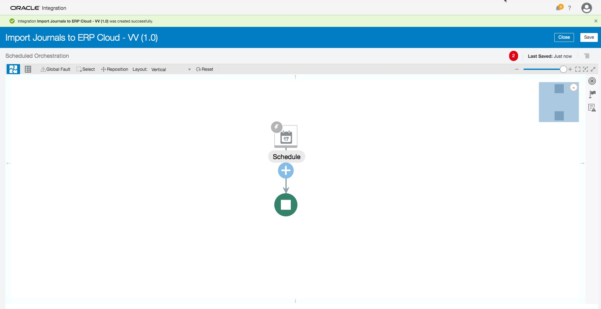

**Step 7:**

 Fetch the ***Journal Entries.zip*** file from **FTP**(FTP Adapter)
>Hover over the wire between Schedule and Stop, and click on the + sign Select the FTP Connection (FTP_Ext) from the list

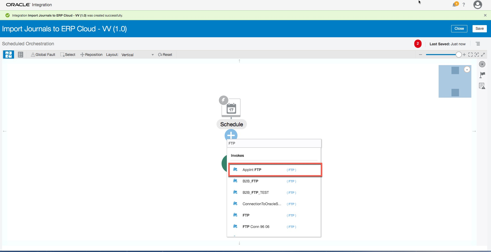
 
 **Step 8:** 
 
 Enter details as in the screenshot below to define the endpoint in the flow.

 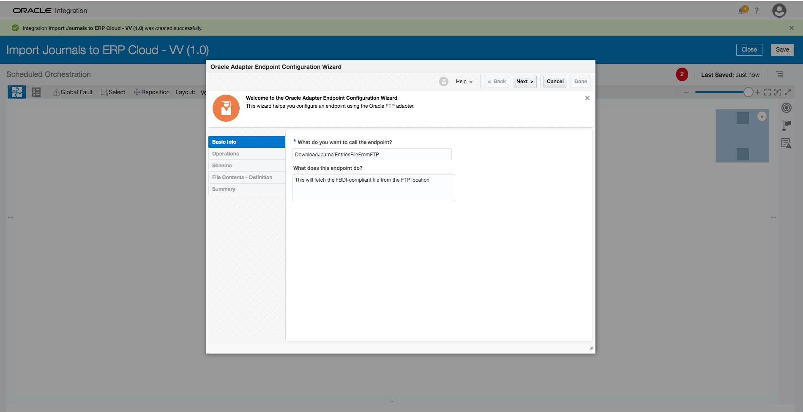

 **Step 9:** 
 
In the next screen, select “Download File” as the option and ASCII as the transfer mode.

For the directory name, make sure you add your own prefix to the “Download directory” e.g  /upload/E_1. 

Leave the 3 checkboxes unchecked and click **"Next"**

**Step 10:** 

Review Summary page and click **"Done"**.

**Step 11:** 

You will see your new FTP endpoint in the flow and a Mapping action that has been added automatically as well. 

Since we are not passing parameters through the Schedule action in this particular case, it is safe to delete the Mapping action. 

Click on the Delete option for the Mapping action and Confirm. 

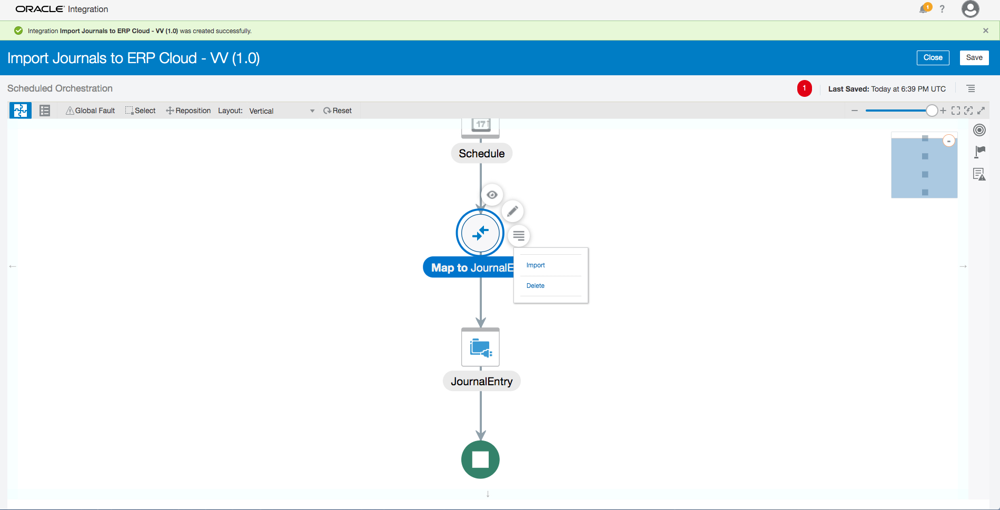

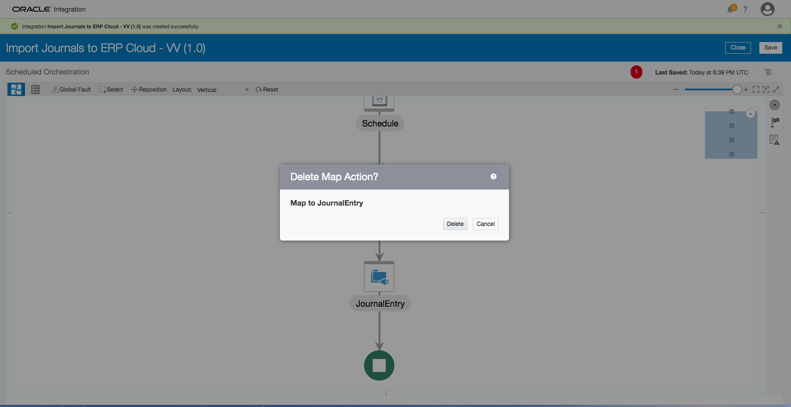

**Step 12:** 

Next, we add our **ERP Cloud endpoint** to the flow. Hover on the wiring between the FTP endpoint and STOP action, and click on the + sign. Select the **ERP Connection.**

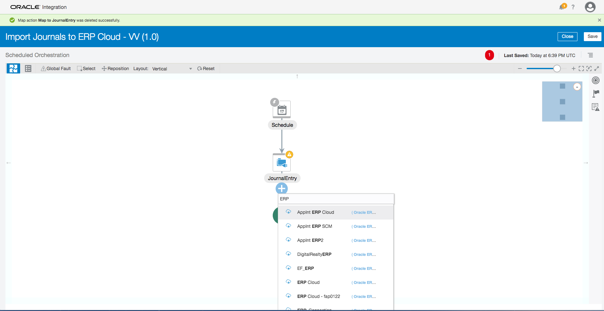

**Step 13:**

 Enter the name and description for ERP endpoint as follows.

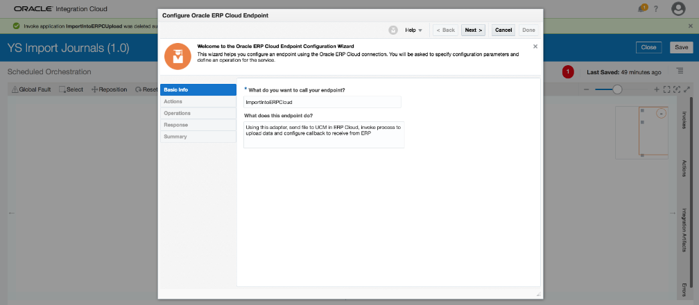

**Step 14:** 

Select the ***Bulk Data into ERP Cloud Application*** option (the screenshot below is an early preview – you might see a slightly different wording in your lab instance)

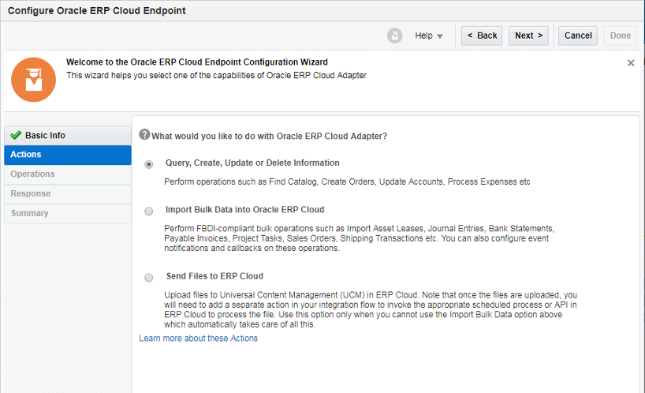

**Step 15:**   

Select the ***Import Journals*** process. Leave the rest of the options at default.

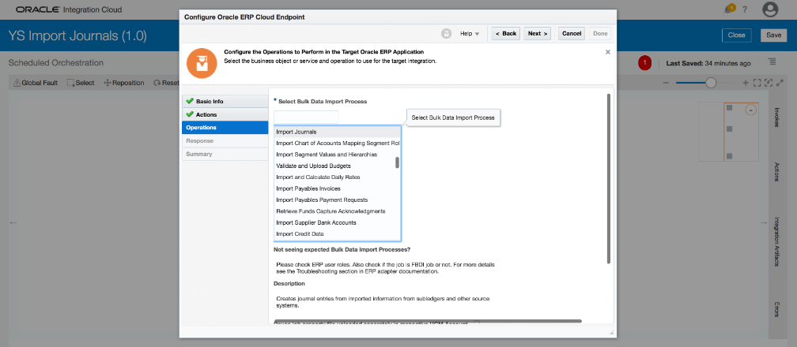

**Step 16:** 

Select the ***Notification Mode*** and ***Occurrence*** as below. 
 These are settings on how the ERP Console will reflect the status of the process. You can set this right here in the adapter instead of having to go to the ERP Console. 

Leave the ***Enable Callback*** checkbox unchecked for now. We will come back here to configure it when we have created the Callback flow a bit later.

**Step 17:**

Review your choices in the Summary window and click ***Done***

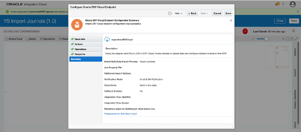

**Step 18:**

   You will see your new endpoint for **ERP**  in the flow with the corresponding mapping action.
Click on the mapping action, and then the pencil icon to edit the mapping.

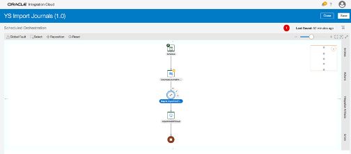

**Step 19:** 

   Map the ***FileReference*** and ***Properties*** elements from the FTP endpoint to the ERP endpoint as below in the mapper.  

  

**Step 20:**

  Click on ***Validate.*** Once confirmed that your mapping is valid, click on ***Close*** to get out of the mapper.

**Step 21:**

  This will now take you back to the flow designer. 

## Configure Notification to Receive Email on successful submission to ERP Cloud  (Notification Action)

**Step 22:**

  Open the ***Actions*** tab, and drag the ***Notification*** action just above the ***Stop*** element.

**Step 23:**

**Name** and **describe** your Action as below and click on **Create** button.

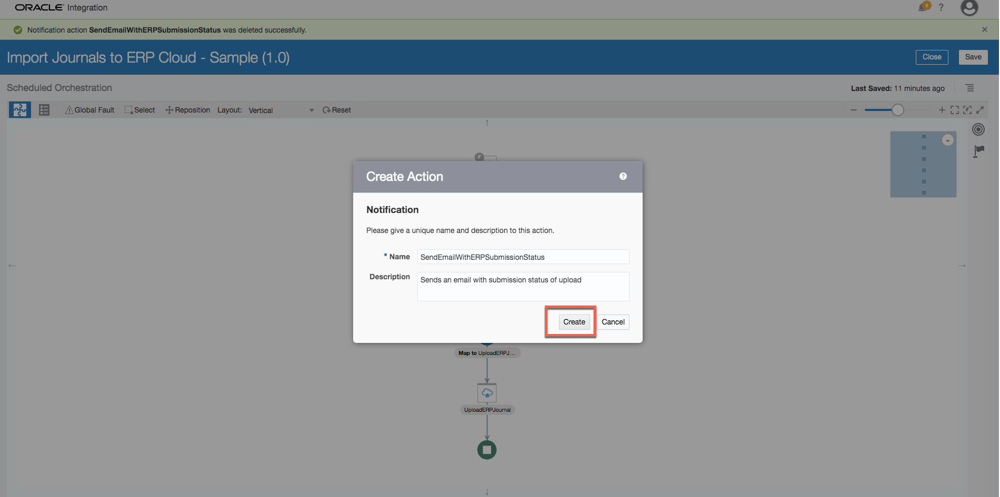

**Step 24:**

Click the pencil icon for ***Form*** field.

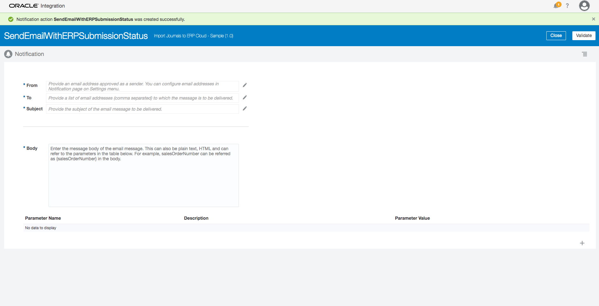

**Step 25:**

Enter your ***own email address*** in the expression in single quotes. Repeat this for the **To** field as well.

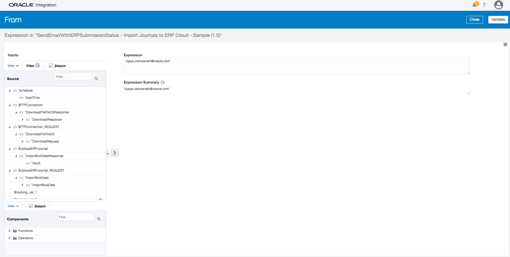

**Step 26:**

 Click on ***Validate*** and ***Close***.

 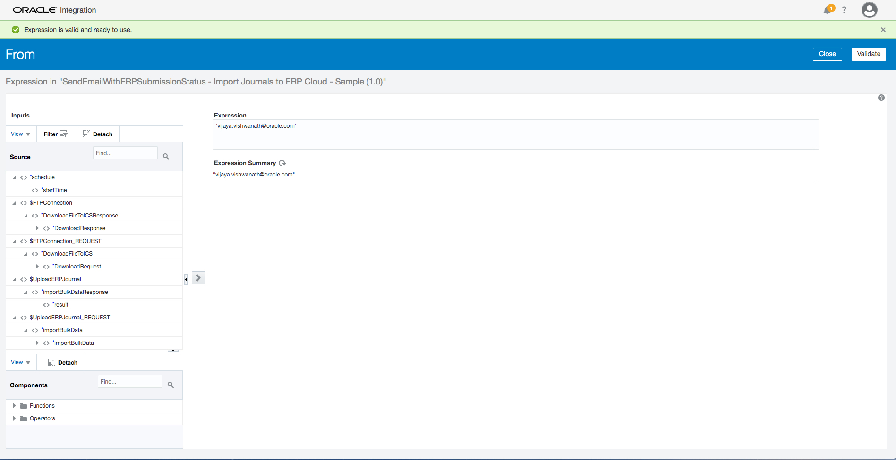

**Step 27:**

Next, click on the pencil icon for the ***Subject***.

**Step 28:**

Drag the **Concat** function from the Components pallete under **String**.

Enter **string('ERP Import submitted with status')** for the first parameter as seen below. 
 
For second parameter, drag the ***$ImportIntoERPCloud->$ImportBulkDataResponse->result*** field.

Click on ***Validate*** and ***Close**.

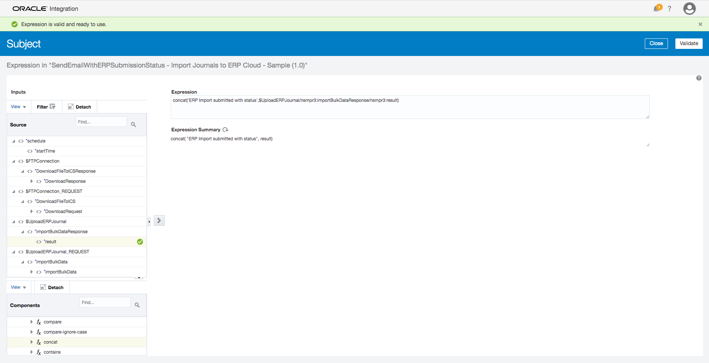

**Step 29:**

Enter text as seen in the ***Body*** below (you don’t need the single quotes here)

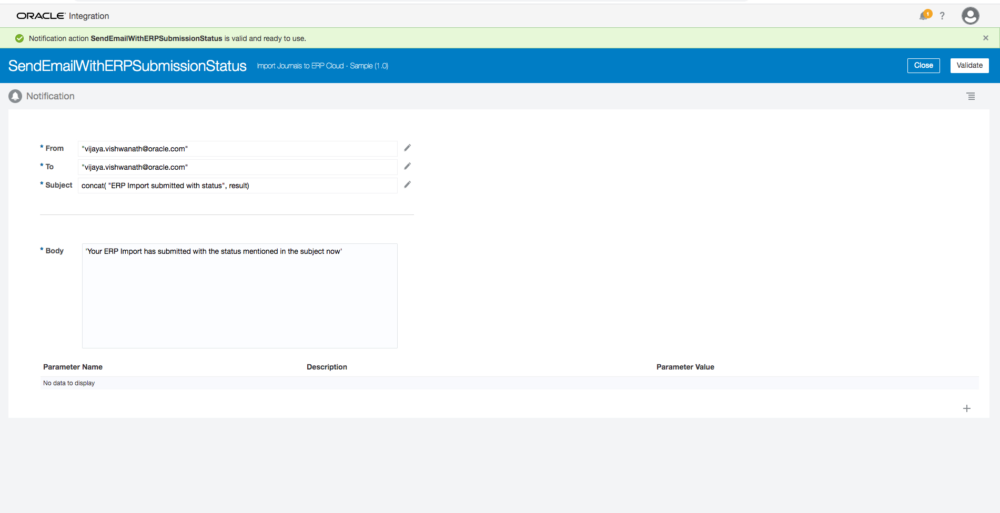

**Step 30:**

***Validate*** your entries and then click on ***Close.*** You will be back in the flow designer with the new notification action

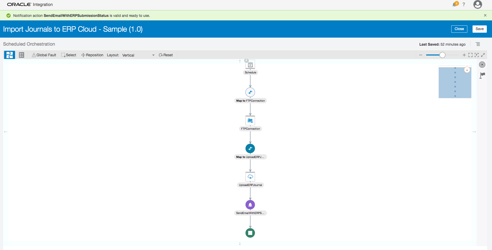

## Configure Business Tracking Identifiers:

Click on the red icon on the top right, which shows the number of errors in your flow. You should have 1 error at this point – when you hover over the Integration Errors icon, you will see the error is about missing business tracking identifiers.

**Step 31:** 

Click on the hamburger icon at the top right, and select ***Tracking***.

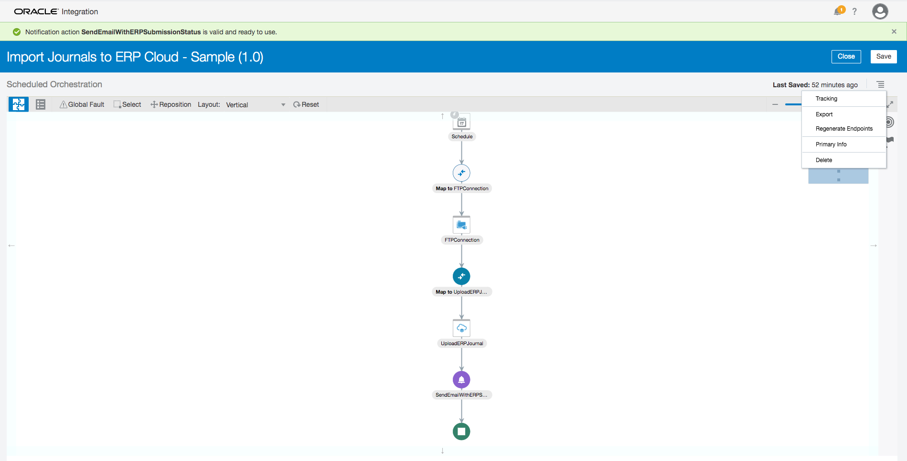

**Step 32:** 

Drag the **schedule->startTime** to the first ***Tracking Field*** cell in the table on the right. 

Here you are configuring OIC to identify instances of runs of this flow in the monitoring consoles with it’s start time as the unique ID.

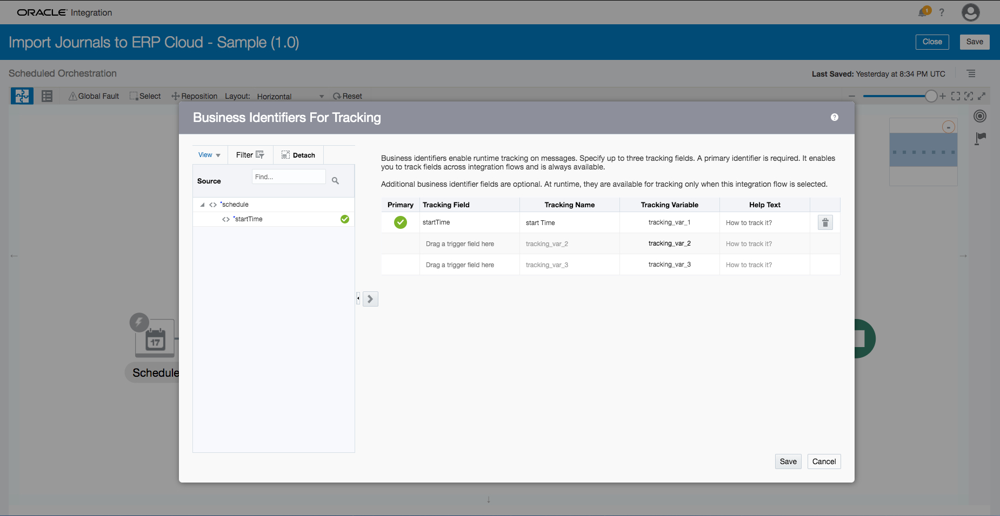

**Step 33:** 

Click on ***Save*** . 

This will bring you back to the flow in the designer, and the red errors icon should no longer be there.

**Step 34:** 

 Click on **Close**.

 And a dialogue box will open up for saving all the work on which you need to click on ***Save**.

 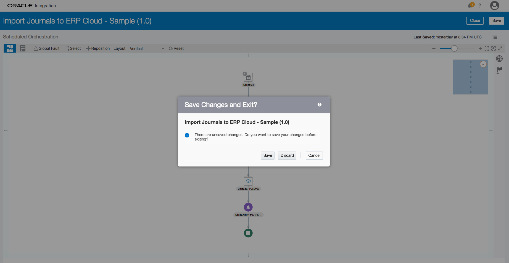

## Creation of Call back Integration for ERP:

  **Step 35:** 

  This will bring you to **Integrations** page.

  Click on **Create** button and select the **App Driven Orchestration**
 
  

  **Step 36:**

  Enter the details as mentioned in the screenshot below and click the **Create** button.

 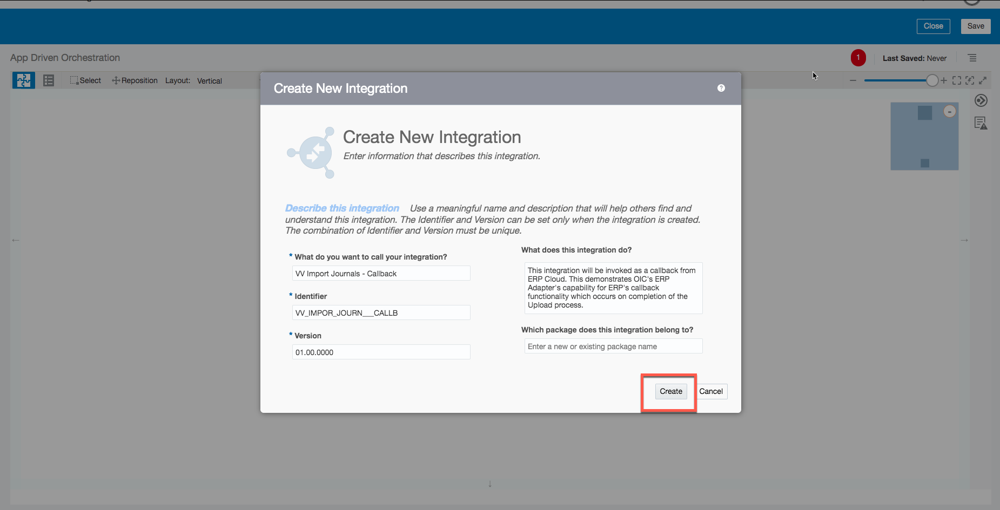

 **Step 37:**

  Once the Integration is succesfully created you will come across a **+** - sign upon hovering over it 

  you will be able to search for ERP adapter as shown in pic below:

  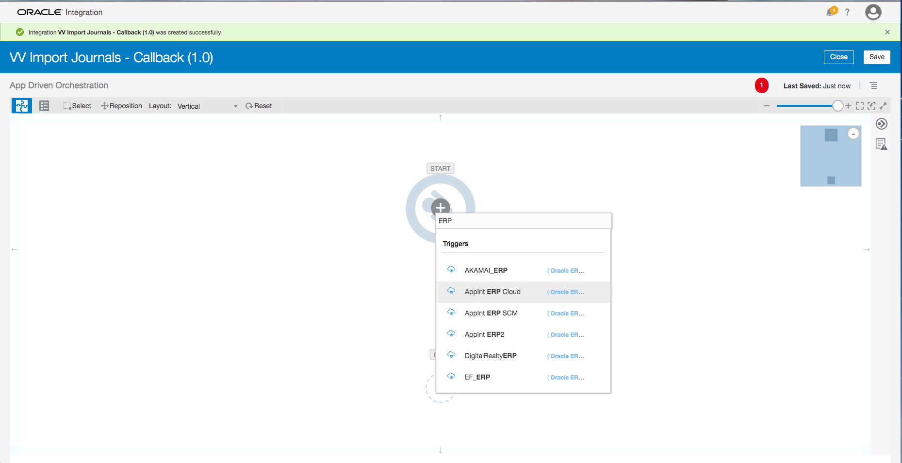

  **Step 38:**
    
  **Step 39:**

  **Step 40:**

  **Step 41:**

   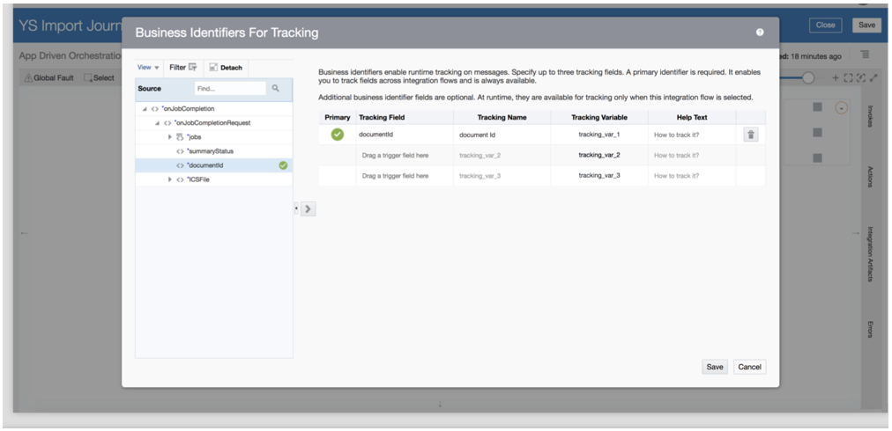

   **Step 43:**
     
  Check the ***Oracle Recommends*** check box to contribute your mappings to the **Recommendations**
  engine that then suggests mappings to you and other users for similar integrations.

  Also, check **Enable tracing** and **Enable payload** for debugging and troubleshooting
 (you would typically have the tracking and payload options disabled on production instances, but we enable them here for this lab).

  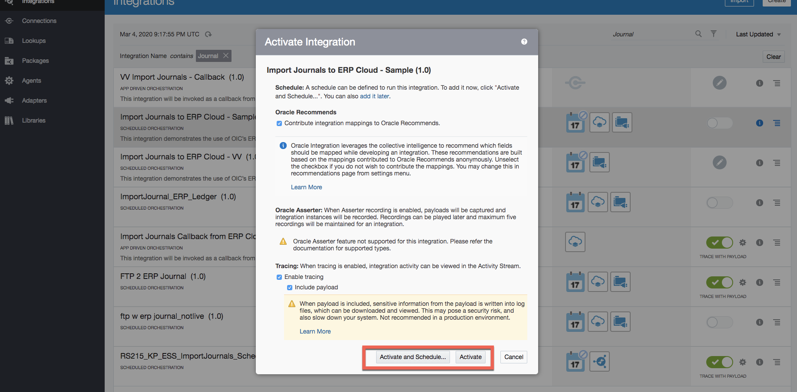

  **Step 44:**

  The activation should complete in a few seconds typically and show a green ribbon at the top with the URL that you can use to invoke this integration from a **SOAP** client.
  
  However, we wont be invoking this flow explicitly.
   
  We will instead configure it as the Callback flow in the **ERP Cloud** (via the ERP endpoint in our Import Journal Entries flow), which **ERP Cloud** will then invoke on completion of the Import job.

  

  **Step 45:**

  Click on the flow name **Import Journals – Callback .**
  
  This will open the flow in **View** mode. 
  
  We need to capture the **flow identifier** and **version** which is required for us to configure the callback in the other flow. 
  
  For this, click on the hamburger menu on the top right, and go to ***Primary Info.***

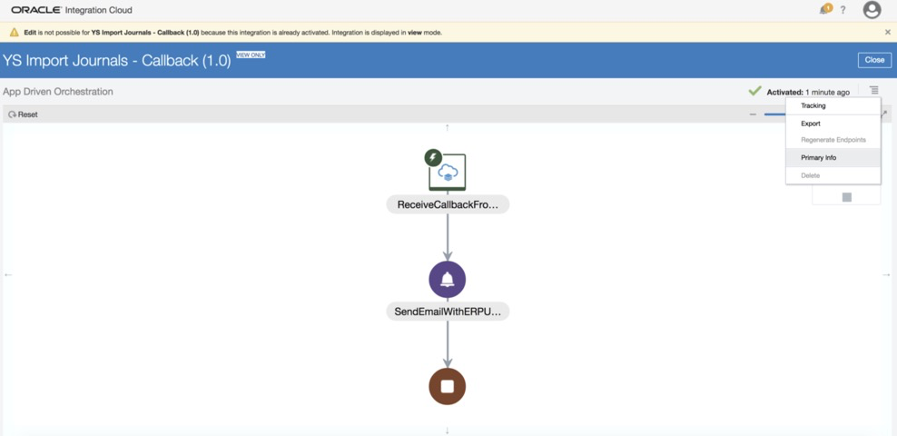

 **Step 46:**

 Note the ***Integration Identifier*** and ***Version***. 
 
 You will need to use this in the next steps. Click **Close.**

 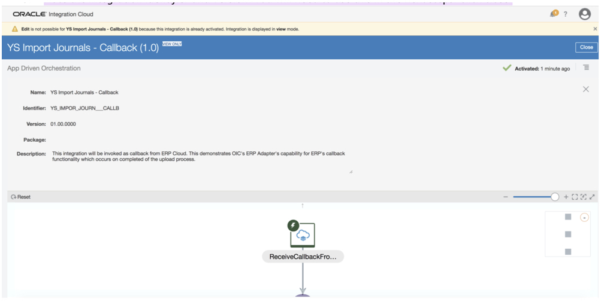

## Complete Callback Config in the Journal Entries Import Flow:

**Step 47:** 

From the Integrations listing, click on the hamburger icon for the ***Import Journals*** flow and select ***Edit***

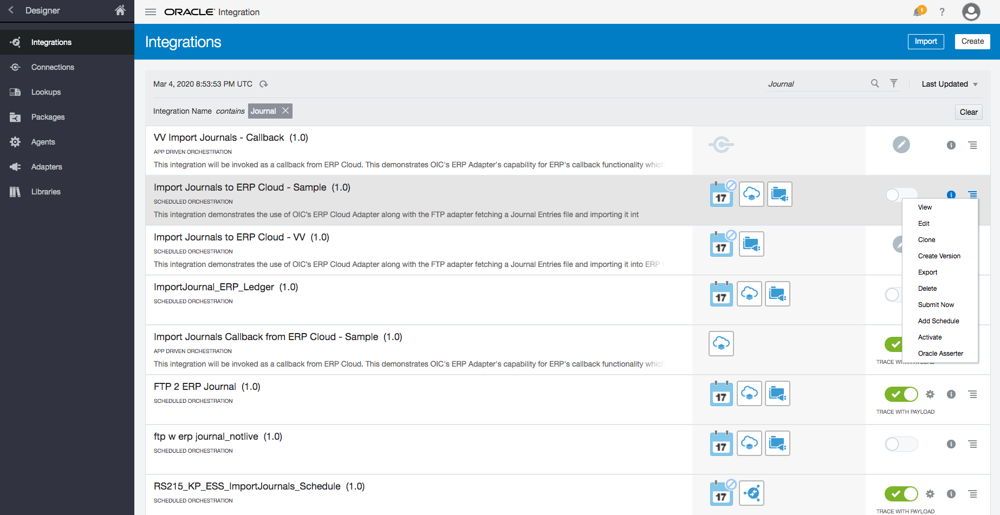

**Step 48:**

Click on the pencil icon to edit the ***ERP Cloud endpoint*** in the flow.

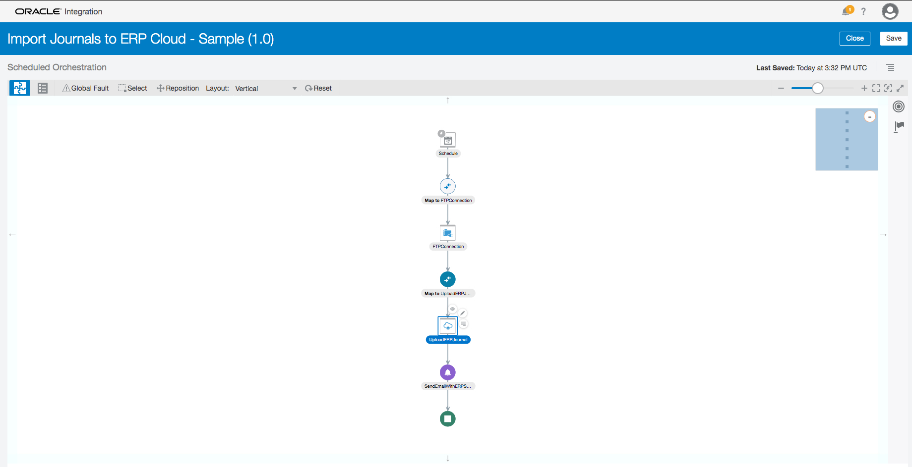

**Step 49:**

This will load the ***Summary*** page. Click Back to get the ***Responses*** tab.

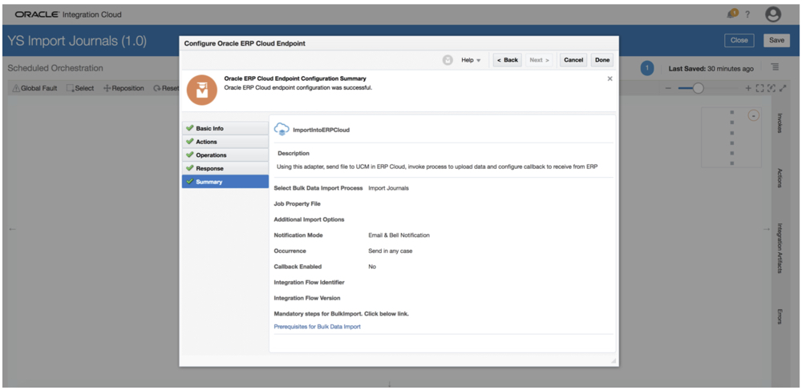

**Step 50:**

Check ***Enable Callback***. 

Enter the ***Integration Flow Identifier*** (not the flow name) and ***Version*** you noted in the previous steps. 

Note for the version we only need the first 2 digits. 

Click ***Next.***

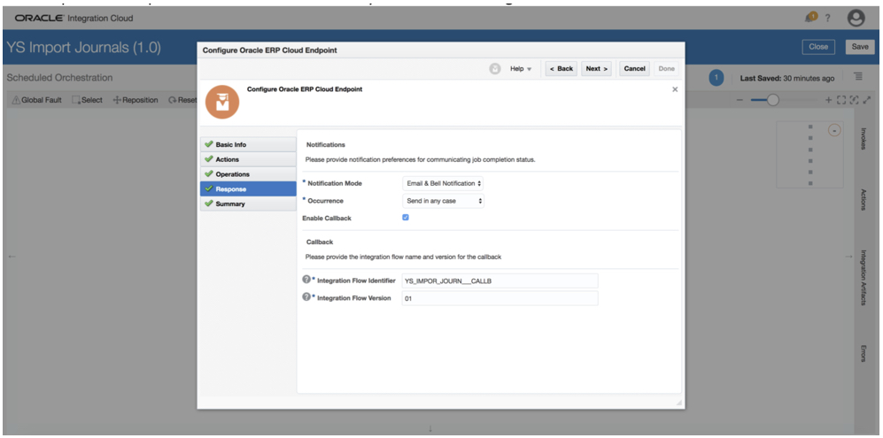

**Step 51:**

Click ***Update*** on the ***Update Configuration*** pop up window to confirm 

updating the configuration and regenerating artifacts of the flow.

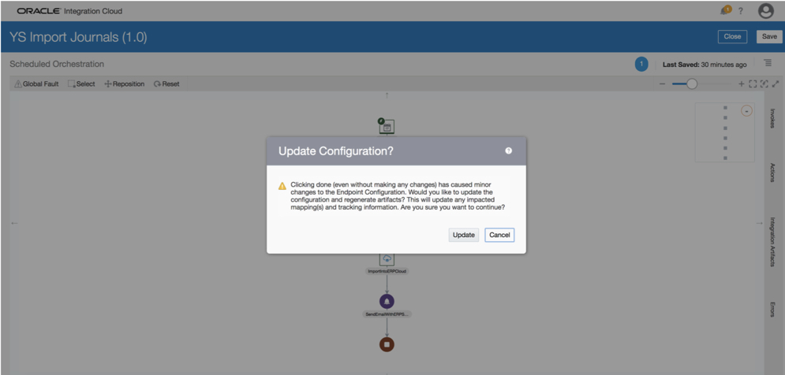

**Step 52:**

Select the slider to activate the **Import Journals** flow.

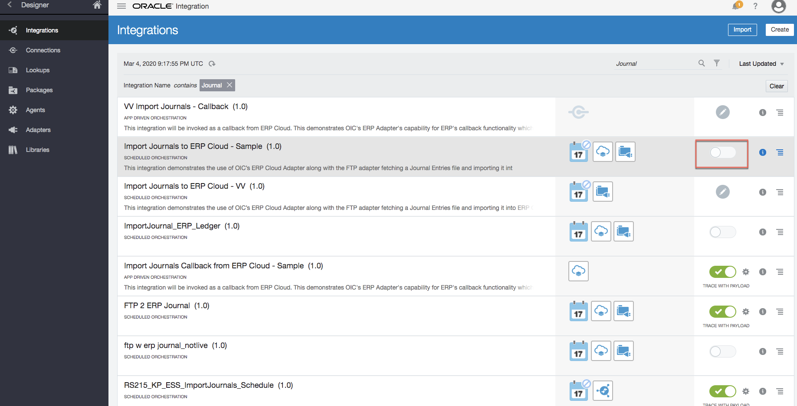

**Step 53:**

Just like with the previous activation step (for the Callback flow),   check the 

***Oracle Recommends*** check box to contribute your mappings to the Recommendations 

engine that then suggests mappings to you and other users for similar integrations. 

Also, check ***Enable tracing*** and ***Enable payload*** for debugging and 

troubleshooting **(you would typically have the tracking and payload options disabled** 

**on production instances, but we enable them here for this lab).**

 

**Step 54:**

The activation should complete in a few seconds typically. 

Since this is a scheduled integration, you can run it on a schedule (you can set the 

schedule by clicking on the hamburger icon to the right of the integration listing) 

or by doing a ***Submit Now*** (also from the same hamburger icon). 

We will do this in the next step.

After activation you will get a info message giving the details of integration as seen

in the pic below.

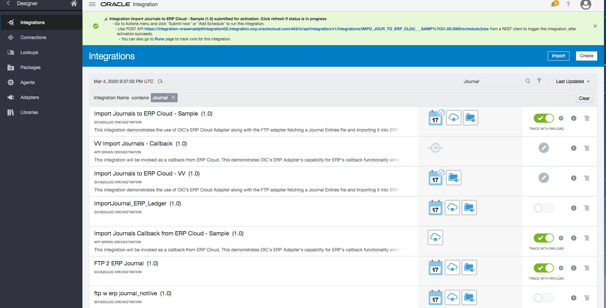

## Triggering the Integration:

**Step 55:**

Log into your FTP Server and ensure that the file ***journalentries.zip*** is located 

in the  ***/Upload/E_1*** directory. 

This zip file contains the **FBDI-compliant data** file and a properties file required by 

the ERP upload process. 

Both these files could be created and encrypted within OIC too but for the sake of 

this lab we have these pre-created. 

(Note, if you are doing this in a lab environment, check with your lab instructor to

 confirm the zip file is present in the FTP location)

 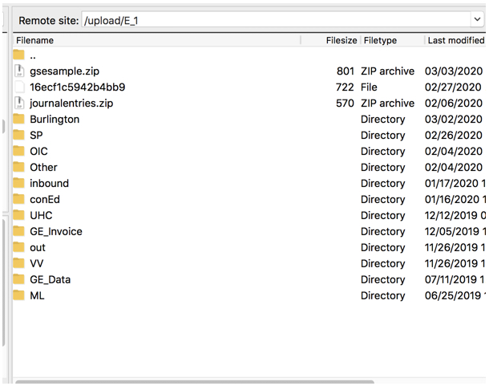

 **Step 56:**

 Click on the hamburger to the right of the ***Import Journal Entries*** flow and select 
 
 ***Submit Now***  to run the flow.

 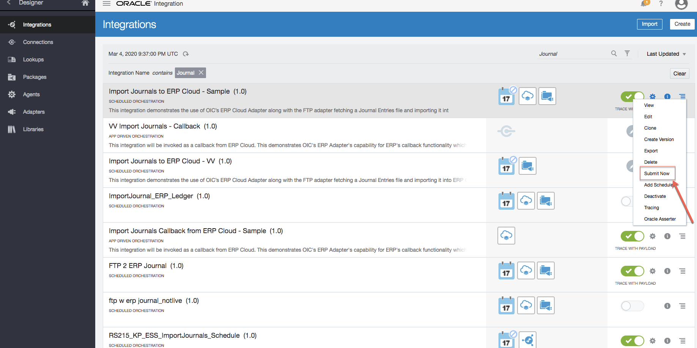

A dialog box open up select the option of ***Ad hoc request*** and 

once again click on ***Submit Now*** button.

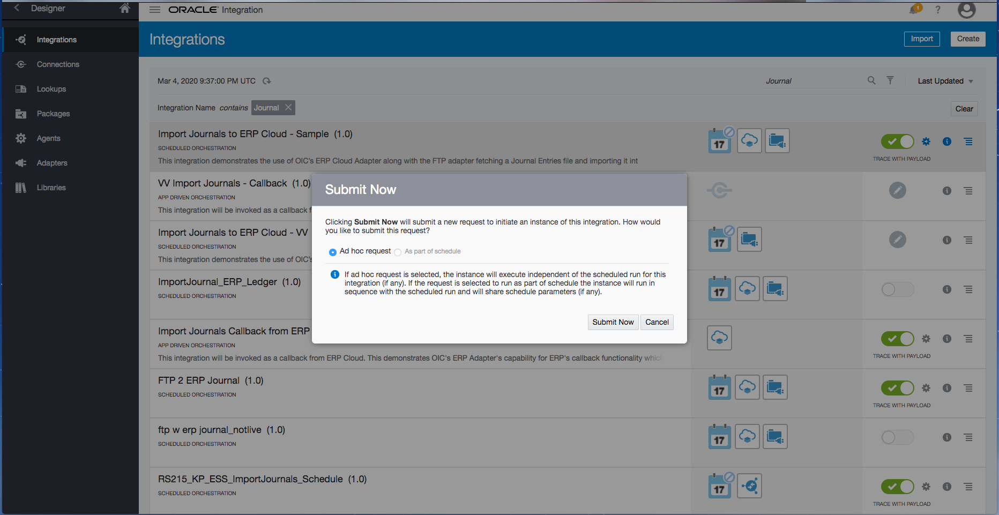

**Step 57:**

The flow should kick off and show you a green ribbon the top with a link to the 

running instance to track it. 

Click on the link to track the run.

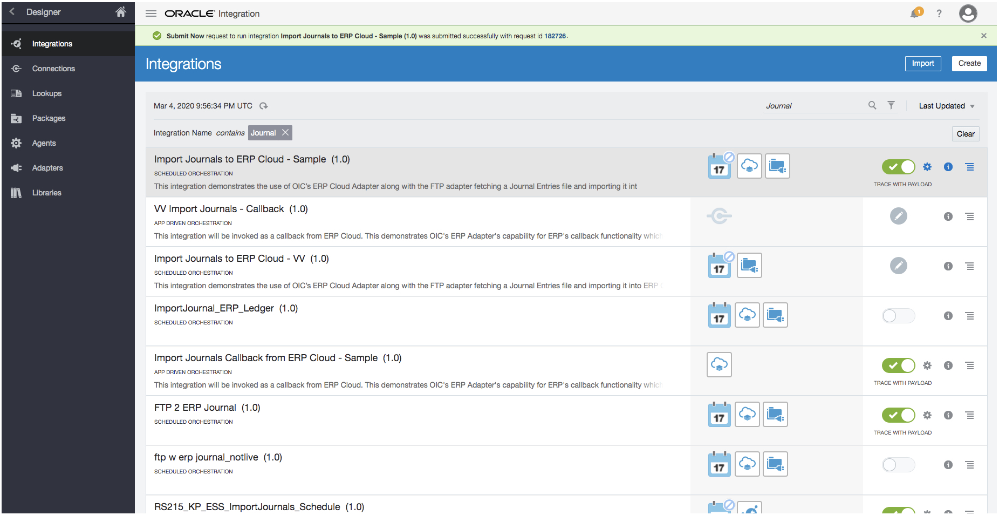

**Step 58:**

This will take you to the **Monitoring** page where you should see your integration 

either in ***Processing*** or ***Successful*** state

**Step 59:**

Once it is marked as ***Successful***, you should receive the submission confirmation

 notification email on the email you configured in your flow.
 
 After a few minutes, once the import process has completed on the **ERP Cloud,** the 
 
 **Callback flow** will automatically be invoked from **ERP Cloud** and you should receive 
 
 the status notification email.

 **Congratulations!!** you have now completed this use case to 
 
 **Import Journal Entries (FBDI) into ERP Cloud!**

You leveraged rich capabilities of **Oracle Integration Cloud (OIC)** such as 

**Scheduled orchestration, App-driven (trigger- based) integration, ERP Cloud** 

**adapter, FTP adapter, Data Mapper, Actions such as Notification, Invoke etc,** 

**Configuring Business Tracking Identifiers and monitoring running flows.**

You could now leverage this knowledge to design, activate and monitor several use 

cases for **ERP Cloud Bulk Data Import scenarios** as well as multiple **FTP-based

integrations.

