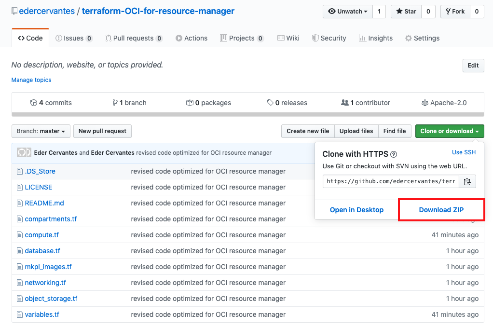
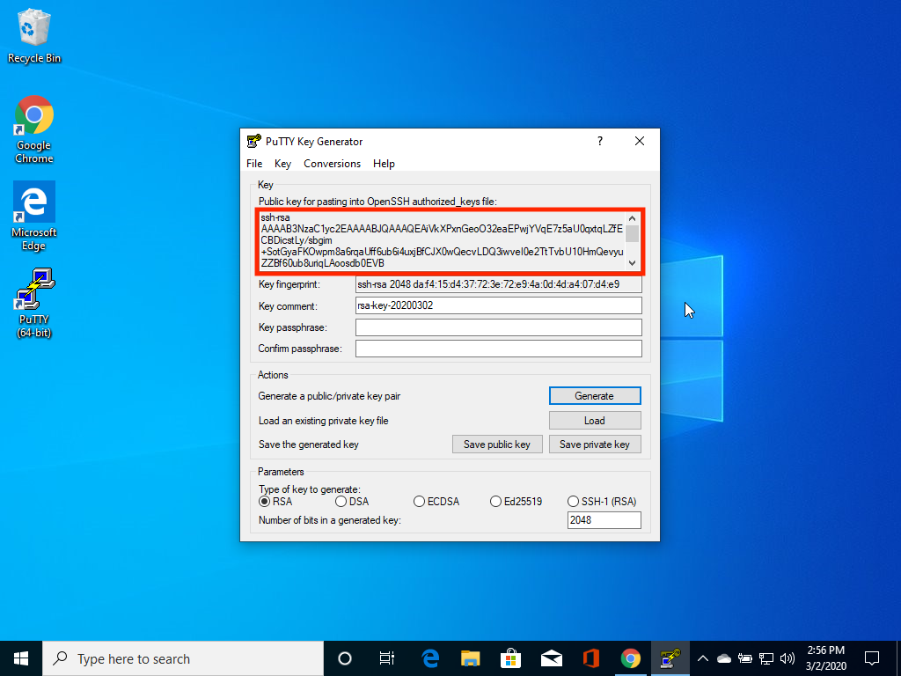
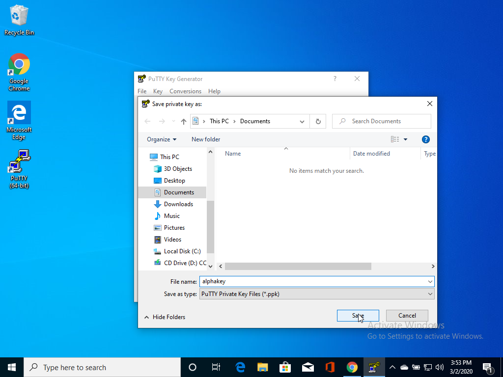
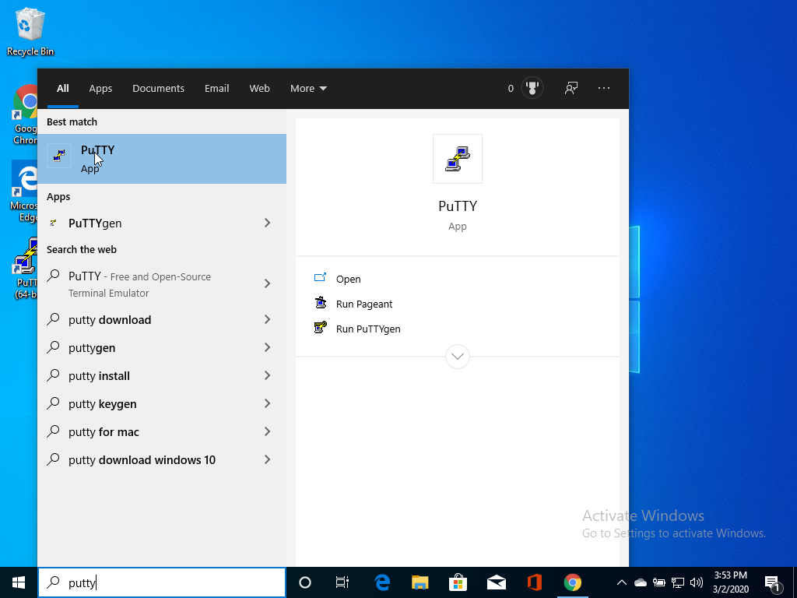

# Lab 050: Setup Cloud Environment

  

## Introduction

In Lab 50 (as Derek) you will initiate the Oracle cloud environment that you will use to create and deploy your microservices applications. This environment will be contained within a cloud Compartment, and communication within the Compartment will be via a Virtual Cloud Network (VCN). The Compartment and VCN will isolate and secure the overall environment. You will deploy two Oracle Cloud Services for this environment. An Oracle Cloud Developer Image will be used to develop and deploy your microservices code. The microservices will access data within an Autonomous Transaction Processing (ATP) Cloud Service.

To deploy these services, you will be using Terraform, a tool for building, changing, and versioning infrastructure safely and efficiently. It is an important tool for anyone looking to standardize IaaS (Infrastructure as a Service) within their organization.

***To log issues***, click here to go to the [github oracle](https://github.com/oracle/learning-library/issues/new) repository issue submission form.

***We recommend that you create a notes page to write down all of the credentials you will need.***

## Lab 050 Objectives

- Log into OCI tenancy.
- Setup your IAAS environment and create common components.
- Create a new Cloud Developer Image from Marketplace.
- Create an Autonomous Transaction Processing (ATP) Database.
- Create an Object Storage bucket.

## Steps

### **STEP 1:** Your Oracle Cloud Trial Account

You have already applied for and received your Oracle Cloud Free Tier Account.

### **STEP 2:** Log in to your OCI dashboard

- From any browser go to oracle.com to access the Oracle Cloud.

    [https://www.oracle.com/](https://www.oracle.com/)

    

- Click the icon in the upper right corner.  Click on **Sign in to Cloud** at the bottom of the drop down.   *NOTE:  Do NOT click the Sign-In button, this will take you to Single Sign-On, not the Oracle Cloud*

       
 
- Enter your **Cloud Account Name** in the input field and click the **Next** button.

  

    **Note this is NOT your email. This is the name of your tenancy noted in the email you received during signup**
- Enter your username (this may be your email address) and password and click on **Sign In**.
  

- Once you log in you will see a page similar to the one below.

      

### **STEP 3:** Download and Install Terraform zip folder

- Grab the zip file [here](https://github.com/edercervantes/terraform-OCI-for-resource-manager) and save it somewhere you can find it later.

    

<!--     

    

    

    

     -->

### **STEP 4:** Get Your Oracle Cloud Credentials

To run our Terraform folder in the cloud, we will take advantage of OCI resource manager. It is a powerful tool for planning, and executing multiple Terraform jobs, all without having to installing anything locally. In order for resource manager to create resources for you, it needs to know a few key credentials on the OCI console.

<!--   

 -->
- Click on the profile icon in the top right. Then click into the tenancy link.

  

- Copy the **Object Storage Namespace** in your notes.

  

<!--   

  

  
 -->

 ### **STEP 5:** Generate your SSH key pair

- On Linux or Mac enter this in a command shell.
    
    `$ ssh-keygen -b 2048 -t rsa`

    You can call the key whatever you want (the default is easiest).  It will create a private key and a public key. The public key is used when you are prompted for a SSH key when you create services, and the matching private key is used to access those services after creation. (eg: Cloud Developer Image).

    

- On Windows, follow these [instructions](https://www.ssh.com/ssh/putty/windows/puttygen).
    You can call the key whatever you want (the default is easiest).  It will create a private key and a public key. The public key is used when you are prompted for a SSH key when you create services, and the matching private key is used to access those services after creation. (eg: Cloud Developer Image). 

### **STEP 6:** Creating a Resource Manager Stack

Now, we will see the true power of Terraform as opposed to manual creation. By using Terraform, you have a reusable process for creating infrastructure. In some cases, like this one, you don't have to know anything about how the process works. You can deploy different pre-designed infrastructure designs for many different purposes, which frees up users to focus on their projects.

- On the OCI console, click on the hamburger menu and scroll down to **Solutions and Platform**. Hover over **Resource Manager** and click on **Stacks**.

    

- Make sure the **Compartment** on the left side says root. If not, then change it to root. Then, click **Create Stack**.

    

- Drag and drop the zip file you downloaded earlier into the dashed line box, or click on **Browse** and find it. Then, you can give your Stack a name, like `python4dev_terraform`. You can also give a description if you'd like, but it is not necessary. Make sure you are still in the root compartment, and using Terraform version 0.11.x. Then click next.

    

- You will see a lot of variables that will be used. Find SSH_PUBLIC_KEY and paste in the give field your public ssh key. **It must be in text format.**

    

- Then, make an AUTONOMOUS_DATABASE_ADMIN_PASSWORD. **The password must be between 12 and 30 characters long, and must contain at least 1 uppercase, 1 lowercase, and 1 numeric character. It cannot contain the double quote symbol (") or the username "admin", regardless of casing.**

    

- Next, populate the OBJ_STORE_NAMESPACE field with the Object Storage Namespace credential you saved earlier. Then click **next**.

    

- Finally, review your variables and make sure everything looks good. Then click **create**.

    

<!--     
 -->

<!--     
 -->

<!--     
 -->

<!--     
 -->

<!--     
 -->

<!--     
 -->

<!--     
 -->

<!--     
 -->

	
### **STEP 7:** Creating OCI resources in Resource Manager

<!--     
 -->

<!--     
 -->

<!--     
 -->

<!--     
 -->

<!--     
 -->

### **STEP 9:** Connect to your marketplace developer image

[See this link for more info](https://cloudmarketplace.oracle.com/marketplace/en_US/listing/54030984).  This info is copied below.

- Navigate to `Compute` > `Instances` and select your image to identify the IP address

	

- Identify the IP address.  You will use this to ssh to the image.

	

- SSH to the image. 
    **Note if you are on Windows you will need to use putty.**
    Open a terminal window on a Mac or command shell on Linux and enter the following command:

    `$ ssh -i <your private key> opc@<your IP address>`

	

- Enter `$ vncpasswd` to set your VNC access (make it a secure one!).

	

- Enter `$ vncserver` to start the vncserver.

	

- Enter `$ exit` to go back to your local directory.

- Open a SSH tunnel.
    ***NOTE:*** do not close this terminal window.  It maintains the tunnel to the developer image, which we access through VNC.  If for whatever reason the window is closed or you are otherwise logged out (sometimes tunnels drop), then just run this again to log in.
    
    For Windows, follow these [instructions](https://www.skyverge.com/blog/how-to-set-up-an-ssh-tunnel-with-putty/) for information on how to create a tunnel on Windows.

     This example works on Linux and Mac. **Note:** on Linux you will need to be su.

     `$ ssh -i <your private key> -L 5901:localhost:5901 opc@<your IP address>`

    

- Open a vnc viewer session.  If you don't already have vnc viewer you can download it [here](https://www.realvnc.com/en/connect/download/viewer/).

    Enter `localhost::5901` into the browser and then press Enter.

    

    Enter the **vncpasswd** password you created earlier. 

	

    Now you have a user interface for your instance.

	

### **STEP 10:** Download Files Used in this Workshop

[Click to Download](https://oracle.github.io/learning-library/workshops/python4atp/lab-resources.zip). **Keep track of which directory this zip file gets saved to.**

- Next, go back into your instance

    **If you are already logged in, you do not need to run the command below.**

    `$ ssh -i <your private key> opc@<your IP address>`

    If you are prompted, enter `yes`.

- Run `$ pwd` to view your home path. Then run `$ exit` to go back to your local environment. If your home path is different than the one below, then change it to yours.

    `$ scp </path/to/lab-resources.zip> opc@<your IP address>:/home/opc`

    If you are prompted, enter `yes`.

    _Now the zip file has been copied into your instance!_

- Finally, go back into your instance.
    
    Once inside, run `$ ls` to verify that you see your zip file.

**This completes the Lab!**

**You are ready to proceed to [Lab 100](LabGuide100.md)**
