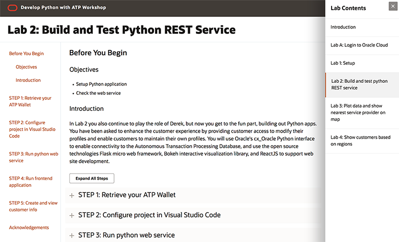

# Python Development with Oracle Autononmous Database

Welcome to the Python Development with Oracle Autonomous Database hands-on lab. This lab will walk you through the following tasks:

- Create a new Cloud Developer Image from Marketplace.
- Create an Autonomous Transaction Processing (ATP) Database.
- Load Data into your ATP Instance
- Setup Python application 
- Check the web service
- Check the distance between customer and service provider
- Show the regions in map from the shapefile.

## Access the Labs Using Our Web Interface
**Click the image to use our easy to navigate HTML format:**

***To log issues***, click here to go to the [github oracle repository](https://github.com/oracle/learning-library/issues/new) issue submission form.  Please include the workshop and lab name.

