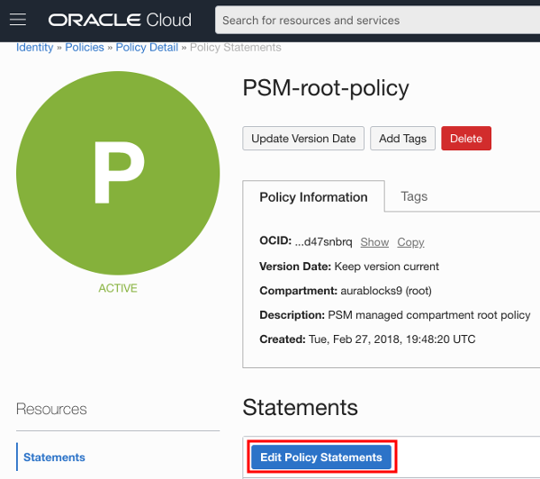
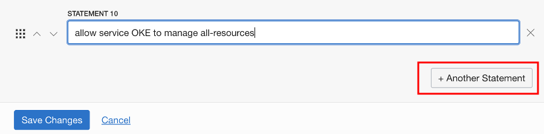
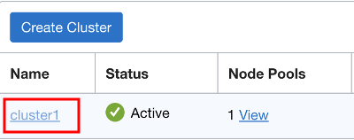
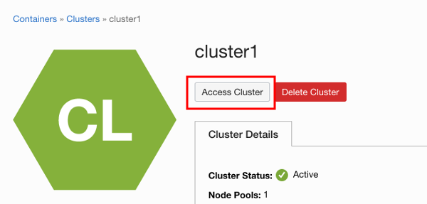
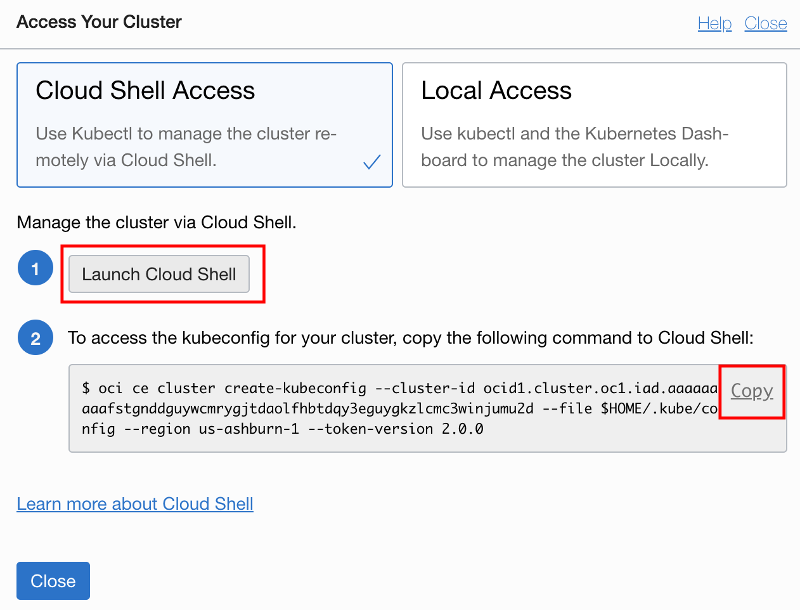
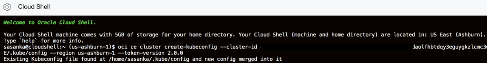
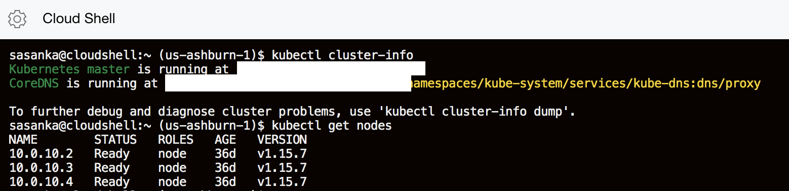

# Lab2: Provision Kubernetes Using the OCI Console

## Before You Begin
### Objectives
- Sign in to Oracle Cloud Infrastructure
- Create a Compartment for your Kubernetes nodes
- Add a Policy Statement for OKE
- Provision Kubernetes Using the OCI Console
- Launch a Cloud Compute Instance for Cluster Management
- Prepare OCI CLI for Cluster Access and Download kubeconfig


### Requirements
To complete this lab, you need to have the following:
- Login credentials and a tenancy name for the Oracle Cloud Infrastructure Console


## **STEP 1**: Sign in to Oracle Cloud Infrastructure
- If you already logged in you continue with Step 2.

## **STEP 2**: Create a Compartment for your Kubernetes nodes

Compartments are used to isolate resources within your OCI tenant. Role-based access policies can be applied to manage access to compute instances and other resources within a Compartment.

- Click the **hamburger icon** in the upper left corner to open the navigation menu. Under the **Identity** section of the menu, click **Compartments**

  

  - If you have a **Demo** compartment already, _**SKIP THIS STEP**_. Otherwise, Click **Create Compartment**

    

  - In the **Name** field, enter `Demo`. Enter a description of your choice. In the **Parent Compartment** field, ensure that the `root` compartment is selected (it will have the same name as your Oracle Cloud Account). Click **Create Compartment**.

    

## **STEP 3**: Add a Policy Statement for OKE

  - Before the Oracle managed Kubernetes service can create compute instances in your OCI tenancy, we must explicitly give it permission to do so using a policy statement. From the OCI Console navigation menu, choose **Identity->Policies**.

    

  - In the Compartment drop down menu on the left side, choose the **root compartment**. It will have the same name as your OCI tenancy (Cloud Account Name).

    

  - Click **PSM-root-policy**

    

  - Click the **Edit Policy Statement** button

    
  
  - Click **Another Statement** and enter: `allow service OKE to manage all-resources in tenancy`. Click **Save Changes** 
  
    


    

## **STEP 4**: Provision Kubernetes Using the OCI Console

  - Now we're ready to create our Kubernetes cluster. From the OCI Console navigation menu, select **Developer Services->Container Clusters (OKE)**.

    

  - In the Compartments drop down, select the **Demo** compartment.

    

  - Select Quick Create and Click Launch Workflow.

     

  - Choose visibility type as Public, enable all Add Ons including Kubernetes Dashboard Enabled and Tiler (Helm) enabled, and Click **Next**.
   
    

  - Review Cluster Creation and Click **Create Cluster**.
  
    
  
  - Wait for creating cluster and associated network resources and Click **Close**.
  
    

  - After a while you can see your cluster is available.
  - 
    


  **Note:**
    - Starting at the top you'll notice that the cluster will be created in our **Demo** compartment.
    - We can customize the name of this cluster if we want
    - Multiple versions of Kubernetes are available, with the newest version selected by default
    - The default cluster creation mode will automatically create a Virtual Cloud Network for our cluster, including 2 load balancer subnets and 3 subnets for our worker VMs
    - We can customize the size and quantity of worker VMs in the node pool; by default we will get 3x 1 OCPU VMs, one in each Availability Domain.
    - We can also add more node pools to the cluster after creation.
    - The dashboard and Tiller will be installed by default.


- Great! We've got Kubernetes installed and accessible.

## **STEP 5**: Access your Kubernetes Cluster using Cloud Shell

  - Click cluster name (cluster1) and click **Access Cluster**.
  
    

  - First **Launch Cloud Shell** and copy following command to Cloud Shell.

    
  
    
  
  - Copy following commands to check your Kubernetes Cluster up and running.
  ```
    <copy> kubectl cluster-info <copy>
  ```
  ```
    <copy> kubectl get nodes <copy>
  ```
  -
    