# WebLogic deployment in a Kubernetes cluster with the Oracle WebLogic Kubernetes Operator 2.0

## Before You Begin
### Objectives
- Get docker images and put them into your VM registry
- Grant the Helm service account the `cluster-admin` role
- Create a Traefik (Ingress-based) load balancer
- Install the WebLogic Kubernetes Operator
- Prepare your environment for a domain
- Test Alpha Office Product Catalog Website

### Requirements
To complete this lab, you need to have the following:
- Kubernetes cluster (Already included Helm)


## **STEP 1**: Get docker images and put them into your VM registry
- You should clone this repository to your Cloud Shell so that you have access to the various sample files mentioned throughout this guide:
  ```
  <copy>git clone https://github.com/oracle/weblogic-kubernetes-operator.git  -b v2.5.0</copy>
  ```
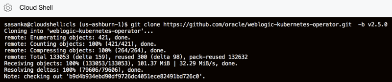

- Pull the operator image.
  ```
  <copy>docker pull oracle/weblogic-kubernetes-operator:2.5.0</copy>
  ```
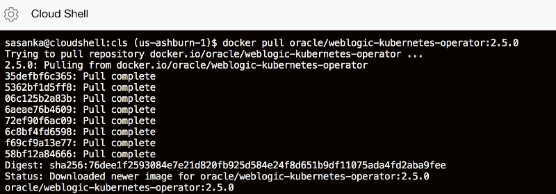

- Pull the Traefik load balancer image.
```
  <copy>docker pull traefik:1.7.12</copy>
```
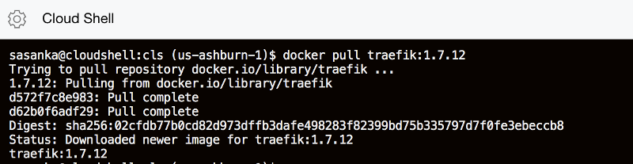

## **STEP 2**: Grant the Helm service account the `cluster-admin` role.

- Grant the Helm service account the `cluster-admin` role
```
cat<<EOF | kubectl apply -f -
apiVersion: rbac.authorization.k8s.io/v1
kind: ClusterRoleBinding
metadata:
  name: helm-user-cluster-admin-role
roleRef:
  apiGroup: rbac.authorization.k8s.io
  kind: ClusterRole
  name: cluster-admin
subjects:
- kind: ServiceAccount
  name: default
  namespace: kube-system
EOF

```
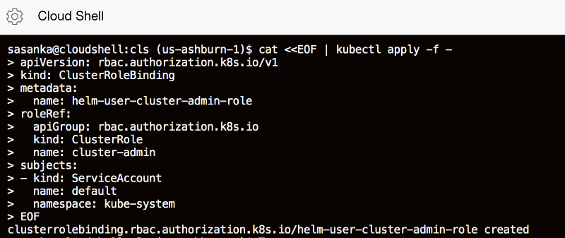

## **STEP 3**: Create a Traefik (Ingress-based) load balancer.
- Use Helm to install the operator and Traefik load balancer.
  
  ```
  <copy>
  helm repo add stable https://kubernetes-charts.storage.googleapis.com/
  </copy>
  ```
  

- Create a namespace for the load balancer.
```
  <copy>
  kubectl create namespace traefik
  </copy>
  ```
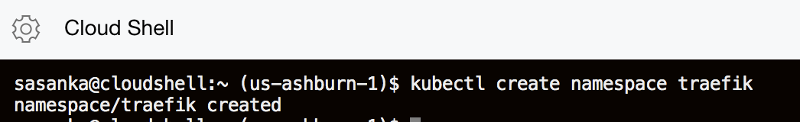

- Use the values.yaml in the sample but set kubernetes.namespaces specifically.
```
  <copy>
  cd weblogic-kubernetes-operator/
  </copy>
```
```
  <copy>
  helm install traefik-operator stable/traefik \
    --namespace traefik \
    --values kubernetes/samples/charts/traefik/values.yaml \
    --set "kubernetes.namespaces={traefik}" \
    --wait
  </copy>
```
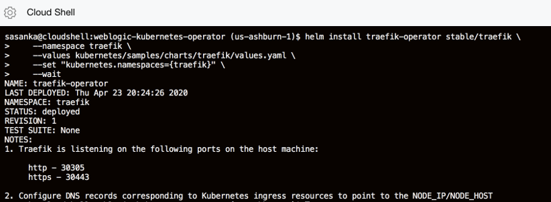

## **STEP 4**: Install the WebLogic Kubernetes Operator.
- Create a namespace for the operator:
  ```
  <copy>
  $ kubectl create namespace sample-weblogic-operator-ns
  </copy>
  ``` 
  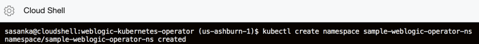

- Create a service account for the operator in the operator's namespace:
  ```
  <copy>
  kubectl create serviceaccount -n sample-weblogic-operator-ns sample-weblogic-operator-sa
  </copy>
  ``` 
  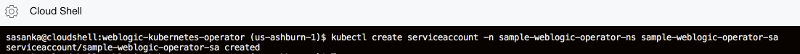

- Use helm to install and start the operator from the directory you just cloned:
  ```
  <copy>
  helm install sample-weblogic-operator kubernetes/charts/weblogic-operator \
  --namespace sample-weblogic-operator-ns \
  --set image=oracle/weblogic-kubernetes-operator:2.5.0 \
  --set serviceAccount=sample-weblogic-operator-sa \
  --set "domainNamespaces={}" \
  --wait
  </copy>
  ``` 
  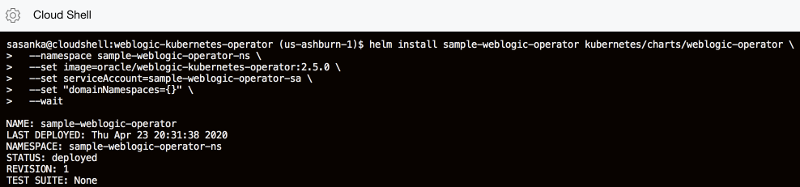

- Verify that the operator's pod is running, by listing the pods in the operator's namespace. You should see one for the operator.
  ```
  <copy>
  kubectl get pods -n sample-weblogic-operator-ns
  </copy>
  ```
  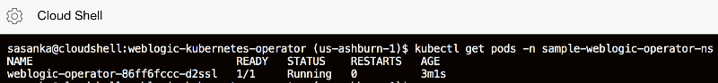

- Verify that the operator is up and running by viewing the operator pod's log:
  ```
  <copy>
  kubectl logs -n sample-weblogic-operator-ns -c weblogic-operator deployments/weblogic-operator
  <copy>
  ```
## **STEP 5**: Prepare your environment for a domain.
- Create a namespace that can host one or more domains
```
<copy>
kubectl create namespace sample-domain1-ns
</copy>
```
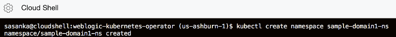

- Use helm to configure the operator to manage domains in this namespace:
 ```
<copy>
helm upgrade sample-weblogic-operator  kubernetes/charts/weblogic-operator \
    --namespace sample-weblogic-operator-ns \
    --reuse-values \
    --set "domainNamespaces={sample-domain1-ns}" \
    --wait
</copy>
```


- Configure Traefik to manage Ingresses created in this namespace:
 ```
<copy>
helm upgrade traefik-operator stable/traefik \
    --namespace traefik \
    --reuse-values \
    --set "kubernetes.namespaces={traefik,sample-domain1-ns}" \
    --wait
</copy>
```


## **STEP 6**: Create your environment for a domain.

- Create a Kubernetes secret for the WebLogic administrator credentials containing the username and password for the domain, using the create-weblogic-credentials script:

 ```
<copy>
kubernetes/samples/scripts/create-weblogic-domain-credentials/create-weblogic-credentials.sh \
  -u <username> -p <password> -n sample-domain1-ns -d sample-domain1
```
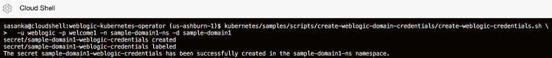
</copy>

- Create OCI image Registry secret to allow Kubernetes to pull you custome WebLogic image. Replace the registry server region code, username and auth token respectively.
WARNING!!! - be careful about username - docker-username parameter should have a value of **YOUR_TENACY_NAME/YOUR_OCIR_USERNAME**

 ```
<copy>
kubectl create secret docker-registry ocirsecret -n sample-domain1-ns --docker-server=YOUR_HOME_REGION_CODE.ocir.io --docker-username='YOUR_TANACY_NAME/YOUR_OCIR_USERNAME' --docker-password='YOUR_OCIR_AUTH_TOKEN' --docker-email='YOUR_EMAIL’
</copy>
 ```
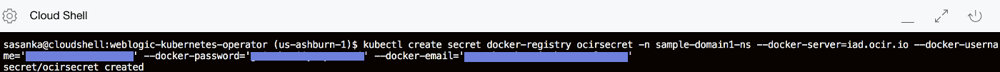
- Create a new image with a domain home by running the create-domain script. First, copy the sample create-domain-inputs.yaml file and update your copy with:

 ```
<copy>
cd kubernetes/samples/scripts/create-weblogic-domain/domain-home-in-image
</copy>
 ```
- Download sample inputs yaml file.
 ```
<copy>
wget https://raw.githubusercontent.com/sasankapdn/wls-oke-cloud-shell/master/my-inputs.yaml
</copy>
 ```
- Edit image field according to Lab 1 Step 6  OCIR docker image URL
```
<copy>
vi my-inputs.yaml  
 ```
<copy>
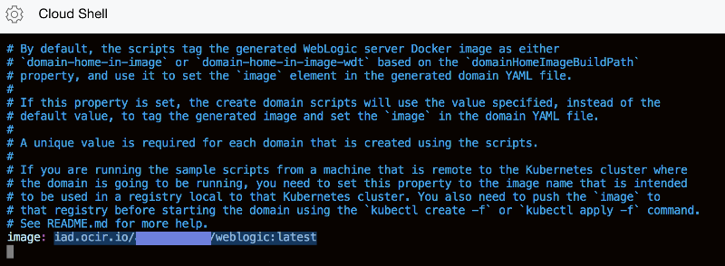

- Execute following command to create domain. Use same username and password you gave on creating WebLogic administrator credentials.
  
 ```
<copy>
 ./create-domain.sh -i my-inputs.yaml -o /OUTPUT_DIRECTORY -u USERNAME -p PASSWORD -e
</copy>
 ```

**Note:** You can copy your image URL from Lab 1 to my-inputs.yaml file image.

Sample my-inputs.yaml file can be find here (https://raw.githubusercontent.com/sasankapdn/wls-oke-cloud-shell/master/my-inputs.yaml).


- Use kubectl to show that the domain resource was created.
 ```
<copy>
kubectl describe domain sample-domain1 -n sample-domain1-ns
</copy>
 ```

- After a short time, you will see the Administration Server and Managed Servers running.
 ```
<copy>
kubectl get pods -n sample-domain1-ns
</copy>
 ```

- The EXTERNAL-IP was determined during Traefik install. If you forgot to note the execute the following command to get the public IP address:
```
<copy>
kubectl describe svc traefik-operator --namespace traefik | grep Ingress | awk '{print $3}'
</copy>
```
- Let’s use one of the node’s external IP addresses to access the Administration Console. Example: http://IP_ADDRESS/console/


## **STEP 7**: Test Alpha Office Product Catalog Website

- Log in to the WebLogic Server Administration Console using the credentials weblogic/welcome1.

    
    
- Click Lock & Edit.

   

- Under Domain Structure, click Deployments.

   

- On the Deployments page, click Install.

   

- On the Install page, click upload your file(s).

   

- On the Install Application Assistant page, click Browse near the Deployment Archive field, download the [Alpha Office Product Catalog.war](https://github.com/Sasankaa/Misc/blob/master/AlphaProductCatalog.war) application, and select .war file to upload.

   

- The name of the selected deployment archive file appears next to the Browse button. Click Next.

   

- Make sure that the deployment archive file is selected, near the bottom of the page, and then click Next.

   

- You can install the deployment as either an application or a library. For this tutorial, we'll install it as an application. Click Next button.

   

- Select the servers or clusters to which you want to deploy the application. For this tutorial, we'll deploy the application to admin-server. So click admin-server, and then click Next. 

   

- On the Optional Settings page, click Next. The default settings are adequate for this tutorial.

   

- Review the configuration settings. You can choose to fine-tune your configuration; but for this tutorial, select No, I will review the configuration later, and then click Finish.

   

- A message is displayed that the application was deployed successfully.

   

- In the Change Center, click Activate Changes.

   

- The application is in the Prepared state and ready to be started.

   

- In the WebLogic Server Administration Console, on the Summary of Deployments page, go to the Control tab.

   

- In the Deployments table, select the check box near the application that you just deployed. Click Start, and then select Servicing all requests.

   

- Click Yes to confirm the deployment.

   

- The application is now in the Active state and is ready to accept requests.

   

- Enter the URL that you identified in the previous step in a browser. 
If you see the untrusted security certificate warning, add the certificate to your browser, as an exception, and continue. The text of this warning and the steps to proceed depend on your browser. In Firefox, for example, you can proceed by clicking Advanced and then Add Exception. 
  - The URL for the application would be in the format **https://managedServer_publicIP/contextRoot** 
   Example: http://129.213.150.77/alpha-office-product-catalog/products.jsp

- Once the app is running it will appear something like this

 

- Congratulations! You've just used the Oracle WebLogic Server Kubernetes Operator to deploy Alpha Office Product Catalog war file into the WebLogic Server.
  
- **This completes Lab 300 and the Workshop**


***

**This completes the Lab!**

**You are ready to proceed to Lab 4**