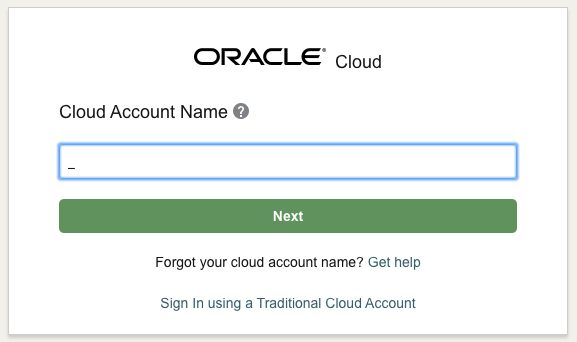
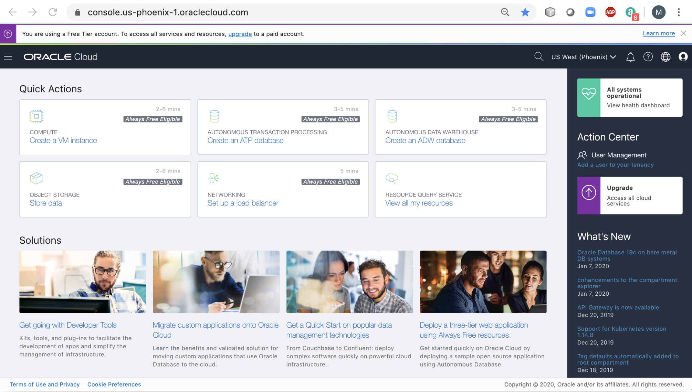
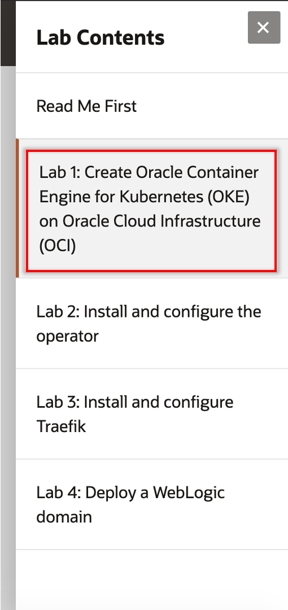

# On-premises WebLogic Server to Oracle Container Engine for Kubernetes (OKE)
## Welcome

This workshop lets you practice through the process of moving an existing On-premises WebLogic application into to a Kubernetes cluster in the Oracle Public Cloud.

### Acquire an Oracle Cloud Free Tier Account or Workshop Account

If you already have an account or an active trial/free tier account, you may skip this section.  If not, you will be creating all required infrastructure components within your Oracle Cloud Free Tier account.

- Bookmark this page for future reference.

## Sign Up for a Free Tier Account

- Open up a browser and click [here](https://myservices.us.oraclecloud.com/mycloud/signup?language=en&sourceType=:ow:lp:pt:::RC_WWMK200728P00006:WeblogicOCI_HOL&intcmp=:ow:lp:pt:::RC_WWMK200728P00006:WeblogicOCI_HOL) to sign up for an Oracle Cloud Account.
Follow the instructions to create your account.  Be sure to enter an email you can access.  

  

- Once you complete the signup, you will receive the **Your Cloud Account is fully provisioned** Email, make note of your **Username and Cloud Account Name**.   *Note: `Usernames are usually your email address.`*  You can login by clicking the Sign In button or access it from any browser.

    

## Login to Oracle Cloud Account

- From any browser go to oracle.com to access the Oracle Cloud.

    [https://www.oracle.com/](https://www.oracle.com/)

    

- Click the icon in the upper right corner.  Click on **Sign in to Cloud** at the bottom of the drop down.  *NOTE:  Do NOT click the Sign-In button, this will take you to Single Sign-On, not the Oracle Cloud*

        

- Enter your **Cloud Account Name** in the input field and click the **My Services** button. If you have a Free Tier account provisioned, this can be found in your welcome email. Otherwise, this will be supplied by your workshop instructor.

      

- Enter your **Username** and **Password** in the input fields and click **Sign In**.

    

  **NOTE**: You will likely be prompted to change the temporary password listed in the welcome email. In that case, enter the new password in the password field.
- That opens the OCI console.
    

## Navigate to Lab 1

  - Use the Contents Menu to access the next lab. For example, to proceed to Lab 1, click Lab **Lab 100: Pull the Docker image for the WebLogic and push to Oracle Cloud Infrastructure Registry (OCIR)** from the menu on the right.

  

- Close the menu by clicking the X.

  

You're now ready to continue with **Lab 1**.

Please proceed to the next lab.

## Acknowledgements

- **Authors/Contributors** - 
- **Last Updated By/Date** - 
- **Workshop Expiration Date** - April 31, 2021

## Need Help?
Please submit feedback or ask for help using our [LiveLabs Support Forum](https://community.oracle.com/tech/developers/categories/livelabsdiscussions). Please click the **Log In** button and login using your Oracle Account. Click the **Ask A Question** button to the left to start a *New Discussion* or *Ask a Question*.  Please include your workshop name and lab name.  You can also include screenshots and attach files.  Engage directly with the author of the workshop.

If you do not have an Oracle Account, click [here](https://profile.oracle.com/myprofile/account/create-account.jspx) to create one.    Please include the workshop name and lab in your request.
