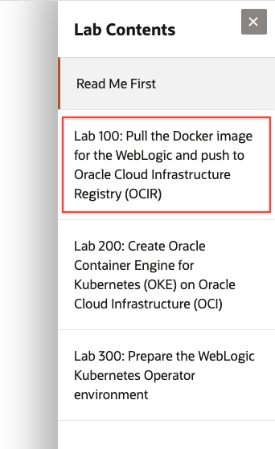

# On-premises WebLogic Server to Oracle Container Engine for Kubernetes (OKE)
## Welcome

This workshop lets you practice through the process of moving an existing On-premises WebLogic application into to a Kubernetes cluster in the Oracle Public Cloud.

### **Step 1**: Acquire an Oracle Cloud Trial or Workshop Account

- The Lab documentation is **best viewed** by using the Workshop's [GitHub Pages site](https://oracle.github.io/learning-library/workshops/wls-oke/?lab=on-premises-weblogic-oracle-container-engine).

- Bookmark this page for future reference.

- Please click on the following link to create your <a class="trial-link" href="https://myservices.us.oraclecloud.com/mycloud/signup?language=en&sourceType=:em:eo:ie:2t:RC_NAMK180921P00075:WLSonPrem_HOL" target="_trial">Free Account</a>, and complete all the required steps to get your free Oracle Cloud Trial Account. When you complete the registration process you will receive a $300 credit that will enable you to complete the lab for free.  Additionally, you will have 1000s of hours left over to continue to explore the Oracle Cloud.

  - Soon after requesting your trial you will receive the following email. _You may begin working on Lab 100 before you receive this email_, but you will not be able to start Lab 200 until you have received it.

  

### **Step 2**: Navigate to Lab 100

Use the Contents Menu to access the next lab. For example, to proceed to Lab 100, click **Lab 100: Pull the Docker image for the WebLogic and push to Oracle Cloud Infrastructure Registry (OCIR)** from the menu on the right.

Close the menu by clicking the **X**.

 

If the menu is not diplayed, you can open by clicking the menu button  
.